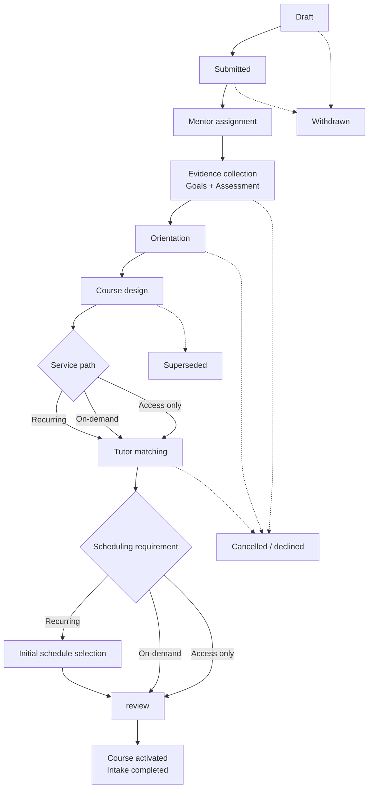

# Phase 2: Mentor-led Student intake lifecycle

**Contract phase:** 2 of 54  
**Status:** Final - approved product contract  
**Last updated:** 2026-07-20  
**Depends on:** [Kelp canonical domain glossary](domain-glossary.md)  
**Applies to:** Kelp-managed Student onboarding, new-Subject intake, Course preparation, Tutor assignment, and initial scheduling

## 1. Purpose

This contract defines how a Kelp-managed Student moves from requesting educational support to receiving an active Course and Classroom.

The normal path is:

1. The Student or Guardian requests Kelp support for one Subject.
2. Kelp assigns a Mentor to the intake.
3. The Student submits a goals form and completes an Assessment.
4. The Mentor holds one Orientation Meeting with the Student.
5. The Mentor selects or designs the Course and Course Schedule.
6. For tutoring plans, the Mentor assigns a qualified Kelp Tutor.
7. The Student chooses the applicable meeting arrangement from that Tutor's Availability.
8. Kelp validates the activation requirements and activates the Course and Classroom.

This contract prevents intake from being represented as a marketplace search, a single form submission, a Class, or an unstructured Student-Tutor link.

## 2. Scope boundaries

### Included

- a new Kelp-managed Student's first Course;
- an existing Student requesting a Course in another Subject;
- an existing access-only Student requesting tutoring;
- a Student or Guardian requesting a specifically named Tutor and Subject;
- recurring, on-demand, and access-only activation branches;
- Assessment, goals, Orientation, Course preparation, Tutor matching, and initial scheduling handoff;
- pausing, withdrawing, superseding, or declining an intake;
- audit, privacy, and evidence requirements for the workflow.

### Excluded

- Independent Tutor onboarding of their privately billed Students;
- the Phase 8 Tutor application and qualification lifecycle, which remains outside Phase 2 but now governs Candidate eligibility;
- detailed Course authoring and Schedule-version rules, which belong to Phase 3;
- detailed recurring scheduling and Lesson Request concurrency, which belong to later scheduling phases;
- Phase 9 Group Queue Entry, offer, reservation, and activation rules, which remain outside Phase 2; exact Group Course prices and initial cohort sizes remain later catalog decisions;
- payment execution, credit purchase, and Stripe integration;
- Guardian verification, hidden-identity, adulthood-transition, and safeguarding rules beyond intake, now governed by Phase 7;
- database tables, RLS policies, and API shapes;
- notification channel implementation.

An Independent Tutor may use Kelp's forms, Assessments, Courses, scheduling, and Report Cards, but their Student intake is not Mentor-led and must be governed by a separate contract.

## 3. Phase 2 terms

These terms extend the Phase 1 glossary and are canonical for this workflow.

### Intake Request

The initial request for one Student to receive a new Kelp-managed Course or to add tutoring to an existing service relationship. It identifies the intended Subject, desired service path, requester, and any specifically requested Tutor.

### Intake Case

The durable workflow record created from an Intake Request. It coordinates one Student's preparation for one intended Course. It links the participants, evidence, decisions, blockers, lifecycle state, and final outcome without copying the complete content of those records into one mutable document.

One Intake Case can produce at most one activated Course. A Student may have multiple Intake Cases over time or for different Subjects.

### Intake requester

The authenticated Student or linked Guardian who submits the Intake Request. The requester is not automatically the academic respondent; the Student must personally complete work that measures the Student's knowledge or goals unless a later accessibility rule permits documented assistance.

### Intake Mentor

The Mentor currently accountable for progressing the Intake Case. This is an explicit, auditable assignment. It is not inferred from whichever Mentor last opened the case.

For a tutoring path, the Intake Mentor must become or already be the assigned Tutor's sole active Supervising Mentor before Tutor Assignment. If Tutor selection requires another Mentor, the complete Intake Case is handed off first.

### Supervising Mentor

The one active Mentor responsible for a Kelp Tutor at a given time. A Kelp Tutor is never split among different supervising Mentors. The Tutor's Kelp-teachable scope is the intersection of the Tutor's approved qualifications and the Supervising Mentor's approved qualifications.

### Goals Form

The versioned form definition used to collect the Student's goals, needs, preferences, background, and other relevant learning context.

### Goals Submission

The immutable Student response to a Goals Form snapshot. A correction creates a new version or superseding submission rather than overwriting historical answers.

### Assessment Assignment

The authorized delivery of a specific Assessment version to the Student for this Intake Case. It identifies the approved exam version, Student, Subject, due expectations, and any approved accommodation.

### Assessment Attempt

The Student's immutable response and grading basis for an Assessment Assignment. Automatically graded and Mentor-reviewed results may coexist in the same attempt lifecycle.

### Assessment Result

The completed diagnostic interpretation used by the Mentor to design the Course. It is placement evidence, not a Course grade, Report Card grade, or pass/fail judgment about whether the Student deserves instruction.

### Orientation Meeting

The one Kelp onboarding meeting in which the Mentor explains how Kelp works, reviews the Student's goals and Assessment at an appropriate level, confirms expectations, and prepares the Student for their Course.

An Orientation Meeting is not a tutoring Class, does not consume Lesson Credits, does not create Tutor compensation, and does not affect Class cancellation or no-show entitlements.

### Course Proposal

The Mentor-owned, pre-activation description of the intended Course. It references a Course Template version or a newly prepared draft and includes enough information to validate Subject, goals, Course Schedule, expected period, and service path.

### Tutor Candidate

A Kelp Tutor considered for assignment but not yet connected to the Student. Candidate status must not grant full Student Profile or Classroom access.

### Initial Schedule Selection

The Student's choice of the applicable recurring meeting pattern or initial scheduling arrangement from the assigned Tutor's valid Availability. It is not a right to choose any Kelp Tutor.

### Activation Review

The final server-authoritative check that every requirement for the selected service path is complete and still valid before the Course becomes active.

### Intake blocker

A structured reason why the next transition cannot occur, such as awaiting Student action, Mentor review, Tutor capacity, Guardian action, commercial readiness, support review, or a replacement Tutor.

### Intake outcome

The terminal result of the Intake Case: completed, withdrawn, cancelled, declined, or superseded.

## 4. Actors and responsibilities

### Student

The Student:

- confirms the requested Subject and service intention;
- submits their own Goals Submission;
- completes their own Assessment Attempt;
- attends the Orientation Meeting;
- reviews the Course summary made available to them;
- chooses the applicable time arrangement after Tutor assignment;
- receives status and required-action notices.

The Student cannot assign their own Tutor, approve their own Assessment Result, edit the Course Schedule, or turn arbitrary text into an approved taxonomy value.

### Guardian

A linked Guardian may:

- initiate an Intake Request for their child;
- provide supplemental context through a separate Guardian-facing form or response area;
- view the child's intake status and Course information within the Phase 7 Guardian contract;
- complete commercial actions they are authorized to fund;
- receive applicable notifications.

A Guardian must not impersonate the Student in an Assessment Attempt or primary Goals Submission. The Student owns the primary Goals Submission. A Guardian may provide a separately identified supplemental submission and may acknowledge the Course summary when acting as payer or responsible Guardian. Guardian and Student statements must never be merged invisibly.

### Intake Mentor

The Intake Mentor:

- verifies that the request is coherent and in scope;
- assigns or selects the Goals Form and Assessment version;
- reviews submitted evidence, including manually graded Assessment items;
- records the diagnostic interpretation;
- conducts and records the Orientation Meeting;
- selects or prepares the Course Proposal;
- selects an eligible Tutor Candidate and creates the Tutor Assignment through the authorized process;
- prepares the Student for Initial Schedule Selection;
- records reasons for overrides, pauses, cancellations, or replacement decisions.

The Intake Mentor cannot bypass Tutor qualification, fabricate Student consent, mutate an immutable submission, or activate a Course with missing prerequisites.

### Kelp Tutor

Before assignment, a Tutor Candidate receives only the information later approved by the privacy contract for capacity and suitability decisions. They do not yet receive the Student's complete Profile.

After assignment, the Kelp Tutor receives the Student and Course visibility granted by the Tutor contract and is notified of the scheduling handoff. A valid Mentor assignment is authoritative when it satisfies qualification, supervision, capacity, contract, and Availability rules. The Tutor may request reassignment immediately with a recorded reason but cannot silently ignore or privately reject the Student.

### Quality Assistant

A Quality Assistant may:

- monitor Intake Case delays and blockers;
- reassign the Intake Mentor with an audit reason;
- resolve subject, qualification, supervision, or availability mismatches;
- review exceptions or declined cases;
- override an operational transition only through a recorded, authorized action;
- investigate misconduct without altering immutable Student evidence.

### Administrator

An Administrator may manage system-level configuration and correct exceptional data through audited administrative procedures. Ordinary intake should remain Mentor- and Quality-Assistant-led rather than depending on Administrator intervention.

### Support

Support may receive the initial request, help a user complete non-academic account steps, or create a Support Case. Support must not interpret the Assessment, design the Course, or assign a Tutor unless the user also holds the required Mentor or Quality Assistant capability.

## 5. Entry routes

An Intake Case may begin from any of these routes:

1. **New Kelp Student:** a new Student requests their first Course.
2. **New Subject:** an existing Student requests a Course in a Subject not covered by their current Tutors.
3. **Tutoring upgrade:** an access-only Student requests recurring or on-demand tutoring.
4. **Service-path change requiring triage:** an existing Student needs a material change that cannot safely reuse the current Course arrangement.
5. **Guardian request:** a linked Guardian initiates the request for their child.
6. **Specifically requested Tutor:** the requester supplies the Tutor's full name and Subject so Kelp can identify the person internally.

The specifically requested Tutor route is not a public search or marketplace. The Mentor verifies identity, qualification, supervision, capacity, and suitability. The request is a preference, not a guaranteed assignment.

## 6. Intake prerequisites

Before submission, the Intake Request must have:

- an authenticated requester;
- a trusted Student Profile;
- Student name and birthdate from signup;
- country, state, and city;
- a detected and Student-confirmed IANA timezone;
- an approved canonical Subject identifier;
- a requested service path;
- a verified Guardian Relationship when a Guardian acts for the Student;
- acceptance of the applicable platform terms once that contract exists.

Kelp must not require or store the Student's full street address for this workflow.

Missing prerequisites keep the request in draft or create a structured blocker. Browser-provided Profile IDs, roles, age, Guardian links, or completion flags are never authoritative.

## 7. Service paths

The Intake Case records one intended service path. Changing paths before activation is allowed but requires the Activation Review to recalculate its requirements.

### Recurring tutoring

The Student receives:

- a Course and Classroom;
- an assigned Kelp Tutor;
- a recurring Lesson Schedule;
- access to Kelp's Course tools;
- the applicable platform and tutoring billing arrangement.

The Student must complete Initial Schedule Selection before activation or before the first recurring commitment, depending on the commercial-gate decision below.

### On-demand tutoring

The Student receives:

- a Course and Classroom;
- an assigned Kelp Tutor;
- access to Kelp's Course tools;
- the ability to request Standalone Classes when needed.

No recurring Lesson Schedule is required. Individual Classes are requested later through the Calendar and Lesson Request workflow.

### Access only

The Student receives:

- a Course and Classroom;
- an assigned Kelp Tutor for academic communication and Course-change requests;
- Assessment-informed Course tools and Course Schedule;
- no recurring Lesson Schedule;
- no included tutoring Classes or Class-booking ability.

Moving from access only to tutoring requires a new or resumed Mentor triage process so qualification, capacity, commercial readiness, and scheduling can be checked.

### Independent Tutor service

Not a Phase 2 service path. It uses an Independent Tutor-owned workflow, is externally billed, and does not create a Mentor-led Kelp Tutor Assignment.

## 8. Lifecycle model

The Intake Case uses one primary lifecycle state and zero or more structured blockers. A blocker must not be hidden by inventing dozens of nearly identical states.

### Primary lifecycle states

| State | Meaning | Required result before leaving |
| --- | --- | --- |
| `draft` | The requester is preparing the Intake Request. | Valid trusted prerequisites and submission. |
| `submitted` | Kelp has received the request. | Intake Case created and queued for Mentor assignment. |
| `mentor_assignment` | The accountable Mentor is being selected. | One active Intake Mentor with an audit record. |
| `evidence_collection` | Goals and Assessment evidence are being collected and reviewed. | Current Goals Submission and completed Assessment Result. |
| `orientation` | The onboarding meeting is pending or under review. | Completed Orientation record. |
| `course_design` | The Mentor is selecting or preparing the Course Proposal. | Valid Course Proposal and pinned content versions. |
| `tutor_matching` | A qualified Kelp Tutor is being selected for a tutoring path. | Valid Tutor Assignment or approved transition back to matching. |
| `schedule_selection` | A recurring Student is selecting the initial meeting pattern. | Valid Initial Schedule Selection. |
| `activation_review` | Kelp revalidates the complete path. | All path-specific activation gates pass atomically. |
| `completed` | The Course and Classroom are active and the Intake Case is closed successfully. | Immutable completion summary and audit event. |
| `withdrawn` | The requester ended the intake before activation. | Reason, actor, timestamp, and retained evidence policy. |
| `cancelled` | Kelp ended the intake without activation. | Authorized reason and user-visible explanation where appropriate. |
| `declined` | Kelp determined that it cannot offer the requested service. | Quality Assistant review and reason; low Assessment performance alone is not a reason. |
| `superseded` | A materially different Intake Case replaced this one. | Link to the replacement case and preserved history. |

### Operational condition

An active lifecycle state may be `working` or `paused`. A paused case records:

- blocker code;
- responsible actor or party;
- pause timestamp;
- user-visible explanation;
- next permitted actions;
- optional review or expiry time.

Resuming a case restores the same lifecycle state. It does not recreate completed evidence or erase the pause history.

## 9. Stage contract

### Stage A: Request submission

The requester chooses one canonical Subject and one intended service path. They may include a specifically requested Tutor's full name and Subject for internal identification.

Submission creates the Intake Case exactly once. Retrying with the same idempotency key returns the existing Case rather than creating a duplicate.

Kelp should detect a potentially duplicate active Intake Case and direct it to review instead of silently combining or discarding it.

### Stage B: Mentor assignment

The Intake Case must have exactly one active Intake Mentor before academic evidence is interpreted. Reassignment preserves every previous Mentor assignment and reason.

Kelp automatically proposes an Intake Mentor using subject competence, supervision structure, workload, timezone coverage, and continuity. A Quality Assistant confirms or overrides the proposal. Both the proposal and final decision are audited.

### Stage C: Evidence collection

The Student must complete both:

1. a Goals Submission from a pinned Goals Form version; and
2. an Assessment Attempt from a pinned Assessment version.

They may be completed in either order, but both must be reviewed before Orientation is marked complete.

The Assessment delivery must:

- use a server-authorized Student identity;
- freeze the question and grading basis shown to the Student;
- preserve raw responses and timing evidence;
- separate automatic scores from Mentor-reviewed items;
- record approved accommodations;
- prevent the browser from declaring its own final result.

The Mentor records an Assessment Result only after required manual review is complete. A low result determines starting level and Course design; it does not automatically decline the Student.

An approved Assessment Result may be reused for another Intake Case in the same Subject for 90 days when the Mentor confirms it is still representative. A different Subject or a material change in the Student's needs requires a new Assessment. Reuse links to the immutable original Attempt and never changes it.

### Stage D: Orientation

The Orientation Meeting occurs after the Mentor can review both Goals and Assessment evidence. The Mentor records:

- scheduled and actual time;
- participants;
- completion status;
- the Kelp workflow topics explained;
- confirmed or corrected goals;
- service-path understanding;
- relevant non-sensitive notes;
- follow-up blockers.

The standard requires one completed Orientation Meeting. An exceptional additional meeting requires a reason but does not become a tutoring Class.

### Stage E: Course design

The Mentor creates the Course Proposal by selecting a Kelp Course Template version or preparing the applicable draft under later Course-authoring rules.

The Proposal must identify:

- one Subject;
- the Student;
- Assessment and Goals evidence used;
- learning goals;
- canonical Subtopics and Content scope;
- Course Template and Product versions where applicable;
- proposed begin and end dates;
- Course Schedule version;
- intended service path;
- expected assessment, assignment, project, and reporting structure;
- any unresolved blocker.

The Student or authorized Guardian must receive and acknowledge a readable Course summary before activation and may request corrections. The Mentor retains final academic authorship and approval. Acknowledgment confirms receipt and commercial understanding; it does not transfer Course-editing authority or create an indefinite veto. Student-caused inactivity follows the reminder and closure rules below.

Once the Course Proposal is valid, Kelp creates a private draft Course with a stable identifier for review. No Classroom or active Membership is created during Course design.

### Stage F: Tutor matching

Every Kelp-managed service path requires Tutor matching. For access only, the assignment gives the Student a qualified Kelp staff Tutor to contact about the Course but does not include Classes, Class-booking authority, or a recurring Lesson Schedule.

An eligible Tutor Candidate must:

- have an active Kelp Tutor Role Assignment created through Phase 8;
- have an active, unexpired, unsuspended, and undisqualified Tutor Qualification covering the Course Subject and required teaching scope;
- have exactly one active Supervising Mentor;
- have an Operationally Enabled Scope, formed by the intersection of Tutor and Mentor Qualifications, that covers the Course Subject and required teaching scope;
- have enough operational capacity;
- for a tutoring path, have Availability that can plausibly serve the Student's timezone and intended arrangement;
- have no blocking probation review, conduct, quality, leave, or account restriction;
- satisfy any relationship constraint defined by later authorization contracts.

An active Probationary Tutor Period does not by itself make a Tutor ineligible. Only a restriction or failed checkpoint outcome that removes the applicable Operationally Enabled Scope blocks matching.

The Intake Mentor selects the Tutor after these checks. Before Tutor Assignment, the Intake Mentor must be the selected Tutor's Supervising Mentor. If the preferred Tutor belongs to another qualified Mentor, the Quality Assistant confirms a complete Intake Case handoff to that Mentor. The original Mentor's work and attribution remain visible, but two Mentors never simultaneously own the intake or split supervision of the Tutor. The Student cannot browse unassigned Tutors as a marketplace.

If the Student named a specific Tutor, the Mentor checks that person first. If they are unavailable or ineligible, Kelp must tell the requester that the preference cannot currently be fulfilled without disclosing private Tutor information. The requester chooses between a Mentor-selected qualified alternative or waiting for the named Tutor until a stated review date. Kelp must not make an indefinite availability promise.

Candidate review must not expose the Student's entire Profile. Full Tutor visibility begins only after the Tutor Assignment becomes active.

### Stage G: Initial scheduling

After Tutor Assignment:

- the Student sees that Tutor's applicable Availability, accepted bookings, buffers, holidays, and overrides as bookable or unavailable time;
- private reasons for unavailability remain hidden;
- Kelp uses the Student's confirmed timezone for display;
- a recurring Student selects the recurring meeting pattern and duration;
- an on-demand Student receives booking readiness but does not need a recurring slot;
- an access-only Student does not select Class times but retains the assigned Tutor as the contact for Course questions and Course-change requests.

Detailed slot locking, Tutor acceptance, request expiry, holiday collision, and recurrence creation remain governed by later scheduling contracts.

### Stage H: Activation review

The server revalidates every required input rather than trusting browser completion flags. Activation must be atomic: either the complete Course relationship is activated, or no partial active Course is exposed.

Commercial readiness is path-specific:

- recurring tutoring requires an active platform subscription and reusable payment authorization before activation; any Lesson Credit shortfall is purchased only before the first actual Class commitment;
- on-demand tutoring requires active platform access before activation; Lesson Credits are required only when a Class is booked;
- access only requires active platform access before activation.

Phase 9 governs the Account-scoped Student Platform Access Subscription, Course-scoped Service Arrangement, Payer Authorization, exact-shortfall recurring funding, and immutable Service Plan Version consumed by these checks.

Phase 10 governs authoritative spendable capacity, Credit Lot allocation, the fully funded Credit Commitment required for booking, and any exact-shortfall Lot issuance. A browser payment callback, displayed balance, or reusable payment reference is never sufficient credit or booking authority.

Completing intake never charges Lesson Credits by itself.

Activation produces or activates:

- the existing private draft Course with its pinned Course Template and Course Schedule versions;
- exactly one newly created Classroom;
- Student Classroom Membership;
- Guardian Memberships allowed by verified relationships;
- Tutor Assignment and Tutor Membership for every Kelp-managed service path;
- the selected service path;
- recurring Lesson Schedule for the recurring path, when required by the final activation rule;
- Curriculum Progression Map linking the approved Course Schedule Version to the recurring path's Theory Slots;
- audit events linking the Intake Case, evidence, decisions, and actors.

The Intake Case becomes `completed` only after the activated records can be read through their normal authorized views.

## 10. Activation matrix

| Requirement | Recurring | On-demand | Access only |
| --- | :---: | :---: | :---: |
| Trusted Student Profile and timezone | Required | Required | Required |
| Current Goals Submission | Required | Required | Required |
| Completed Assessment Result | Required | Required | Required |
| Completed Orientation | Required | Required | Required |
| Valid Course Proposal and Schedule version | Required | Required | Required |
| Active Tutor Assignment | Required | Required | Required |
| Recurring Initial Schedule Selection | Required | Not applicable | Not applicable |
| Curriculum Progression Map | Required | Not applicable | Not applicable |
| Classroom | Required | Required | Required |
| Commercial readiness | Required | Required | Required |

No path may be marked completed merely because a form was submitted or a payment page returned successfully.

## 11. Changes, exceptions, and terminal paths

### Goal correction

A goal correction creates a new Goals Submission or explicit Mentor-authored interpretation linked to the original evidence. Historical answers are never overwritten.

### Material Subject change

A change to a different Subject after Assessment begins normally supersedes the Intake Case because the Assessment, Tutor qualifications, Course Proposal, and matching pool may no longer apply. The replacement Case links to reusable evidence where later policy permits it.

### Service-path change

Before activation, the service path may change within the same Intake Case. The workflow returns to the earliest stage invalidated by the change and reruns Activation Review.

After activation, a change requiring a Tutor Assignment or recurring commitment uses a new or resumed triage workflow rather than mutating historical intake completion.

### Mentor reassignment

A Quality Assistant or other authorized actor may replace the Intake Mentor. Completed evidence and Course drafts remain attached to the Intake Case; attribution and decision history remain visible.

### Tutor unavailable

The Intake Case pauses at Tutor matching. Kelp may offer a qualified alternative or retain the Student in a controlled wait state. It must not create a placeholder Tutor Assignment.

### Tutor becomes unavailable after assignment but before activation

The tentative or active assignment is ended with a reason, the Case returns to Tutor matching, and the same Course Proposal remains unless the replacement requires a justified revision.

### Orientation absence

The meeting may be rescheduled. It is not a Class, so Class credits, the Student late-change entitlement, and Class no-show streaks do not apply.

### Student withdrawal

The Student or authorized Guardian may withdraw before activation. Kelp records the reason if provided, stops future intake actions, and applies the later retention contract to submitted evidence.

### Kelp cancellation or decline

Cancellation requires an operational reason. Decline requires Quality Assistant review and a clear reason. Academic starting level alone must not be treated as a failure or denial reason.

### Inactivity

When an Intake Case is waiting for Student or Guardian action, Kelp sends reminders after 3, 7, and 14 elapsed days. The Case pauses after 14 days and closes after 30 days of unresolved user-caused inactivity. Returning later creates a new linked Intake Case that may reuse eligible evidence under the Assessment-reuse rule.

Mentor-, Tutor-, Quality-Assistant-, support-, or Kelp-caused delays never count toward Student inactivity closure. The blocker owner and elapsed-time clock must therefore be server-authoritative.

## 12. Data and audit requirements

The conceptual Intake Case must retain references to:

- Intake Case identifier and idempotency key;
- trusted Student and requester Accounts;
- verified Guardian Relationship when applicable;
- requested Subject and label snapshot;
- intended service path and its change history;
- specifically requested Tutor text and the internally resolved Tutor, if any;
- Intake Mentor assignment history;
- Goals Form version and Goals Submission versions;
- Assessment definition version, Assignment, Attempts, and final Result;
- Orientation Meeting record;
- Course Proposal and Course Schedule versions;
- Tutor Candidate decisions and reason codes;
- selected Tutor Assignment;
- Initial Schedule Selection or on-demand readiness;
- blockers, pauses, resumptions, and terminal reasons;
- actor and timestamp for every privileged transition;
- activated Course, Classroom, Memberships, and Schedule identifiers;
- Notification Events generated by the workflow.

Audit records are append-only. A correction creates a new event or version and must not rewrite who made the original decision.

## 13. Visibility boundaries

### Student

May see their status, required next action, submitted Goals response, Assessment delivery and permitted results, Orientation details, readable Course summary, assigned Tutor after assignment, and scheduling handoff.

### Guardian

May see the same child-scoped intake information permitted by the Phase 7 Guardian contract, but cannot complete the Student's Assessment or make academic decisions.

### Intake Mentor

May see the complete Intake Case and educational evidence needed to perform the workflow.

### Tutor Candidate

May see only the minimum Course, Subject, timezone, scheduling, and operational information needed for an authorized capacity or suitability decision. The Student's identity and full Profile should remain hidden until assignment unless a later contract identifies a necessary exception.

### Assigned Tutor

May see the Student's Tutor-visible Profile and active Course information after the Tutor Assignment becomes effective.

### Quality Assistant

May inspect Intake Cases within their operational scope, including evidence and audit history needed for review or exception handling.

Browser routing, a dashboard role label, or knowledge of an Intake Case ID never grants access.

## 14. Notification events

Phase 2 creates server-side Notification Events for at least:

- Intake Request received;
- Mentor assigned or reassigned;
- Goals Form available or incomplete;
- Assessment assigned, approaching its deadline, submitted, or reviewed;
- Orientation scheduled, rescheduled, approaching, or completed;
- Course summary ready;
- additional information required;
- Tutor assigned;
- requested Tutor unavailable;
- time selection required;
- Intake Case paused, resumed, withdrawn, cancelled, declined, or superseded;
- Course activated.

Channel delivery through email or Twilio SMS is later work. The event and its audit history must exist independently of delivery success.

## 15. Phase 2 invariants

1. One Intake Case can activate at most one Course.
2. One Intake Case concerns one canonical Subject.
3. Intake does not expose a public Tutor marketplace.
4. A specifically requested Tutor is a preference, not a guaranteed assignment.
5. The Student completes their own Assessment Attempt.
6. Assessment results inform placement; low performance alone does not reject a Student.
7. Goals and Assessment records are versioned or immutable and are never silently overwritten.
8. Orientation is not a Class and creates no Lesson Credit charge, Tutor compensation, or Class reliability event.
9. Access-only activation has an assigned qualified Kelp Tutor but no Lesson Schedule or Class-booking ability.
10. On-demand activation has a Tutor Assignment but no recurring Lesson Schedule.
11. Recurring activation requires a Tutor Assignment and Initial Schedule Selection.
12. Tutor matching is restricted to active, qualified Kelp Tutors with compatible supervision and capacity.
13. Each Kelp Tutor has exactly one active Supervising Mentor at a time.
14. A Kelp Tutor may teach only within the intersection of the Tutor's and Supervising Mentor's approved qualifications.
15. The Intake Mentor must be the selected Tutor's Supervising Mentor before Tutor Assignment; otherwise, the complete Intake Case is handed off first.
16. A Tutor Candidate does not receive full Student access.
17. Tutor Assignment must precede Student scheduling with that Tutor.
18. Course design creates a private draft Course but no Classroom or active Membership.
19. Course activation pins the evidence and content versions used for the decision.
20. Exactly one Classroom belongs to the activated Course.
21. Activation is server-authoritative, commercially ready, and atomic.
22. A browser payment-success return cannot complete intake.
23. Mentor, Tutor, and service-path changes preserve their history and reasons.
24. Independent Tutor Student intake is outside this Mentor-led workflow.
25. Recurring activation requires at least one 60- or 90-minute Theory Slot and a Curriculum Progression Map linked to the approved Course Schedule Version.
26. Every Kelp-managed activated Course has an active Kelp Tutor Assignment; Independent Tutor Courses remain assigned to their Independent Tutor outside this workflow.

## 16. Relationship to existing implementation

The repository already contains useful components, but none is the complete Phase 2 workflow:

- `form_definitions` and immutable `form_submissions` can support versioned Goals Forms and Goals Submissions after they are linked to an Intake Case.
- the Exam Builder, immutable delivery snapshot, attempts, and review states can support Assessment evidence after diagnostic-purpose and Intake Case links are added.
- current `course_compositions` are reusable approved-question compositions and practice content. They are not yet the canonical Course, Course Template, Course Proposal, or Classroom.
- current `learning_schedules` represent curriculum sessions and progress. They are closer to a Course Schedule prototype than to the recurring Lesson Schedule for live Classes.
- current multi-role authorization is a useful capability base but does not yet implement the complete Phase 7 Guardian, Quality Assistant, Intake Mentor, Tutor Candidate, Role Assignment, or relationship-scoped access contract.

Phase 2 does not authorize migrations or frontend wiring. Later architecture must adapt these assets to this contract rather than renaming an existing table and assuming the lifecycle is complete.

## 17. Approved Phase 2 decisions

1. Kelp automatically proposes the Intake Mentor; a Quality Assistant confirms or overrides the proposal.
2. The Student or authorized Guardian acknowledges the Course summary and may request corrections; the Mentor retains final academic approval.
3. A valid Mentor assignment is authoritative; the Tutor may request reassignment with a reason but cannot silently reject the Student.
4. Kelp creates a private draft Course during design and creates its Classroom and Memberships atomically at activation.
5. Platform-payment readiness blocks activation, while Lesson Credit purchase waits until the first Class commitment that requires it.
6. Kelp reminds inactive users after 3, 7, and 14 days, pauses after 14 days, and closes after 30 days; Kelp-caused delays do not count.
7. A Mentor-confirmed Assessment Result may be reused for the same Subject for 90 days.
8. The Student owns the primary Goals Submission; Guardian input is separate and attributed.
9. When a specifically requested Tutor is unavailable, the requester chooses a qualified alternative or waits until a stated review date.
10. Each Kelp Tutor has one active Supervising Mentor. The Tutor may teach only within the intersection of Tutor and Mentor qualifications. Intake hands off completely before assigning a Tutor supervised by another Mentor.

## 18. Phase 2 completion and Phase 3 handoff

Phase 2 is final and authoritative. Its terms and invariants are linked from the product documentation index.

Phase 3 defines Course design and the curriculum Course Schedule contract without reopening the Intake lifecycle. Phase 7 governs the actors and relationship-scoped authority used by this workflow, Phase 8 governs the Kelp Tutor Role Assignment, Qualification, Operationally Enabled Scope, probation restrictions, and renewal state consumed during matching, Phase 9 governs commercial service readiness and Group Course entry, and Phase 10 governs the credit capacity and Commitment consumed at Class booking. These contracts preserve the private draft Course boundary, the acknowledgment and Mentor-approval rule, the pinned evidence and content versions, and atomic Classroom creation at activation.
