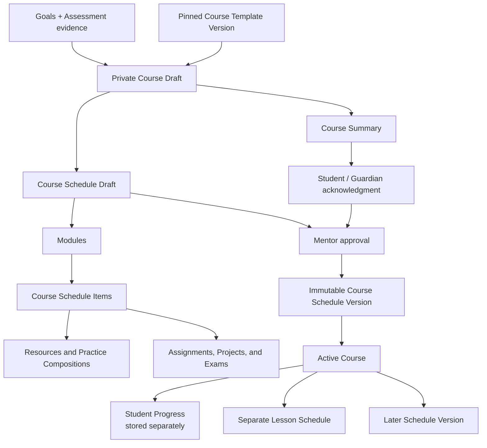
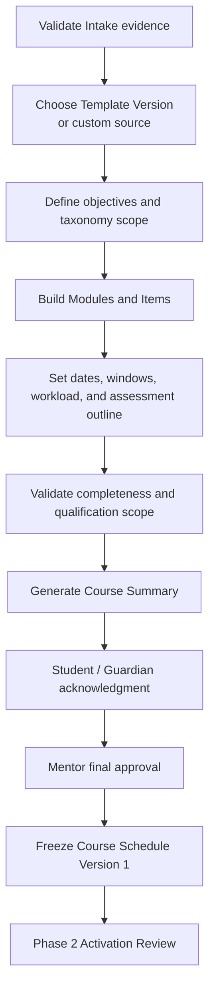

# Phase 3: Course design and curriculum Schedule

**Contract phase:** 3 of 54  
**Status:** Final - approved product contract  
**Last updated:** 2026-07-20  
**Depends on:** [Kelp canonical domain glossary](domain-glossary.md) and [Phase 2: Mentor-led Student intake](02-mentor-led-student-intake.md)  
**Applies to:** Student-specific Course design, reusable Course Template references, curriculum Course Schedules, versioning, acknowledgment, and academic-plan changes

## 1. Purpose

This contract defines how Kelp turns approved intake evidence into a structured Course and a versioned curriculum Course Schedule.

It answers:

- what the Student is expected to learn;
- how goals, modules, Content, resources, practice, Assignments, Projects, and Exams are organized over time;
- how a reusable Course Template becomes a Student-specific Course;
- which parts remain immutable after approval;
- how an active academic plan changes without rewriting history;
- how the Course Schedule remains distinct from the Lesson Schedule for live Classes.

The shortest boundary is:

- **Course Schedule:** what the Student should study and complete over time.
- **Lesson Schedule:** when live Classes occur.

Changing one never silently changes the other.

## 2. Scope boundaries

### Included

- designing the private draft Course created during Phase 2;
- choosing and pinning a Course Template version;
- adapting a reusable Template to one Student;
- defining learning goals and curriculum scope;
- arranging Modules and Course Schedule Items;
- estimated workload, planned windows, and optional hard deadlines;
- Course summary acknowledgment and Mentor approval;
- immutable Course Schedule versions;
- changes after activation;
- early completion, extension, and normal Course-end effects on the academic plan;
- the Independent Tutor variant;
- the boundary around current Course Builder and Schedule Generator prototypes.

### Excluded

- Lesson Schedule recurrence and specific Class dates;
- Tutor Availability, Class buffers, holidays, and Class rescheduling;
- detailed Assignment submission and grading workflows;
- detailed Exam and Report Card calculation;
- Phase 9 Group Queue Entry, offer, reservation, and activation rules; detailed Group Course academic progression, exact prices, and initial cohort sizes remain outside Phase 3;
- authored-product copyright, royalties, derivative works, and shared-catalog publication;
- database schema, APIs, RLS, and scheduled jobs;
- dashboard and Classroom interface implementation.

## 3. Domain map

## 4. Phase 3 terms

These terms extend the Phase 1 glossary and are canonical for this workflow.

### Course Design

The academic planning process that turns Goals and Assessment evidence into a Student-specific Course Draft and Course Schedule Draft.

### Course Template

The reusable educational structure defined in Phase 1. It is not assigned directly as a live mutable object. A Course Draft references one immutable Course Template Version and may adapt it for the Student.

### Course Template Version

An immutable, numbered snapshot of a reusable Course Template. It preserves its curriculum path, suggested Modules, goals, Schedule Items, resources, assessment structure, authorship, and provenance as they existed when published or approved for use.

An active Course never follows a moving `latest` Template pointer.

### Course Draft

The private Student-specific Course record created during Phase 2 Course design. It has a stable identity but is not active and has no Classroom.

The Draft links the Student, Intake Case, Subject, evidence, Course Template Version, Course Schedule Draft, service path, Supervising Mentor, and later Tutor Assignment.

### Course Proposal

The Phase 2 planning state represented by the Course Draft plus its readable Course Summary. `Course Proposal` describes its workflow purpose; `Course Draft` is the persistent Student-specific object.

### Course Summary

The Student- and Guardian-readable explanation of the proposed Course. It communicates the Subject, goals, current starting point, major curriculum scope, expected dates, approximate weekly workload, assessment structure, service path, and important expectations without exposing answer keys or internal review notes.

### Course Schedule Draft

The editable academic plan being prepared for a Course. It may change until Mentor approval. It must never be treated as the version that governed historical Student work.

### Course Schedule Version

An immutable, numbered snapshot of the complete approved academic plan for a Course. It records the effective date, previous version, author, approver, acknowledgment where required, change summary, Modules, Schedule Items, and source references.

### Module

An ordered pedagogical grouping inside a Course Schedule, such as Mechanics, Linear Equations, or Cell Biology. A Module organizes a meaningful portion of the Course but is not itself a Subject, Course, Class, or calendar week.

### Learning Objective

A clear statement of what the Student is expected to understand or be able to do. Objectives may apply to the whole Course, one Module, or one Schedule Item.

### Course Schedule Item

One stable planned unit inside a Course Schedule Version. An Item describes academic work or a milestone, not a live Class event.

Supported conceptual Item types include:

- `content`;
- `reading`;
- `video`;
- `resource_review`;
- `practice`;
- `assignment`;
- `project`;
- `exam`;
- `review`;
- `milestone`;
- `mentor_check_in`.

### Planned window

The date range during which a Schedule Item should normally be worked on. It is guidance unless a hard deadline is also present.

### Hard deadline

The exact date or instant after which an assessed item follows the later late-work or closure contract. Not every Schedule Item has a Hard deadline.

### Estimated workload

The Mentor's good-faith estimate of active Student work time for a Course, Module, week, or Schedule Item. It excludes passive calendar time and ordinarily excludes the duration of live Classes unless explicitly shown as a separate summary value.

### Course Week

A numbered, date-bounded planning window used to present Course work in manageable sections. A Course Week is not a recurring Class and must not be derived only from the Tutor's meeting days.

### Resource Reference

A durable reference to a Kelp resource, approved external webpage, textbook section, video, simulator, file, or other learning material. It retains source, title, provider, access information, and a readable snapshot sufficient to explain historical Course intent.

### Practice Composition

A reusable ordered collection of approved practice or exam-question references. The repository's current `course_compositions` are Practice Compositions under this contract; they are components that may be attached to a Schedule Item, not complete domain Courses.

### Course change request

A Student-, Guardian-, Tutor-, Mentor-, or Quality-Assistant-originated request to revise the academic plan. A request is not itself an approved change.

### Course Schedule change set

The structured comparison between one approved Course Schedule Version and a proposed successor. It identifies added, removed, moved, or edited Items and any effect on goals, dates, workload, or assessed work.

### Material Course change

A change significant enough to require a new Student or Guardian acknowledgment before the successor Schedule Version becomes effective. The exact threshold is a Phase 3 decision.

### Minor Course change

A correction or equivalent substitution that does not materially alter the acknowledged academic commitment. It still creates auditable version history.

### Course Progress

The Student-specific completion and performance state associated with Course Schedule Item identifiers. Progress is stored separately from Course Schedule Versions so saving work never rewrites the plan.

For recurring tutoring, Course Progress also contains the Curriculum Progression Cursor defined in Phase 4. The Cursor advances after a Qualifying Theory Class without editing the approved Course Schedule Version.

For on-demand tutoring and access only, the Course uses fixed-date progression: planned windows and Hard deadlines are set in the generated Course Schedule Version and do not move automatically as Classes occur or work is completed. The Student requests a change through the assigned Tutor; any approved change follows the ordinary successor-version authority in this contract.

### Course Progression Mode

The Course-level rule that determines whether live tutoring advances expected curriculum pacing:

- `theory_gated` applies to recurring tutoring and uses the Curriculum Progression Map and Cursor;
- `fixed_dates` applies to on-demand tutoring and access only, uses the generated Course Schedule dates, and has no Class-driven cursor advancement.

Changing the service path requires the progression mode to be revalidated and recorded. It never silently rewrites an approved Course Schedule Version.

### Course end date

The approved date on which the planned Course Schedule ends. It starts the 14-day wind-down unless an authorized successor Schedule Version extends or shortens the Course.

## 5. Three-layer content model

Course design keeps three layers separate.

### Reusable content layer

Contains Course Templates, Modules, Practice Compositions, questions, Exams, resource definitions, and other reusable products. These records have their own authorship, review, publication, and version lifecycles.

### Student Course layer

Contains the private Course Draft, Course Schedule Draft, approved Course Schedule Versions, Course Summary, evidence links, acknowledgment, service path, and lifecycle dates.

### Student activity layer

Contains progress, submissions, attempts, grades, participation records, notes, and Report Cards. Activity refers to the approved Schedule Item and governing Schedule Version but does not mutate either one.

Deleting, archiving, or revising reusable source content must not rewrite a Student's approved Course Schedule or historical activity.

## 6. Actors and authority

### Student

The Student:

- supplies Goals and completes the Assessment through Phase 2;
- sees the Course Summary and permitted weekly outline;
- acknowledges the proposed Course;
- may request corrections or later academic-plan changes;
- records progress and completes work;
- cannot directly edit the authoritative Course Schedule.

### Guardian

A linked Guardian may see and acknowledge the child-scoped Course Summary, submit separately attributed context, and request corrections. Guardian access does not transfer academic authorship from the Mentor.

### Supervising Mentor

For a Kelp-managed Course, the Supervising Mentor:

- owns Course Design and final academic approval;
- chooses the Course Template Version;
- defines goals, scope, Modules, workload, and Schedule Items;
- interprets Assessment evidence;
- reviews Student or Guardian correction requests;
- approves every Course Schedule Version;
- decides whether a proposed change is valid and material;
- remains responsible for the Course across Tutor reassignment unless Phase 6 performs a Quality-Assistant-confirmed Supervisory ownership handoff to the replacement Tutor's qualified Mentor.

### Assigned Kelp Tutor

The assigned Tutor executes the Course, prepares Classes, assigns permitted work, records participation, and may request or draft Course Schedule changes within the Phase 7 relationship-scoped capability boundary.

The Tutor cannot independently change the Course Subject, expand beyond the Tutor-Mentor qualification intersection, publish a successor Schedule Version, or silently substitute a different Course.

After Tutor Assignment and before activation, the Tutor receives the complete Course Draft and may submit attributed comments. The Tutor cannot block activation or approve the Course. The Supervising Mentor resolves the comments and remains the final academic owner.

### Quality Assistant

A Quality Assistant may review exceptions, resolve Mentor-Tutor misalignment, approve a Course extension as already settled, confirm a cross-Mentor Supervisory ownership handoff, or intervene through an audited support action. Routine Course authorship remains with the effective Supervising Mentor and preserves prior attribution.

### Independent Tutor

An Independent Tutor acts as academic owner for their externally billed Student's Course. They may select a Kelp Course Template Version or create their own Course structure, administer the Assessment, approve the Course, and generate Kelp Report Cards.

The Independent Tutor has no Supervising Mentor. Shared-catalog publication and authored-product commercial rights remain outside Phase 3.

### Administrator

An Administrator maintains system configuration and exceptional repair capabilities. Administrative access must not replace ordinary Mentor approval or content authorship.

## 7. Required design inputs

Course Design starts only after Phase 2 has produced:

- trusted Student identity and confirmed timezone;
- one canonical Subject;
- current Goals Submission;
- completed or validly reused Assessment Result;
- completed Orientation;
- selected service path;
- Intake Mentor who is or becomes the Supervising Mentor for tutoring paths.

The Mentor should also consider:

- prior Courses and demonstrated mastery;
- current availability for independent study;
- the Student's stated weekly study-time availability from the Goals Form;
- relevant accommodations;
- requested outcome and target timeframe;
- known school, exam, or project milestones;
- existing materials the Student is expected to use;
- holidays and calendar constraints when those contracts become available;
- the intended recurring, on-demand, or access-only service path.

## 8. Required Course Draft fields

Before acknowledgment, a Course Draft must identify:

- stable Course identifier;
- Student;
- originating Intake Case;
- one Subject identifier and label snapshot;
- service path;
- Supervising Mentor for a Kelp-managed Course;
- selected Course Template Version or explicit custom-source marker;
- Assessment Result and Goals Submission versions used;
- starting-point summary;
- Course Learning Objectives;
- included Subtopics and Content scope;
- proposed begin and end dates;
- Student-confirmed IANA timezone;
- estimated weekly workload;
- Course Schedule Draft;
- assessment and reporting outline;
- known accommodations and constraints without unnecessary sensitive detail;
- Course Summary version;
- current design status and blockers.

The Draft must not contain payment credentials, full billing addresses, answer keys in Student-readable projections, or private support-case material.

## 9. Course Schedule structure

An approved Course Schedule Version contains:

1. version identity and effective dates;
2. Course and Student references;
3. Subject and curriculum taxonomy snapshot;
4. Course Learning Objectives;
5. ordered Modules;
6. ordered Course Schedule Items inside each Module;
7. planned Course Weeks or equivalent date windows;
8. Resource References and Practice Composition links;
9. assessment and reporting outline;
10. estimated workload totals;
11. predecessor version and change set;
12. author, approver, acknowledgment, and timestamps.

### Module contract

Each Module has:

- stable identity;
- title and description;
- ordered position;
- canonical taxonomy identifiers and snapshots;
- Module Learning Objectives;
- optional prerequisites;
- estimated workload;
- planned date window;
- ordered Schedule Item identifiers;
- source Template and version provenance where applicable.

Moving or renaming a Module in a later version must not change the identity or historical interpretation of its Items.

### Schedule Item contract

Each Course Schedule Item has:

- stable identity within the Course;
- type;
- title and Student-readable instructions;
- Module identity;
- ordered position;
- Learning Objectives;
- canonical Subtopic and Content identifiers plus label snapshots;
- planned start and end dates;
- optional Hard deadline;
- estimated active-work minutes;
- required or optional status;
- dependencies or prerequisites;
- Resource References;
- optional Practice Composition, Assignment, Project, or Exam definition reference and pinned version;
- assessment category where applicable;
- source Template/product provenance;
- accessibility or accommodation presentation flags where applicable.

An Item does not store Student progress, answers, grades, or mutable completion state.

## 10. Dates, weeks, and timezone

All Course Schedule date interpretation uses the Student's confirmed IANA timezone.

Date-only planned windows remain date-only values interpreted in that timezone. Hard deadlines requiring an instant store both the authoritative timestamp and timezone used to present it.

Course Weeks are explicit Monday-through-Sunday date ranges in the Student's confirmed timezone, with sequence numbers and partial first and last weeks when the Course does not begin or end on those boundaries.

The Course end date must not precede the last required Schedule Item's planned window or Hard deadline unless an authorized successor version explicitly closes, cancels, dismisses, or carries that Item forward.

## 11. Template selection and adaptation

The Mentor may:

- select one approved Course Template Version as the primary source;
- remove material the Assessment shows the Student already masters;
- add prerequisite or enrichment material;
- change ordering for pedagogical reasons;
- substitute approved equivalent resources;
- adapt workload and timing;
- attach Student-specific Practice Compositions, Assignments, Projects, and Exams.

The Course Draft records every retained source identity and version. It is not a live view over the Template.

Publishing a later Template Version never changes an existing Course automatically. Adopting new Template content requires an explicit Course Schedule change set and successor version.

Kelp may notify the Supervising Mentor that a newer Template Version exists. The Mentor may select individual changes through the normal successor-version workflow but must not replace the Student's source or Schedule wholesale.

A custom Student Course is not automatically a reusable Course Template or Authored Product. Shared publication requires the later content-governance and authored-product contracts.

## 12. Initial Course Design workflow

### Step A: Validate inputs

The system confirms the trusted Intake Case, evidence versions, Subject, service path, Student timezone, and responsible Mentor.

### Step B: Choose a source

The Mentor selects an approved Course Template Version or starts a custom Course Draft. The choice and reason are recorded.

### Step C: Define objectives and scope

The Mentor records the starting point, target outcome, Course Learning Objectives, Subtopics, and Content. The Course remains within one Subject.

### Step D: Build the outline

The Mentor organizes Modules and Schedule Items, attaches approved resources and activities, and records prerequisites.

### Step E: Plan dates and workload

The Mentor sets the begin date, Course end date, Course Weeks, planned windows, optional Hard deadlines, and estimated workload.

The Course Summary compares the estimated weekly workload with the Student's stated weekly availability. Exceeding that availability requires explicit acknowledgment, while the Supervising Mentor retains final academic control of the plan.

### Step F: Validate

Validation checks:

- one Subject and valid taxonomy;
- no orphan or cyclic dependencies;
- dates inside the Course range;
- required content versions remain available;
- workload estimates exist where required;
- assessed items have categories;
- Kelp Tutor and Supervising Mentor qualifications cover the teaching scope;
- Student projections contain no answer keys or private notes.

### Step G: Generate and acknowledge the summary

The Student or authorized Guardian sees the readable Course Summary and planned weekly outline, may request corrections, and acknowledges it under Phase 2.

### Step H: Mentor approval

The Mentor resolves correction requests and records final academic approval. The server freezes Course Schedule Version 1 with its evidence, content, acknowledgment, and approval references.

### Step I: Activation handoff

The approved Course returns to Phase 2 Activation Review. For recurring tutoring, Initial Lesson Schedule selection also derives a Curriculum Progression Map from the Theory Slots and approved Course Schedule Version. Only activation creates the Classroom and active Memberships.

## 13. Course Design status

| Status | Meaning |
| --- | --- |
| `draft` | The Mentor is editing the private Course and Schedule. |
| `validation_blocked` | Required structure, scope, version, or qualification validation failed. |
| `awaiting_acknowledgment` | The readable summary is available to the Student or Guardian. |
| `changes_requested` | The Student or Guardian requested a correction. |
| `acknowledged` | The current summary has been acknowledged. |
| `approved` | The Mentor approved and froze the initial Schedule Version. |
| `activation_ready` | Commercial and Intake gates may now be checked by Phase 2. |
| `activated` | The Course is active and has its Classroom. |
| `superseded` | A different Course Draft replaced this pre-activation Draft. |
| `cancelled` | The Draft ended without activation. |

Acknowledgment and Mentor approval refer to exact Course Summary and Course Schedule Draft versions. Editing an acknowledged material field invalidates the acknowledgment and returns the Draft to the appropriate review state.

## 14. Student and Guardian presentation

Before acknowledgment, the Student-facing Course Summary should show:

- Course title and Subject;
- why this starting point was selected;
- major Learning Objectives;
- Modules and high-level weekly outline;
- proposed begin and end dates;
- estimated weekly workload;
- expected assessment types;
- service path and assigned Tutor when already available;
- what acknowledgment means;
- how to request a correction.

It must not expose:

- answer keys or grading rubrics intended only for authorized staff;
- Mentor or Tutor private notes;
- candidate Tutor information;
- other Students' data;
- support-case or conduct-investigation details;
- hidden reusable-content internals unnecessary to understand the Course.

Acknowledgment is not academic co-authorship and does not authorize direct editing.

## 15. Changes after activation

An active Course Schedule Version is immutable. Every approved change produces a successor version.

The change workflow is:

1. an authorized person creates a Course change request;
2. the current approved Schedule Version is copied into a private successor draft;
3. the author prepares a Course Schedule change set;
4. validation rechecks taxonomy, dates, workload, source versions, and qualifications;
5. the Student or Guardian acknowledges the change when it is material;
6. the Supervising Mentor approves the successor;
7. the successor becomes effective at a recorded date or instant;
8. future views use the successor while historical work retains its governing version.

### Change effects

- completed Items and submitted work remain readable under their original version;
- a successor may carry forward an incomplete Item using the same stable Item identity;
- removing an incomplete assessed Item uses the Assignment or Exam cancellation/dismissal contract rather than erasing it;
- changing the Course Subject requires a new Intake Case and Course, not a Schedule Version;
- Tutor reassignment keeps the Course and current Schedule Version;
- Class rescheduling does not automatically create a Course Schedule change;
- Course extension creates a successor Schedule Version and moves the Course end date;
- source Template updates never flow into the Course without this workflow.

Students and Guardians may request changes. The assigned Tutor may request a change and prepare the private successor draft. Only the Supervising Mentor may approve and publish a successor version for a Kelp-managed Course. A Quality Assistant intervenes only for an authorized exception.

A Material Course change is one that:

- changes a Course Learning Objective;
- adds or removes graded work;
- moves the Course end date by more than seven days;
- increases estimated weekly workload by more than 20%;
- moves a required Item into a different Course Week; or
- changes a Hard deadline.

Material changes require a new Student or authorized Guardian acknowledgment. Typographical corrections, equivalent replacements for broken Resource References, and non-substantive wording changes are Minor changes and do not require acknowledgment. Every Material and Minor approved change still creates a successor Schedule Version.

Students may organize personal reminders, but they cannot move authoritative planned windows or Hard deadlines themselves.

Rescheduling or cancelling a Class leaves the Course Schedule unchanged. When the academic plan is affected, the Tutor or Student must deliberately request a Course Schedule change.

## 16. Progress and Schedule separation

Course Progress is keyed to stable Course Schedule Item identities and stored independently.

Progress may include states such as:

- not started;
- in progress;
- submitted;
- completed;
- cancelled;
- dismissed;
- not completed at Course end.

The detailed state machine belongs to Assignment, Exam, and Course Progress phases. Phase 3 requires only that:

- progress never rewrites an approved Schedule Version;
- a later Schedule Version does not erase prior progress;
- the governing Schedule Version remains identifiable for each attempt or submission;
- recurring Course progression uses a separate Cursor linked through the Curriculum Progression Map;
- completing a Qualifying Theory Class may advance that Cursor without changing the Schedule Version;
- on-demand and access-only Courses keep their generated planned windows and Hard deadlines until an authorized successor Schedule Version changes them;
- booking or completing a Standalone Class never moves those fixed dates automatically;
- the Student routes a requested fixed-date change through the assigned Tutor, after which the existing Mentor or Independent Tutor approval rules apply;
- PDF export is a snapshot, not the source of truth;
- Student display may merge plan and progress without storing them as one record.

## 17. Course end, early completion, and extension

### Normal end

The approved Course end date starts the 14-day wind-down. The Course and Classroom remain active during wind-down and cannot be archived.

At termination:

- incomplete Assignments are cancelled;
- owed and unsubmitted Exams are dismissed as `dismissed_due_to_course_end`;
- future Classes and pending Lesson Requests are cancelled under Phase 1;
- the final Report Card is generated, or enters `pending_final_review` without delaying termination when submitted work remains ungraded;
- the Tutor Assignment ends;
- the Classroom becomes inactive, read-only, and independently archivable by each continuing historically authorized member.

Submitted but ungraded work becomes `awaiting_final_review` and never an automatic zero. Kelp escalates the pending closeout to the Tutor, Mentor, and Quality Assistant until the work is graded or explicitly excluded with a reason.

### Extension

A Mentor or Quality Assistant may extend during wind-down. The extension creates a successor Course Schedule Version, preserves the Classroom and Tutor Assignment, moves the Course end date, and restarts the future wind-down from that date.

### Early completion

Progress reaching 100% does not silently end the Course. A Mentor or Quality Assistant must approve a successor Schedule Version with the earlier end date, after which the ordinary 14-day wind-down still applies.

### Unfinished non-assessed work

At termination, required unfinished non-assessed Items become `not_completed_at_course_end`; optional unfinished Items become `expired_optional`. Both remain readable and do not create a grade unless a later assessment contract explicitly connects them to graded work.

## 18. Independent Tutor Course design

For an Independent Tutor Course:

- the Independent Tutor performs the Course Design role;
- the Course is externally billed;
- no Kelp Supervising Mentor or Mentor qualification intersection applies;
- the Tutor may select an available Kelp Course Template Version or create a private custom Course;
- the Student or Guardian still receives and acknowledges a Course Summary;
- approved Schedule Versions remain immutable;
- progress remains separate;
- Kelp may structurally validate the Course and investigate later quality or conduct complaints;
- Kelp does not adjudicate the private lesson price or payment dispute.
- the Independent Tutor may approve a wind-down extension after Kelp validates the Course structure, dates, Memberships, and service state.

An Independent Tutor may approve their own Student-specific Course after server-side structural, taxonomy, version, and safety validation. Routine Quality Assistant preapproval is not required, but the Course remains auditable and reviewable after a complaint. Shared-catalog publication is always a separate content-governance event.

## 19. Existing implementation boundary

The repository contains useful prototypes, but their existing names are not the complete Phase 3 model.

### Current Course Builder

`course_compositions` and `course_composition_items` represent reusable ordered collections of approved question references. Phase 3 calls these Practice Compositions. They may be attached to Course Schedule Items but are not Course Templates, Student Courses, complete Course Schedules, or Classrooms.

Existing immutable Student delivery snapshots remain valuable. A Schedule Item should reference the resulting Assignment and version rather than copying answer-bearing content into the Student-readable Course document.

### Current Schedule Generator

The existing schedule document already contains useful concepts:

- stable schedule, Module, and session identifiers;
- ordered Modules and sessions;
- source references;
- date-only planning;
- Student IANA timezone;
- separate progress;
- PDF as a non-authoritative snapshot.

Phase 3 treats its `sessions` as prototypes for Course Schedule Items. Its current `meeting cadence` language must not be reused as the authoritative Lesson Schedule for live Classes. A curriculum Item date may align with a Class, but the two records remain separate.

### Required later adaptation

Later architecture must introduce or map:

- Student-specific Course Drafts;
- Course Template Versions;
- Course Schedule Drafts and immutable Versions;
- Learning Objectives;
- Course Summary and acknowledgment;
- planned windows, workload, and Hard deadlines;
- change sets and effective dates;
- stable links from progress and Assignments to governing Schedule Versions.

Phase 3 does not authorize a migration or a mechanical rename of the existing tables.

## 20. Phase 3 invariants

1. One Course concerns exactly one Subject.
2. A Course Schedule describes academic work; a Lesson Schedule describes live Class timing.
3. Changing a Lesson Schedule never silently changes the Course Schedule.
4. Changing a Course Schedule never silently books, cancels, or reschedules a Class.
5. Phase 2 creates a private Course Draft before activation and no Classroom until activation.
6. A Course Draft references trusted Goals and Assessment evidence.
7. An active Course pins one immutable Course Schedule Version.
8. An active Course never follows a mutable latest Course Template.
9. Course Schedule Versions are immutable and linked to their predecessors.
10. Every approved post-activation change creates a successor Schedule Version.
11. Historical work retains the Schedule Version that governed it.
12. Progress, answers, grades, and participation never live inside the Schedule Version.
13. Course Template changes do not rewrite Student Courses.
14. A Course Schedule Item is not a Class event.
15. Stable Item identity survives a move or carry-forward when pedagogically equivalent.
16. Removing work from a successor version never deletes historical submissions or attempts.
17. A Subject change requires a new Intake Case and Course.
18. Tutor reassignment preserves the Course, Classroom, and current Schedule history.
19. Kelp Tutor teaching scope remains within the Tutor-Mentor qualification intersection.
20. The Supervising Mentor gives final academic approval for a Kelp-managed Course.
21. Student or Guardian acknowledgment refers to an exact Summary and Schedule draft.
22. Student-visible projections contain no answer keys or private staff notes.
23. All Course date interpretation uses the Student's confirmed IANA timezone.
24. A Course end date begins wind-down; it does not immediately archive the Classroom.
25. An Independent Tutor Course remains externally billed and has no Kelp Tutor payout.
26. A custom Student Course does not automatically become a reusable shared Product.
27. Existing Practice Compositions are Course components, not complete domain Courses.
28. PDF output is never the authoritative Course Schedule.
29. A recurring Lesson Schedule maps Theory Slots to expected curriculum steps without converting Classes into Course Schedule Items.
30. Only a completed 60- or 90-minute Class where theory was actually delivered advances recurring Course progression.
31. A 30-minute Class and a problem-solving-only Class never advance the Curriculum Progression Cursor.
32. Cursor advancement is Course Progress and never mutates the immutable Course Schedule Version.
33. The Curriculum Progression Map references exact Course Schedule and Lesson Schedule Versions.
34. Theory-gated progression applies only to recurring tutoring Courses.
35. On-demand and access-only Courses use fixed generated planned windows and Hard deadlines with no Class-driven progression Cursor.
36. Booking, completing, cancelling, or rescheduling a Standalone Class never changes fixed Course Schedule dates automatically.
37. A Student requests a fixed-date change through the assigned Tutor, and any approved change creates an authorized successor Course Schedule Version.
38. Submitted ungraded work becomes `awaiting_final_review` and never an automatic zero at Course termination.
39. A pending grade or final Report Card render does not delay Course termination.
40. Each published final Report Card Version and PDF snapshot is immutable; corrections create successor Versions.
41. A terminated Course's Classroom is read-only and archivable only through each continuing historical Membership's own preference.
42. A cross-Mentor Tutor reassignment changes Course supervisory ownership only through a Quality-Assistant-confirmed non-overlapping handoff.
43. Tutor reassignment preserves academic-work authorship, while any later grade separately identifies its grader.
44. Reports spanning multiple Tutor Assignment periods identify every Tutor and their effective period.

## 21. Approved Phase 3 decisions

1. The assigned Tutor may review and comment on the Course Draft before activation but cannot block or approve it.
2. Students and Guardians may request changes; the assigned Tutor may draft them; the Supervising Mentor approves them.
3. Changed goals, graded work, end-date movement over seven days, workload increases over 20%, a required Item moving to another Course Week, and Hard-deadline changes require new acknowledgment.
4. Course Weeks run Monday through Sunday in the Student's timezone, with explicit dates and partial first or last weeks.
5. The Goals Form records weekly study availability; exceeding it requires explicit acknowledgment.
6. Students may organize personal reminders but cannot move authoritative Course Items or deadlines.
7. Every approved Material or Minor change creates an immutable successor Schedule Version, and Template updates never apply automatically.
8. Early completion requires an approved earlier end date followed by the normal 14-day wind-down.
9. Required unfinished non-assessed work becomes `not_completed_at_course_end`; optional unfinished work becomes `expired_optional`.
10. Independent Tutors may self-approve structurally valid Student-specific Courses without routine Quality Assistant preapproval.
11. Class cancellation or rescheduling never automatically changes the Course Schedule.
12. Kelp may notify Mentors about newer Template Versions, but adoption occurs only through a deliberate successor Schedule Version.
13. Recurring tutoring uses theory-gated progression; on-demand tutoring and access only use fixed generated Course Schedule dates that change only through the approved Tutor-routed successor-version workflow.

## 22. Phase 3 completion and Phase 4 handoff

Phase 3 is final and authoritative.

Phase 7 now governs the Guardian, assigned Tutor, Supervising Mentor, Quality Assistant, Independent Tutor, Support, and Administrator authority used by this contract. A teaching Mentor cannot self-approve a protected Course action.

Phase 4 may define the live Lesson Schedule and recurring meeting rules while relying on the strict Course Schedule boundary established here. It must not turn curriculum Course Weeks, planned windows, or Schedule Items into Class occurrences, and ordinary Class changes must not cascade into academic-plan changes. Theory-gated advancement is limited to recurring tutoring; on-demand and access-only Course dates remain fixed until an authorized successor Course Schedule Version changes them.

Phase 9 now governs the Course Service Arrangement and Group Course entry or formation state that selects which of these approved Course Schedule behaviors applies.
