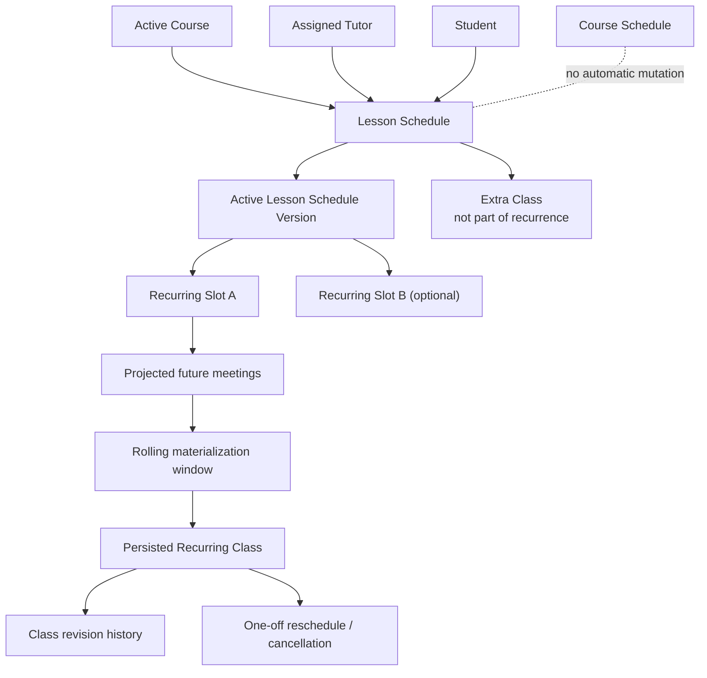

# Phase 4: Lesson Schedule and recurring meetings

**Contract phase:** 4 of 54  
**Status:** Final - approved product contract  
**Last updated:** 2026-07-20  
**Depends on:** [Kelp canonical domain glossary](domain-glossary.md), [Phase 2: Mentor-led Student intake](02-mentor-led-student-intake.md), and [Phase 3: Course design and curriculum Schedule](03-course-design-and-curriculum-schedule.md)  
**Applies to:** live-Class recurrence, initial scheduling, recurring Schedule changes, one-off exceptions, duration changes, Class projection, and Course-bound scheduling limits

## 1. Purpose

This contract defines how an assigned Student and Tutor establish and maintain the Lesson Schedule for live Classes.

It answers:

- how recurring meeting times are represented;
- how a Student selects the initial arrangement from the assigned Tutor's Availability;
- how Recurring Classes differ from Extra Classes and one-off reschedules;
- how moving a recurring series affects future ordinary Classes;
- how 30-, 60-, and 90-minute durations change;
- how timezones and daylight-saving transitions are handled;
- how Kelp distinguishes projected future meetings from persisted Classes;
- when a Lesson Schedule pauses or ends.

This Phase preserves the Phase 3 boundary:

- **Course Schedule:** what the Student studies and completes.
- **Lesson Schedule:** when live Classes are intended to occur.
- **Class:** one persisted live meeting event.

No change to one of these objects silently mutates either of the others.

## 2. Scope boundaries

### Included

- recurring Lesson Schedules for recurring tutoring;
- initial Schedule selection after Tutor Assignment;
- weekly recurring slots;
- Projected Meetings and Scheduled Classes;
- Extra Classes;
- one-off rescheduling and cancellation exceptions;
- moving all future ordinary Recurring Classes from an effective date;
- Class duration changes;
- timezone anchoring and daylight-saving behavior;
- Course, Tutor Assignment, and subscription effects on recurrence;
- high-level availability, conflict, and one-hour Tutor-buffer requirements;
- Independent Tutor externally billed recurrence.

### Excluded

- detailed Tutor Availability editing, date overrides, holidays, and Time Off, handled in Phase 16;
- complete Lesson Request forms, attachments, expiry, and competing-request workflow, handled in Phase 18;
- Student Lesson Credit lot allocation and top-ups;
- detailed six-hour Hold Window and cancellation entitlement accounting;
- Phase 11 attendance, completion, no-show, outage, and Authoritative Class Outcome rules, which remain outside Phase 4 but now govern live-session evidence; Tutor money settlement remains later;
- Group Course scheduling and cohort consent;
- calendar interface implementation and drag interactions;
- database tables, recurrence jobs, RLS, and APIs.

Phase 4 establishes the domain behavior those later contracts must implement without guessing.

## 3. Domain map

## 4. Phase 4 terms

These terms extend the canonical glossary and are canonical for this workflow.

### Lesson Schedule

The Course-scoped plan for recurring live meeting times between one Student and the assigned Tutor. It owns one or more Recurring Slots and their version history.

A Lesson Schedule is not a Course Schedule, Tutor Availability record, subscription, credit commitment, or collection of attendance records.

### Lesson Schedule Version

An immutable numbered snapshot of the recurring meeting arrangement. It records the Course, Student, Tutor, anchor timezone, Recurring Slots, effective date, predecessor, author, approvals, and change reason.

Every approved series-level change creates a successor Version. One-off Class exceptions do not rewrite the Lesson Schedule Version.

### Recurring Slot

One weekly rule inside a Lesson Schedule Version, such as every Tuesday at 15:00 for 60 minutes. A Course may have more than one Recurring Slot when the service plan permits multiple ordinary Classes per week.

The Student chooses how many weekly Slots to reserve for the Course within the applicable service and commercial limits. Every Slot has a planned Instruction Focus.

### Instruction Focus

The planned academic purpose of a Recurring Slot or Class. The initial values are `theory` and `problem_solving`.

### Theory Slot

A Recurring Slot whose planned Instruction Focus is `theory`. A Theory Slot must last 60 or 90 minutes. Every active recurring Lesson Schedule must contain at least one Theory Slot.

### Problem-Solving Slot

A Recurring Slot whose planned Instruction Focus is `problem_solving`. It may last 30, 60, or 90 minutes and does not advance the recurring Course's curriculum progression unless theory is actually delivered and validly recorded for that Class.

### Qualifying Theory Class

A completed 60- or 90-minute Class whose post-Class record confirms that theory was delivered. Only a Qualifying Theory Class advances the curriculum progression of a recurring tutoring Course. A 30-minute Class can never qualify as a Theory Class.

### Curriculum Progression Map

The derived link between expected Theory occurrences and the ordered Course Schedule steps they are intended to advance. It lets a Tuesday/Thursday Lesson Schedule pace the Course around one or both days without turning Classes into Course Schedule Items.

The Map refers to exact Course Schedule and Lesson Schedule Versions. It may update expected instruction dates when the Lesson Schedule changes, but it never rewrites Course Schedule content, planned windows, or Hard deadlines.

### Curriculum Progression Cursor

The Course Progress state identifying the next curriculum step for a recurring tutoring Course. It advances only after a Qualifying Theory Class. Problem-solving-only Classes, cancellations, no-shows, and projected meetings do not advance it.

### Recurrence Rule

The machine-readable rule used to project expected Class dates. Phase 4 supports weekly recurrence with one weekday, local start time, duration, Instruction Focus, start date, optional end bound, and anchor timezone per Recurring Slot. Biweekly and irregular recurrence are deferred.

### Schedule anchor timezone

The IANA timezone in which the Recurring Slot's local weekday and wall-clock time remain stable across daylight-saving changes. Other users see converted local times.

### Recurring occurrence

One expected instance generated conceptually by a Recurrence Rule. Before persistence it is only a projection. Once materialized, it is a Class.

This term exists to distinguish one instance of a series without creating a competing `Lesson` object.

### Projected Meeting

A read-only calendar preview computed from an active Lesson Schedule beyond the persisted booking window. It has an expected date, time, duration, Subject, Course, and Tutor, but is not a Class, Lesson Credit commitment, Hold, or Tutor earning.

### Scheduled Class

A persisted Class with a stable identity, authoritative timestamp, duration, participants, Course, Classroom, Subject, origin, and current scheduling state. A Scheduled Class may originate from recurrence, an Extra Class request, or a Standalone Class request.

### Materialization window

The rolling two-week future period in which projected Recurring occurrences become persisted Scheduled Classes after revalidation.

### Ordinary Recurring Class

A Scheduled Class that still follows the Recurring Slot that generated it and has not received a one-off time exception.

### Schedule exception

A one-Class departure from its generating recurrence, such as individual rescheduling, cancellation, or an approved holiday action. It does not alter the underlying Recurring Slot.

### Individually rescheduled Class

A Recurring Class whose date or time changes for that one meeting only. It retains its logical Class identity and revision history and is excluded from later bulk series moves unless the user explicitly selects it.

### Extra Class

A one-off additional Class outside the ordinary recurrence. It never becomes part of the Lesson Schedule merely because it occurs on a repeated weekday or time.

### Recurring Schedule move

A series-level change that replaces one or more Recurring Slots from an effective date. It affects future ordinary Recurring Classes but preserves Extra Classes and individually rescheduled Classes.

### Effective date

The date or instant from which a successor Lesson Schedule Version governs projected and eligible future ordinary Recurring Classes.

### Class revision

An immutable record of a scheduling change to one Class, such as old and new start time, duration, scheduling state, actor, reason, source request, and timestamp.

### Duration change

A change between the supported scheduled durations of 30, 60, and 90 minutes. It affects expected credit commitment and Tutor capacity but does not change the Course Subject or Course Schedule.

### Lesson Schedule pause

A temporary state that stops new recurrence materialization while preserving the Lesson Schedule and its history. The reason may be subscription freeze, approved Course action, Tutor replacement, or another later-defined condition.

### Lesson Schedule end

The permanent end of future recurrence generation because the Course, Tutor Assignment, or recurring service arrangement ended.

## 5. Service-path behavior

### Recurring tutoring

Requires an active Lesson Schedule before ordinary Recurring Classes can be generated. The Lesson Schedule may contain one or more approved weekly Recurring Slots.

The Student chooses the number of weekly Slots permitted by the service arrangement. At least one Slot must be a 60- or 90-minute Theory Slot. Additional Slots may be Theory or Problem-Solving Slots. If both Tuesday and Thursday are Theory Slots, the curriculum may advance twice that week; if only Tuesday is Theory and Thursday is problem solving, only the qualifying Tuesday Class advances it.

### On-demand tutoring

Has an assigned Tutor but no recurring Lesson Schedule. Every requested meeting becomes a Standalone or Extra-style one-off Class through the later Lesson Request workflow.

Its Course Schedule uses fixed generated planned windows and Hard deadlines. Booking, completing, rescheduling, or cancelling a Standalone Class does not advance or move those dates automatically. The Student requests Course Schedule changes through the assigned Tutor under Phase 3 authority and versioning.

### Access only

Has an assigned qualified Kelp Tutor for academic communication and Course-change requests, but no Lesson Schedule or Class-booking ability until a later tutoring Intake activates that service.

Its Course Schedule also uses fixed generated planned windows and Hard deadlines. Progress or elapsed time does not move those dates automatically; the Student requests changes through the assigned Tutor under Phase 3 authority and versioning.

### Independent Tutor service

May use a Lesson Schedule and the same recurrence model, but its Classes are externally billed. Projection and scheduling never create Kelp Lesson Credit commitments or Kelp Tutor payouts.

## 6. Actors and authority

### Student

The Student:

- selects the initial meeting arrangement from the assigned Tutor's valid Availability;
- may request or initiate a Recurring Schedule move;
- may book an Extra Class;
- may reschedule or cancel one Class subject to the later notice and entitlement rules;
- may request supported duration changes;
- sees every time converted to their confirmed timezone;
- cannot create Tutor Availability or schedule with an unassigned Tutor.

### Guardian

A Guardian sees the linked child's Lesson Schedule and Class states but remains read-only under the Phase 7 Guardian contract. Purchasing credits does not grant authority to change the child's academic calendar.

### Assigned Kelp Tutor

The Tutor:

- maintains Availability through the later Availability contract;
- sees the active Lesson Schedule and exceptions;
- receives notice of Student-initiated changes;
- may request a Schedule move, one-off reschedule, cancellation, or duration change;
- cannot silently impose a Tutor-initiated time or duration change on the Student;
- must maintain the one-hour buffer and avoid conflicts.

### Supervising Mentor

The Mentor is not required to approve ordinary Student scheduling inside valid Availability. They may review exceptions, Tutor replacement, Course-boundary issues, or requests outside standard policy.

### Quality Assistant

A Quality Assistant may review operational exceptions, support cases, repeated reliability issues, and schedule conflicts that cannot be resolved normally.

### Independent Tutor

Acts as Tutor and scheduling-service owner for their externally billed Course. The Student-facing recurrence and exception history remains auditable, but Kelp does not govern the private price.

## 7. Required inputs

Creating a recurring Lesson Schedule requires:

- active or activation-ready Course;
- recurring tutoring service path;
- trusted Student;
- active assigned Tutor;
- one Course Subject;
- Student and Tutor confirmed IANA timezones;
- Tutor Availability sufficient for every selected Slot;
- one-hour Tutor buffer around every Class;
- supported duration of 30, 60, or 90 minutes;
- one selected Instruction Focus per Recurring Slot;
- at least one 60- or 90-minute Theory Slot;
- recurrence start date;
- Course end date;
- commercial readiness from Phase 2;
- no blocking Tutor Time Off, accepted booking, or policy restriction.

The Lesson Schedule must not copy private unavailability reasons into Student-visible data.

## 8. Lesson Schedule structure

A Lesson Schedule identifies:

- stable Lesson Schedule ID;
- Course, Classroom after activation, Student, and Tutor;
- recurring service-plan reference;
- active, paused, or ended state;
- active Lesson Schedule Version;
- complete Version history;
- creation and end reasons;
- source Intake Case and Initial Schedule Selection;
- later pause and resume events.

Each Lesson Schedule Version identifies:

- Version number and stable ID;
- predecessor Version;
- Schedule anchor timezone policy;
- one or more Recurring Slots;
- effective date;
- Course end bound;
- actor and reason;
- Student approval when a Tutor initiated the change;
- server validation result;
- creation and activation timestamps.

Each Recurring Slot identifies:

- stable Slot ID;
- weekday in the anchor timezone;
- local start time;
- duration of 30, 60, or 90 minutes;
- planned Instruction Focus of `theory` or `problem_solving`;
- recurrence start date;
- optional Slot end date no later than the Course end date;
- active or ended state;
- originating selection or change request;
- Subject, Course, Tutor, and Classroom through the parent Schedule;
- display snapshots needed to explain history.

## 9. Timezone and daylight-saving behavior

A recurring wall-clock time must be anchored to exactly one IANA timezone. Storing only UTC time or a numeric offset is insufficient because offsets change.

The anchor is the Tutor's confirmed timezone because Availability, buffers, and overlapping Tutor commitments are governed there. The Student chooses from times displayed in the Student's timezone and sees a warning when a future daylight-saving transition will change their local display time.

For every materialized Class, Kelp stores the authoritative UTC start and end instants plus the source anchor timezone and local recurrence values.

If a jurisdiction changes its timezone rules, already persisted Classes retain their instants unless deliberately rescheduled. Future projections use the current timezone rules and surface material shifts before materialization.

Changing the Tutor through reassignment requires a new Tutor-scoped Lesson Schedule and therefore a new anchor review.

## 10. Initial Schedule selection

After Tutor Assignment, the recurring Student:

1. opens the assigned Tutor's calendar;
2. sees availability converted to the Student's timezone;
3. selects how many weekly Slots to reserve within the service limits, their weekday/time, supported duration, and Instruction Focus;
4. sees one-hour buffer effects, unavailable time, and known exceptions without private reasons;
5. reviews the anchor timezone and daylight-saving preview;
6. reviews the first expected Classes and commercial implications;
7. confirms the Initial Schedule Selection;
8. receives the first active Lesson Schedule Version and Curriculum Progression Map after atomic revalidation.

The Student never chooses from unassigned Tutors in this workflow.

A selection inside declared Tutor Availability becomes authoritative after atomic validation. Separate Tutor approval is not required because the Tutor already published that Availability. The Tutor is notified.

## 11. Projection and rolling materialization

The active Lesson Schedule can project expected recurring meeting dates through the Course end date. Projection is for calendar understanding only.

The contract is:

- project the recurrence through the Course end date;
- persist Scheduled Classes only inside a rolling two-week Materialization window;
- revalidate Tutor Assignment, service state, Availability exceptions, Course state, conflicts, one-hour buffer, and commercial capacity before materialization;
- materialize idempotently so retries cannot duplicate a Class;
- preserve a stable relationship to the Recurring Slot and expected date;
- copy the planned Instruction Focus to the Scheduled Class;
- link projected Theory occurrences to the Curriculum Progression Map;
- show why a projected meeting failed to materialize without revealing private Tutor information.

A Projected Meeting:

- does not reduce spendable Lesson Credit capacity;
- does not become held;
- cannot earn Tutor compensation;
- cannot be marked attended or completed;
- is clearly distinguished from a Scheduled Class in the calendar.

A Kelp-billed Scheduled Class requires the fully allocated Credit Commitment defined by Phase 10. Materialization must fail safely rather than create a negative balance, duplicate allocation, or overlapping booking.

Projected Meetings appear in the calendar with a visually distinct `planned` state and explanatory text. They become ordinary Scheduled Classes only inside the two-week window after validation; before then they consume no credits and cannot be opened as live meetings.

### Curriculum progression

Theory-gated curriculum progression applies only when Tutor and Student use a recurring weekly Lesson Schedule. After Initial Schedule Selection, Kelp derives a Curriculum Progression Map from the approved Course Schedule Version and Theory Slots. The map gives expected theory days to the Course pacing without changing the Course Schedule itself.

After each persisted Class:

- the Tutor's server-stored post-Class record identifies whether theory was actually delivered;
- a completed 60- or 90-minute Class with theory delivered becomes a Qualifying Theory Class;
- the Curriculum Progression Cursor advances the next mapped Course step exactly once and idempotently;
- a planned Theory Slot that delivered only problem solving does not advance the Cursor;
- a planned Problem-Solving Slot lasting 60 or 90 minutes may advance the Cursor if theory was actually delivered and recorded;
- a 30-minute Class, projected meeting, cancelled Class, no-show, or non-completed Class never advances the Cursor.

Cursor advancement is Course Progress. It does not edit the immutable Course Schedule Version, change Hard deadlines, or create a new academic-plan version.

On-demand tutoring and access only do not receive a Curriculum Progression Map or Cursor. Their planned windows and Hard deadlines are fixed when the Course Schedule Version is generated. A Standalone Class and ordinary progress updates do not advance, postpone, or otherwise move those dates. The Student must ask the assigned Tutor for a change; the Tutor routes or drafts the request under Phase 3, and only an authorized successor Course Schedule Version changes the dates.

## 12. One-off Class exceptions

### Individually reschedule one Class

The selected Class receives a revision with its new date and time. Its Recurring Slot does not change. The revised Class remains excluded from a later bulk Recurring Schedule move unless deliberately selected.

### Cancel one Class

The selected Class records cancellation and reason under later cancellation rules. The next ordinary Recurring Class still follows the Lesson Schedule.

### Add an Extra Class

The new Class is created through a one-off request. It has no generating Recurring Slot and is never moved by a later series change.

### Holiday or Time Off exception

The later calendar contract decides whether a projected recurrence is skipped, requires confirmation, or creates a rescheduling action. It must create an explicit exception and must not silently edit the Recurrence Rule.

### Technical or support exception

An operational correction creates an auditable Class revision or exception. It never rewrites historical calendar data in place.

## 13. Moving the recurring Schedule

When a recurring Student chooses a new time, Kelp must ask whether they intend to:

1. **Add an Extra Class**, leaving the recurring Lesson Schedule unchanged; or
2. **Move the recurring Lesson Schedule**, changing future ordinary Recurring Classes.

A Recurring Schedule move:

- creates a private successor Lesson Schedule Version;
- identifies the affected Recurring Slot or Slots;
- has an explicit effective date;
- shows an impact preview and affected Class count;
- revalidates Tutor Availability, conflicts, buffer, duration, Course end, and commercial state;
- preserves Extra Classes;
- preserves Individually rescheduled Classes;
- preserves already completed, ongoing, cancelled, or otherwise historical Classes;
- does not alter Course Schedule Items or deadlines;
- activates atomically.

An effective date cannot change a Class inside the six-hour Hold Window through ordinary Schedule movement. The user must either choose a later effective date or use the applicable late-change entitlement for the individual Class.

For ordinary future Recurring Classes already materialized outside the Hold Window, activation records Class revisions linking the old and new expected times to the successor Lesson Schedule Version.

## 14. Tutor- and Student-initiated changes

### Student-initiated

A Student selecting a valid free time inside the Tutor's declared Availability may establish or move their recurring arrangement after atomic validation. The Tutor is notified. Published Availability is an operational commitment and does not require the Tutor to approve the same free time twice.

### Tutor-initiated

A Tutor may request a new recurring time or duration, but the Student must approve it. No Class or series changes until approval and atomic revalidation succeed.

Tutor Time Off, emergency cancellations, and reliability consequences use their later dedicated contracts and do not grant a general power to rewrite the Student's Schedule.

## 15. Duration changes

Supported durations are 30, 60, and 90 minutes.

### Inside the six-hour Hold Window

Duration cannot change.

### Outside the Hold Window

- shortening a Class or Recurring Slot is permitted after conflict revalidation;
- lengthening is permitted only when the Tutor has adjacent Availability and the resulting end time plus one-hour buffer does not conflict;
- if adjacent time is unavailable, Kelp asks the Student to choose another available Tutor slot or move the Class to a time that accommodates the longer duration;
- a Student-initiated valid change does not require separate Tutor approval;
- a Tutor-initiated change requires Student approval;
- expected Lesson Credit commitment changes to 10, 20, or 30 credits for 30, 60, or 90 minutes;
- the prior duration remains in revision or Lesson Schedule Version history.

Changing one Class duration creates a Class revision and leaves the Recurring Slot unchanged. Changing the ordinary recurring duration creates a successor Lesson Schedule Version and affects future ordinary Classes from its effective date.

## 16. Subject and Course boundary

Each Lesson Schedule belongs to one Course, and each Course has one Subject. Therefore, changing a Class to a different Subject cannot silently leave it in the original Classroom.

The rule is:

- if the Student already has another active Course and Classroom for the requested Subject with the same assigned Tutor, the one-off Class may be moved to that Course after qualification, schedule, and commercial validation;
- otherwise, the Student needs a new Subject Intake and Course before booking that Subject;
- the Tutor and their sole Supervising Mentor must both be qualified for the requested Subject;
- the Class always retains exactly one Subject and one owning Course.

## 17. Course and recurrence boundary

The Lesson Schedule is Course-scoped.

- it cannot begin before the Course is activation-ready;
- ordinary recurring projection cannot extend beyond the Course end date;
- extending the Course permits a successor Lesson Schedule Version or extends its recurrence bound after revalidation;
- Course termination ends recurrence and cancels future Classes under Phase 1;
- Tutor reassignment ends the old Tutor's Lesson Schedule, cancels old-Tutor pending Lesson Requests and future Classes under Phase 6, and requires a new arrangement with the replacement Tutor;
- Course Schedule changes do not move Lesson Schedule times;
- Lesson Schedule changes do not move Course work or deadlines.

Ordinary recurrence stops at the Course end date. An explicitly requested Extra Class may occur during the 14-day wind-down only with Mentor or Quality Assistant authorization and valid credits. Its scheduled end must precede or equal the authoritative Course termination instant.

## 18. Lesson Schedule lifecycle

| State | Meaning |
| --- | --- |
| `draft` | Initial Slots or a successor Version are being prepared. |
| `validation_blocked` | Availability, conflict, buffer, Course, commercial, or policy validation failed. |
| `awaiting_student_approval` | A Tutor-initiated change needs the Student's decision. |
| `active` | The current Version projects and materializes Recurring Classes. |
| `paused` | New materialization is temporarily stopped, with reason and history preserved. |
| `superseded` | A successor Version replaced this Version. |
| `ended` | The recurring relationship permanently stopped. |
| `cancelled` | A Draft ended without becoming active. |

Only one Lesson Schedule Version is active for one Course and Tutor Assignment at a time. Activation of a successor and supersession of its predecessor occur atomically.

## 19. Conflict and buffer validation

Before activating a Lesson Schedule Version or materializing a Class, Kelp revalidates:

- active Tutor Assignment;
- supported duration;
- Tutor qualification and Supervising Mentor intersection;
- Tutor Availability and date-specific overrides;
- accepted Classes;
- Tutor Time Off and applicable holidays;
- one-hour buffer after the proposed Class and after any preceding Class;
- competing atomic writes;
- Course and subscription state;
- Student commercial capacity where applicable.

The Student sees only that time is unavailable, plus any later-approved pending-request count. They do not see another Student's identity or private reason.

The server is authoritative. Calendar paint, drag state, or a previously loaded Availability response cannot reserve a Slot.

## 20. Commercial and credit boundary

For Kelp-billed recurring Classes:

- a Projected Meeting creates no commitment;
- a successfully materialized Kelp-billed Scheduled Class requires the applicable fully allocated Phase 10 Credit Commitment;
- duration maps to 10, 20, or 30 Lesson Credits;
- insufficient commercial capacity prevents materialization and triggers the Phase 9 Payer-authorization and Phase 10 funding workflow; notification delivery remains later;
- the six-hour Hold begins only for a persisted eligible Class;
- Tutor earnings never arise from projection or scheduling alone.

For Independent Tutor Classes:

- the Lesson Schedule and Class history may exist in Kelp;
- no Kelp Lesson Credits are committed or charged;
- no Kelp Tutor accrual or payout is created;
- private pricing and payment remain outside Kelp.

## 21. Pause, subscription, and relationship effects

### Subscription freeze

The account-wide freeze triggered by three consecutive Student no-shows follows Phase 9: recurring materialization, billing, Automatic Top-ups, and Credit Lot expiration clocks pause; future recurring Classes receive the service-freeze outcome; and the Lesson Schedule remains preserved for possible reactivation. If unresolved for two months, the Course Service Arrangement becomes `on_demand` and the recurring Lesson Schedule ends without erasing history.

### Student subscription cancellation or pause

Future recurring service stops through the effective-dated Phase 9 Service Plan Change workflow. Projected Meetings stop materializing, eligible future Classes outside the Hold Window may be cancelled without reliability or entitlement effects, and Held, Ongoing, or completed Classes remain governed by their own contracts.

### Tutor Assignment termination

Ends the Lesson Schedule for that Tutor. Reassignment preserves the Course and Classroom but requires a new Tutor-scoped Lesson Schedule or on-demand readiness. The outgoing Schedule, pending Lesson Requests, and future Classes never transfer automatically to the replacement Tutor.

### Course extension

Does not silently extend recurrence. Kelp revalidates the active Tutor, service path, commercial state, and Slots before extending or replacing the Lesson Schedule bound.

### Service-path change

- recurring to on-demand ends future recurrence but keeps the Tutor Assignment;
- on-demand to recurring requires a new Initial Schedule Selection;
- access only cannot keep a Lesson Schedule;
- moving between Kelp-managed and Independent Tutor models never converts an active Course in place; Phase 9 requires wind-down and a linked successor Course, and old credit or private-payment history never converts.

## 22. Notification events

Phase 4 creates server-side Notification Events for at least:

- initial Lesson Schedule activated;
- Student time selection required;
- Tutor requested Schedule or duration change;
- Student approved or declined Tutor change;
- recurring Schedule moved;
- one Class individually rescheduled or cancelled;
- Extra Class added;
- duration changed;
- projected meeting could not materialize;
- Lesson Schedule paused, resumed, or ended;
- daylight-saving display change approaching;
- Tutor reassignment requires a new Schedule;
- Course extension requires recurrence review.

Email and Twilio SMS delivery remain later channel work.

## 23. Existing implementation boundary

The current Schedule Generator is primarily a curriculum Course Schedule prototype:

- its Modules and sessions represent planned learning content;
- its progress fields belong to Course Progress;
- its `meeting cadence` currently dates curriculum sessions;
- it does not represent Tutor Availability, recurring live-Class Slots, exceptions, credit commitments, or Class revision history.

Phase 4 requires a separate Lesson Schedule domain. Later architecture must not rename `learning_schedules` into live recurrence without reconciling their existing curriculum meaning.

The Student dashboard calendar may eventually merge:

- Course Schedule Items and deadlines;
- Projected Meetings;
- persisted Scheduled Classes;
- holidays and Time Off visibility;
- personal display preferences.

Merging for display never merges their source records or lifecycle rules.

## 24. Phase 4 invariants

1. A Lesson Schedule is Course-scoped and Tutor-Assignment-scoped.
2. A Course Schedule and Lesson Schedule are separate authoritative records.
3. A Recurring Slot is a rule; a Class is one persisted meeting.
4. A Projected Meeting is not a Class, credit commitment, Hold, attendance record, or Tutor earning.
5. Every Scheduled Class has a stable identity and revision history.
6. One-off rescheduling does not change the Recurring Slot.
7. Cancelling one Class does not cancel the recurring series.
8. An Extra Class never becomes part of recurrence automatically.
9. Moving recurrence preserves Extra and individually rescheduled Classes.
10. Every series-level change creates an immutable Lesson Schedule Version.
11. Only one Version is active for one Course and Tutor Assignment at a time.
12. Effective-date activation and prior-Version supersession are atomic.
13. The Tutor's one-hour buffer applies to every materialized Class.
14. Only 30-, 60-, and 90-minute durations are supported.
15. Duration cannot change inside the six-hour Hold Window.
16. Student-initiated lengthening requires adjacent Availability and buffer capacity.
17. Tutor-initiated time or duration changes require Student approval.
18. Lesson Schedule projection never extends beyond the Course recurrence bound.
19. Course termination ends recurrence and cancels future Classes.
20. Tutor reassignment preserves the Course but requires a new Tutor-scoped Schedule.
21. A Class remains owned by exactly one Course and one Subject.
22. Tutor and Supervising Mentor qualifications must cover the Class Subject.
23. No calendar UI state is authoritative for Slot reservation.
24. Conflict checks and materialization are server-authoritative and idempotent.
25. Projected Meetings do not consume Lesson Credits.
26. Independent Tutor recurrence is externally billed and creates no Kelp credit or payout entries.
27. Guardian visibility remains read-only.
28. Class changes do not silently alter Course Schedule Items or deadlines.
29. Course Schedule changes do not silently book or move Classes.
30. Every displayed time identifies or derives from an IANA timezone.
31. The Student chooses the number of weekly Recurring Slots within the service and commercial limits.
32. Every Recurring Slot has a planned Instruction Focus of `theory` or `problem_solving`.
33. Every active recurring Lesson Schedule has at least one Theory Slot, and every Theory Slot lasts 60 or 90 minutes.
34. A 30-minute Class never qualifies as theory and never advances the Curriculum Progression Cursor.
35. Only a completed 60- or 90-minute Class with theory actually delivered advances recurring Course progression.
36. Problem-solving-only Classes, projected meetings, cancellations, and no-shows do not advance the Cursor.
37. Cursor advancement is idempotent Course Progress and never mutates the Course Schedule Version.
38. The Curriculum Progression Map references exact Course Schedule and Lesson Schedule Versions.
39. Theory-gated curriculum progression applies only to a recurring weekly Lesson Schedule.
40. On-demand and access-only Courses use fixed generated Course Schedule dates and have no Curriculum Progression Map or Cursor.
41. A Standalone Class never advances, postpones, or moves fixed Course Schedule dates automatically.
42. A Student requests a fixed Course Schedule date change through the assigned Tutor, and only an authorized successor Course Schedule Version changes it.
43. A wind-down Extra Class may not end after the authoritative Course termination instant.
44. Course-end cancellation of a pending Lesson Request or future Class consumes no late-change entitlement, creates no Tutor-reliability incident, and creates no attendance, Lesson Credit charge, or Tutor compensation.
45. Ordinary Tutor reassignment cannot become effective during an ongoing Class.
46. Reassignment cancellation of an outgoing-Tutor pending Lesson Request or future Class consumes no late-change entitlement and creates no Tutor-reliability, attendance, Lesson Credit, or compensation event.
47. An outgoing Tutor's Lesson Schedule, pending Lesson Requests, and future Classes never transfer automatically to the replacement Tutor.
48. A replacement Tutor requires new Initial Schedule Selection or explicit on-demand or access-only readiness after Assignment activation.

## 25. Approved Phase 4 decisions

1. Recurrence is weekly. The Student chooses the number of weekly Slots within service limits and assigns each a Theory or Problem-Solving focus. At least one Slot is Theory; Theory Slots last 60 or 90 minutes. Only completed Classes where theory was actually delivered advance recurring Course progression. On-demand and access-only Courses instead retain their generated fixed dates until an authorized Tutor-routed Course Schedule change is approved.
2. Each Slot is anchored in the Tutor's confirmed IANA timezone, with converted Student times and daylight-saving warnings.
3. Meetings are projected through the Course end date but persisted and credit-committed only inside a rolling two-week window.
4. A Student's selection or move inside published Tutor Availability becomes authoritative after atomic validation without separate Tutor approval.
5. Every Tutor-initiated time or duration change requires Student approval.
6. A Recurring Schedule move affects only future ordinary Classes outside the Hold Window and preserves Extra, individually rescheduled, and historical Classes plus Course deadlines.
7. An individually rescheduled Class keeps one logical Class ID with append-only revisions.
8. Ordinary recurrence stops at the Course end date; an Extra Class during wind-down requires Mentor or Quality Assistant authorization, valid credits, and an end no later than the authoritative Course termination instant.
9. A different-Subject Class moves to another valid Course with the same Tutor or requires a new Subject Intake; it never stays under the wrong Course.
10. Duration cannot change inside six hours. Outside six hours, shortening is allowed; lengthening requires adjacent Availability and buffer; Student changes activate after validation, while Tutor changes require Student approval.
11. Cancelling one Class never changes recurrence; moving or ending the series is a separate explicit action.
12. Projected Meetings display a distinct `planned` state, consume no credits, and cannot open as live meetings.

## 26. Phase 4 completion and Phase 5 boundary

Phase 4 is final and authoritative.

Phase 7 now governs the relationship-scoped authority used for Student, Guardian, Tutor, Mentor, Quality Assistant, Independent Tutor, Support, and Administrator scheduling actions. Workspace selection never changes this Schedule authority.

Phase 5 defines Course wind-down, termination, and exam-dismissal mechanics without reopening recurrence identity, exception behavior, or theory-gated curriculum progression.

Phase 9 now governs the Account subscription, Course Service Arrangement, plan transition, no-show freeze, and service-model conversion states consumed by this Schedule contract.

Phase 10 now governs class-time spendable capacity, Credit Commitments, the six-hour Hold conversion, releases, and settlement inputs. Phase 4 supplies schedule identity and timing but never derives credit authority from calendar or browser state.

Phase 11 now consumes the persisted Class identity, current revision, scheduled start, and approved duration to create the Class Session, time anchors, Joint Attendance, completion result, no-show result, and Clean Completion or Course Progress inputs. It never changes the Lesson Schedule or Class revision merely because actual attendance differs from the schedule.
