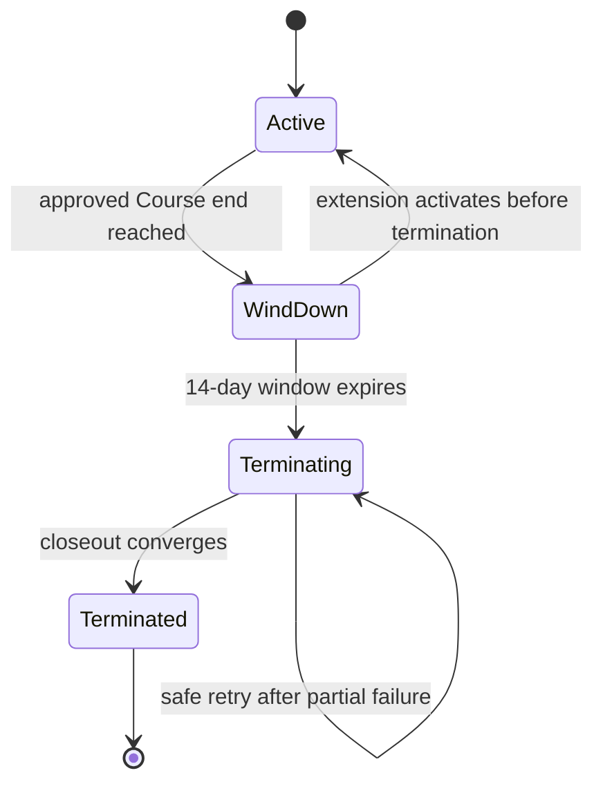
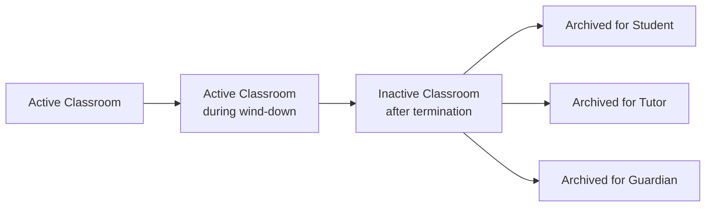

# Phase 5: Course wind-down, termination, and archival

**Contract phase:** 5 of 54

**Status:** Final - approved product contract

**Last updated:** 2026-07-20

**Depends on:** [Kelp canonical domain glossary](domain-glossary.md), [Phase 2: Mentor-led Student intake](02-mentor-led-student-intake.md), [Phase 3: Course design and curriculum Schedule](03-course-design-and-curriculum-schedule.md), and [Phase 4: Lesson Schedule and recurring meetings](04-lesson-schedule-and-recurring-meetings.md)

**Applies to:** normal Course end, 14-day wind-down, Course extension, automatic termination, academic-work closure, final Report Card generation, Classroom inactivation, historical access, and per-member archival

## 1. Purpose

This contract defines how an active Course stops producing new ordinary work, remains available for an orderly 14-day closeout, terminates automatically, and becomes an inactive Classroom that authorized members may archive.

It answers:

- when wind-down begins and ends;
- which actions remain allowed during wind-down;
- how an authorized extension prevents termination;
- how future Classes, Lesson Requests, Assignments, Exams, and Course Progress close;
- how the mandatory final Report Card is produced;
- when Tutor Assignment and Classroom Membership authority changes;
- what remains readable after termination;
- how archival differs from termination, deletion, and retention.

Phase 5 does not redefine Course design, Lesson Schedule recurrence, credits, Tutor payout, grading formulas, support-case adjudication, or legal deletion periods.

## 2. Contract authority

The product owner approved all ten Phase 5 recommendations on 2026-07-20. Rules labeled Settled were inherited from earlier approved contracts; rules labeled Approved were settled in this phase. Both are authoritative.

Items labeled Deferred remain explicit boundaries owned by later contracts and must not be guessed during implementation.

## 3. Settled product rules

The following rules are already approved:

1. The approved Course end date begins a 14-day wind-down; it does not immediately terminate the Course.
2. The Course, Classroom, and Course-scoped Tutor Assignment remain active during wind-down.
3. Active and wind-down Classrooms cannot be archived by anyone.
4. Ordinary recurring Classes stop at the Course end date.
5. An Extra Class during wind-down requires Mentor or Quality Assistant authorization and valid Lesson Credits.
6. A Mentor or Quality Assistant may extend a Kelp-managed Course during wind-down.
7. Extension preserves the Course, Classroom, Tutor Assignment, and Assessment evidence; creates a successor Course Schedule Version; and restarts wind-down from the new end date.
8. Automatic termination occurs when the 14-day wind-down ends without an approved extension.
9. Automatic termination terminates the Course-scoped Tutor Assignment.
10. Incomplete Assignments are cancelled.
11. An owed and unsubmitted Exam is dismissed as `dismissed_due_to_course_end`, is not scored as zero, and is excluded from grade calculations.
12. Pending Lesson Requests and future Classes are cancelled.
13. A mandatory final Report Card is generated automatically from the entire Course's underlying grade records rather than by averaging monthly Report Cards.
14. The Classroom becomes inactive and eligible for per-member archival only after Course termination.
15. The Classroom and its authorized historical content are retained for at least two years under the current provisional retention rule.
16. Archived Report Cards remain downloadable while the Classroom record and the viewer's authorization remain available.
17. Archival is a per-membership presentation preference. It is not deletion and does not alter another member's view.
18. Tutor reassignment preserves the Course and Classroom and is not Course termination.

## 4. Scope boundaries

### Included

- scheduled Course end;
- normal and approved-early end dates;
- Course wind-down lifecycle;
- extension during wind-down;
- automatic termination orchestration;
- closure states for unfinished academic work;
- termination effects on Lesson Schedule and Class operations;
- final Report Card lifecycle boundary;
- Classroom active, inactive, and archived presentation states;
- historical visibility and downloads;
- audit, notification, retry, and idempotency requirements.

### Deferred

- exact grading and rounding algorithms beyond already approved Report Card rules;
- late-work penalties before Course end;
- money-refund formulas, processor deductions, and provider execution; Phase 9 governs subscription effects and Phase 10 governs credit expiration, release, reversal, and refund allocation;
- misconduct, safeguarding, legal-hold, and emergency-access restrictions;
- full support-case state machines;
- permanent deletion and jurisdiction-specific retention schedules;
- notification channel delivery through Twilio, email, or another provider;
- database tables, API endpoints, background-job technology, and frontend implementation.

## 5. Canonical lifecycle

The Classroom presentation lifecycle follows the Course lifecycle:

Archiving one Membership does not move the Classroom or any other Membership to an archived state.

## 6. Authoritative dates and clocks

### Settled

- The Course end date belongs to an exact approved Course Schedule Version.
- Course dates use the Student's confirmed IANA timezone.
- Extension creates a successor Course Schedule Version with a new end date.
- Browser clocks and client-generated completion flags are never authoritative.

### Approved deterministic boundary

The Course enters wind-down at `00:00` on the calendar day immediately after the Course end date in the Student's confirmed timezone. Automatic termination becomes due at the same local boundary 14 calendar days later.

The server stores the derived instants and the timezone used to calculate them. A later timezone Profile change does not silently move an already-approved wind-down or termination instant; changing it requires an authorized Course correction.

This definition avoids treating the Course end date as ending at an ambiguous browser-local instant.

## 7. Entering wind-down

Entry must be server-authoritative and idempotent. It records:

- Course identifier;
- governing Course Schedule Version;
- Course end date and Student timezone;
- wind-down start and scheduled termination instants;
- active Tutor Assignment;
- service and progression mode;
- actor or system event that established the end date;
- whether the end is normal or an approved early completion;
- an immutable lifecycle event.

On entry:

- ordinary recurrence stops;
- no new ordinary Recurring Class may materialize;
- Projected Meetings after the Course end disappear from the active calendar as recurrence output;
- the Course and Classroom remain active;
- the Tutor Assignment remains active;
- all authorized members receive a wind-down Notification Event;
- the assigned Tutor receives a closeout checklist for grades, comments, and final reporting inputs.

## 8. Wind-down capabilities

The following matrix separates inherited Settled behavior from behavior Approved in Phase 5. Every row is authoritative.

| Capability | Student | Guardian | Assigned Tutor | Mentor / Quality Assistant | Status |
| --- | --- | --- | --- | --- | --- |
| Read Classroom history and materials | Yes | Read-only | Yes | Within scope | Settled |
| Archive the Classroom | No | No | No | No | Settled |
| Generate ordinary Recurring Classes | No | No | No | No | Settled |
| Request an Extra Class | Request only | No academic action | Participate in review | Authorize | Settled |
| Grade submitted work | No | No | Yes | Oversight | Approved |
| Add final Tutor comments | No | No | Yes | Oversight | Approved |
| Post in existing Forum threads | Yes | Read-only | Yes | Within scope | Approved |
| Submit existing work | Only when still open or explicitly reopened | No | Controls permitted reopening | Exception oversight | Approved |
| Create new required Assignments or Exams | No | No | No | Exception only | Approved |
| Prepare final Report Card draft | View when authorized | View | Edit Tutor inputs | Oversight | Approved |
| Extend Course | Request only | Request only | Request only | Approve | Settled for Kelp-managed Courses |

Phase 7 governs the relationship scope behind this matrix. The combined Mentor / Quality Assistant column does not make their capabilities identical: the Supervising Mentor holds ordinary academic authority, while a Quality Assistant acts through assigned oversight or explicit Temporary Intervention Scope.

### Approved closeout rule

Wind-down is for finishing and reviewing already-authorized Course work, not adding a new academic commitment. A Tutor may reopen existing work during wind-down when the reopening does not move the Course end date or create work after the termination instant. A new required Assignment, Project, or Exam requires a Course extension rather than being inserted into wind-down.

## 9. Extension during wind-down

### Kelp-managed Course

Only the Course's Mentor or an authorized Quality Assistant may approve an extension. The Student, Guardian, or Tutor may request it but cannot activate it.

An approved extension:

- must activate before the scheduled termination instant;
- creates an immutable successor Course Schedule Version;
- records reason, requester, approver, and timestamps;
- keeps the same Course and Classroom;
- extends the Tutor Assignment automatically;
- preserves Course Progress and all prior Schedule Versions;
- does not require a new Assessment;
- revalidates the service path, Tutor eligibility, and commercial readiness;
- updates the Lesson Schedule recurrence bound under Phase 4;
- supersedes the pending termination job idempotently;
- derives a new wind-down and termination boundary from the successor end date;
- requires acknowledgment when Phase 3 classifies the change as Material.

### Independent Tutor Course

The Independent Tutor may approve an extension to their own Course after structural, date, membership, and service validation. Kelp does not create lesson-payment or payout effects for that extension.

### After termination

A terminated Course cannot be extended or silently reactivated. Continued study uses a successor Course linked to the prior Course. A Quality Assistant may correct an erroneous system transition through an explicit administrative reversal record, never by deleting lifecycle history.

## 10. Automatic termination orchestration

Termination must be idempotent and converge safely when a worker or downstream operation fails. One Course can have at most one effective termination transition.

The server-authoritative closeout performs these logical steps:

1. lock or serialize the Course lifecycle transition;
2. revalidate that no successor Course Schedule Version extended the Course;
3. record `terminating` and the immutable termination reason;
4. stop Lesson Schedule materialization and end the active Lesson Schedule;
5. cancel pending Lesson Requests owned by the Course;
6. cancel future Scheduled Classes owned by the Course;
7. close unfinished academic work using the Phase 5 closure matrix;
8. create or finalize the final Report Card workflow;
9. terminate the Course-scoped Tutor Assignment;
10. convert active Classroom Memberships to the applicable historical access state;
11. mark the Course `terminated` and Classroom `inactive`;
12. emit report-ready, termination, and archive-eligibility Notification Events;
13. retain a complete append-only audit of every successful, skipped, failed, and retried step.

The implementation may use one database transaction or an idempotent orchestration process, but partial failure must never duplicate cancellation events, reports, or notifications.

## 11. Operational cancellation at termination

### Pending Lesson Requests

Every pending Lesson Request owned by the terminating Course becomes `cancelled_due_to_course_end`. The cancellation is system-authored, retains its original request and files under the applicable retention rule, and cannot be accepted afterward.

### Future Classes

Every future Scheduled Class owned by the Course becomes `cancelled_due_to_course_end`. The cancellation:

- does not consume a Student late-change entitlement;
- does not count against Tutor reliability;
- does not create attendance, a Lesson Credit charge, or Tutor compensation;
- preserves the Class identity and scheduling revision history;
- creates a Notification Event for affected members.

Kelp must refuse an Extra Class whose scheduled end would cross the Course termination instant. This prevents automatic termination from colliding with a legitimate ongoing Class.

### Historical Classes

Completed, cancelled, no-show, and incident-reviewed Classes remain in Lesson History. Termination never rewrites their attendance, credit, payout, or incident records.

## 12. Academic-work closure matrix

| Work state at termination | Termination result | Grade effect | Approval status |
| --- | --- | --- | --- |
| Completed and graded work | Preserve | Included normally | Settled |
| Incomplete Assignment | `cancelled_due_to_course_end` | No new grade created by termination | Settled |
| Owed, unsubmitted Exam | `dismissed_due_to_course_end` | Excluded; never converted to zero | Settled |
| Required unfinished non-assessed Item | `not_completed_at_course_end` | None unless another approved grading rule applies | Settled |
| Optional unfinished Item | `expired_optional` | None | Settled |
| Submitted but ungraded Assignment, Project, or Exam | `awaiting_final_review` | Must not become zero automatically | Approved |
| Work under an open academic correction | Preserve correction state and escalate | No invented result | Approved |

The closure event stores the governing Course Schedule Version, Work identifier, prior state, terminal state, effective timestamp, and reason.

### Approved ungraded-work rule

Submitted work awaiting a Tutor grade does not keep the Course operationally active. The Course terminates on time, while the final Report Card enters `pending_final_review`. Kelp alerts the Tutor, Mentor, and Quality Assistant. The report becomes final only after the work is graded or an authorized reviewer records a justified exclusion.

This prevents a missing staff action from extending Classroom activity indefinitely or assigning an unfair automatic zero.

## 13. Final Report Card lifecycle

### Settled calculation boundary

The final Report Card:

- is Course-wise;
- covers the entire Course;
- uses underlying graded Homework, Projects, Exams, and Participation records;
- uses the approved category weights and proportionally renormalizes categories with no grades;
- normalizes Participation from 0-5 to 0-100;
- does not average monthly Report Cards;
- excludes dismissed Exams from the grade calculation;
- remains downloadable while authorized historical access exists.

### Approved record and publication model

During wind-down, Kelp maintains a final Report Card draft sourced from authoritative grade records. Students and Guardians may see the draft because Guardian visibility includes report drafts. The assigned Tutor may complete Tutor comments and review the inputs.

At termination:

- if every required grade input is resolved, Kelp generates and publishes Final Report Card Version 1 automatically;
- if submitted work remains ungraded, Kelp creates the report in `pending_final_review` rather than inventing a grade;
- the Course may still terminate and the Classroom may still become inactive;
- report completion continues through a separately auditable closeout task.

Each published Report Card Version is immutable. Its downloadable PDF is a snapshot of that exact Version. A correction creates a successor Report Card Version and PDF while preserving the prior one and the correction reason.

The Tutor may edit their Report Card comment for two hours after initial publication. Because every published Version is immutable, an edit creates a successor Version even inside that window. Silent replacement is forbidden.

## 14. Tutor Assignment and membership effects

At termination:

- the active Course-scoped Tutor Assignment ends with `course_terminated`;
- every prior Tutor Assignment period and reassignment Handoff Snapshot remains historical and unchanged;
- the Tutor's active Classroom Membership becomes historical;
- the Student Membership becomes historical but remains the Student's own Course record;
- verified Guardian Memberships remain child-scoped and historical;
- Mentor and Quality Assistant access remains role-, scope-, and purpose-constrained;
- authored Posts, Files, grades, comments, and reports retain original attribution;
- termination does not delete the Student, Tutor, Guardian Relationship, Account, or another Course relationship.

### Approved former-Tutor boundary

A former Tutor may read the historical Classroom content from their effective Assignment period, download Course records they were already authorized to use, and respond to an authorized quality or support review. Their view remains bounded by the applicable reassignment or termination snapshot. They do not retain access to the Student's changing live Profile, unrelated Courses, new Tutor relationships, ordinary post-cutover activity, or post-termination private data outside that preserved snapshot.

## 15. Inactive Classroom behavior

### Settled

After termination, the Classroom is inactive. It remains the same persistent Course hub and is not copied into an archive object.

Active scheduling surfaces no longer show the terminated Course's Classes or requests. Historical meeting information remains available through Lesson History inside the Classroom.

### Approved read-only boundary

The inactive Classroom is read-only for ordinary Student, Guardian, and former-Tutor collaboration:

- Forum history remains readable but ordinary new Posts and replies are disabled;
- Assignments, submissions, grades, and feedback remain readable;
- authorized Files remain previewable and downloadable;
- Course materials and Overview remain readable;
- Lesson History remains readable;
- monthly and final Report Cards remain readable and downloadable;
- Live Classroom entry is disabled;
- new Lesson Requests, Classes, Assignments, submissions, and academic edits are disabled.

New disputes, correction requests, complaints, praise, refunds, or transfer requests use the Support Case system instead of mutating the historical Classroom.

## 16. Per-member archival

Archival is allowed only after the Classroom becomes inactive.

Each Student, Guardian, Tutor, Mentor, or Quality Assistant Membership with continuing historical access may independently:

- archive the Inactive Classroom;
- remove it from the default Classroom-card and active navigation views;
- find it through an Archived Classrooms view;
- restore it to their visible inactive list;
- retain the same read authorization before and after archive.

Archival:

- does not delete or anonymize anything;
- does not alter another member's archive preference;
- does not shorten retention;
- does not remove Report Card or file download rights;
- does not recreate calendar events;
- does not reactivate the Course, Classroom, Tutor Assignment, or Lesson Schedule.

## 17. Retention and deletion boundary

### Settled provisional minimum

The Course, Classroom, academic history, accepted Class files, and Report Cards remain stored for at least two years. The minimum clock begins at the effective Course termination instant.

Per-member archival does not affect the clock.

### Deferred legal/accounting policy

Phase 5 does not authorize automatic deletion at the two-year boundary. A later retention contract must decide:

- which content is deleted, anonymized, or retained longer;
- legal-hold and safeguarding exceptions;
- accounting, tax, payment, and chargeback records;
- identity snapshots needed to explain historical transactions;
- data-subject deletion requests;
- Independent Tutor export and retention obligations;
- what remains after Account deletion.

Until that contract is approved, two years is a minimum retention period, not an automatic purge deadline.

## 18. Manual, premature, and exceptional endings

Tutor reassignment does not terminate a Course. It replaces the Tutor Assignment while preserving the Course and Classroom.

Phase 9 subscription pause or cancellation may pause or cancel scheduled Classes through an effective-dated Service Plan Change, but it does not silently terminate the Course. Ending Student platform access requires an explicit continuity or early-ending outcome for every affected active Course, and Course termination still requires the authorized effective end date and reason defined here.

### Approved default

A voluntary early Course ending approved before its current end date creates a successor Course Schedule Version with an earlier end date and then follows the ordinary 14-day wind-down.

Safety, misconduct, fraud, legal restriction, or compromised-account cases may require immediate access restriction. That restriction is not ordinary archival and must use explicit administrative authority, reason codes, audit events, and Support Case linkage. The detailed incident policy is deferred.

## 19. Independent Tutor boundary

An Independent Tutor Course may use the same Course, wind-down, final-report, Classroom, historical-access, and archival structures.

It differs in these respects:

- the Independent Tutor is not a Kelp staff Tutor and has no Kelp Supervising Mentor;
- lesson billing, refunds, chargebacks, and Tutor payout are external to Kelp;
- Kelp creates no Lesson Credit or Tutor-earning entries for termination cancellation;
- the Independent Tutor owns ordinary academic approval for their Student-specific Course;
- Quality Assistants may investigate conduct, safety, platform misuse, or academic-quality complaints without adjudicating the private lesson payment.

## 20. Notifications

Phase 5 creates server-side Notification Events for at least:

- Course entering wind-down;
- closeout action required from Tutor;
- unfinished or ungraded work reminder;
- extension requested, approved, or declined;
- scheduled Course termination approaching;
- pending Lesson Request cancelled due to Course end;
- future Class cancelled due to Course end;
- Course terminated;
- final Report Card ready or pending final review;
- Classroom eligible for archival;
- corrected final Report Card Version published.

Notification preferences and later email or Twilio SMS delivery do not replace the authoritative in-app event and audit history. Later notification contracts may identify critical messages that cannot be disabled.

## 21. Data and audit requirements

The conceptual lifecycle must retain:

- Course and Classroom identifiers;
- governing Course Schedule Version;
- service path and Course Progression Mode;
- Student timezone used for lifecycle instants;
- Course end, wind-down start, and scheduled termination instants;
- extension request and decision history;
- Tutor Assignment and Membership transitions;
- Lesson Schedule end reason;
- every cancelled Lesson Request and Class identifier;
- every academic-work prior and terminal state;
- final Report Card source cutoff, status, and Versions;
- archive preference per Membership;
- lifecycle job idempotency keys, attempts, and failures;
- actor, authority, reason, timestamp, and Support Case link for privileged actions;
- Notification Events.

Lifecycle, cancellation, closure, report, membership, and archive events are append-only. Corrections create new events or Versions and do not rewrite the original actor or decision.

## 22. Authorization requirements

- Student and Guardian requests never directly activate Course extension or termination.
- A Kelp Tutor may request an extension or early end but cannot approve it for their Kelp-managed Course.
- The Supervising Mentor or Quality Assistant may approve a Kelp-managed extension within scope.
- An Independent Tutor may approve ordinary extension or early end for their own Course, subject to structural validation.
- Only a server-authoritative lifecycle process may perform automatic termination.
- Only inactive Classroom Memberships may set archive preferences.
- Historical access is derived from Membership and role scope, never from possession of an identifier or archived-card URL.
- Report correction and administrative reversal require explicit authority, reason, and audit history.

## 23. Failure and recovery requirements

The lifecycle must tolerate retries and partial downstream failure.

- Repeating wind-down entry does not create a second wind-down period.
- Repeating cancellation does not duplicate refunds, credit events, reliability events, or notifications.
- Repeating academic closure does not overwrite a later authorized grade or correction.
- Repeating final-report generation does not create multiple Version 1 records.
- Repeating termination does not end an already superseded Tutor Assignment twice.
- An extension racing termination wins only if its authorized successor Course Schedule Version became effective before the termination boundary and lifecycle lock.
- A report-rendering failure must not silently return the Course to active state.
- Every unresolved closeout failure appears in an operational queue with an owner and audit trail.

## 24. Phase 5 invariants

The following invariants are authoritative:

1. A Course end date begins wind-down and does not immediately archive or delete the Classroom.
2. Wind-down lasts 14 calendar days unless an authorized extension activates first.
3. Active and wind-down Classrooms cannot be archived by anyone.
4. Ordinary recurrence stops at the Course end date.
5. An approved wind-down Extra Class does not become recurrence.
6. Extension preserves the Course, Classroom, Assessment evidence, and progress history.
7. Every extension creates a successor Course Schedule Version.
8. A terminated Course cannot be silently reactivated.
9. Automatic termination is server-authoritative and idempotent.
10. Course termination ends its Course-scoped Tutor Assignment.
11. Tutor reassignment does not terminate the Course.
12. Pending Lesson Requests and future Classes are cancelled at termination without late-change or Tutor-reliability penalties.
13. Historical Class financial and attendance records are never rewritten by Course termination.
14. An incomplete Assignment is cancelled rather than converted into a new grade.
15. An owed unsubmitted Exam is dismissed and excluded rather than scored as zero.
16. Required unfinished non-assessed work and optional unfinished work retain distinct terminal states.
17. Submitted ungraded work never becomes an automatic zero.
18. The final Report Card uses Course-wide underlying records and never averages monthly Report Cards.
19. A published Report Card Version and its PDF snapshot are immutable.
20. Report-generation failure does not keep the Course active indefinitely.
21. Course termination makes the Classroom inactive, not deleted.
22. Inactive Classroom collaboration is read-only unless a later authorized correction workflow applies.
23. Archival belongs to one Membership and never changes another member's view.
24. Archival does not alter access authority, retention, or Course lifecycle.
25. Active calendar surfaces do not show terminated Course operations; Lesson History preserves historical meetings.
26. Historical access never grants a former Tutor access to the Student's changing live Profile or unrelated Courses.
27. Classroom retention is at least two years and archival does not shorten it.
28. Two years is not an automatic deletion instruction until the retention contract is approved.
29. Independent Tutor termination creates no Kelp lesson-payment, Lesson Credit, or Tutor-payout event.
30. Every privileged lifecycle action records actor, authority, reason, time, and immutable history.

## 25. Approved Phase 5 decisions

The product owner approved all ten recommendations on 2026-07-20.

### Approved decision 1: exact wind-down clock

Enter wind-down at `00:00` on the day after the Course end date in the Student's timezone and terminate at the same boundary 14 calendar days later.

### Approved decision 2: allowed collaboration during wind-down

Keep existing Forum threads writable by Student and Tutor; allow grading, comments, and explicitly reopened existing submissions; prohibit new required work unless the Course is extended.

### Approved decision 3: submitted but ungraded work

Never assign zero automatically. Terminate the Course on time, mark the final report `pending_final_review`, and escalate to Tutor, Mentor, then Quality Assistant until the work is graded or explicitly excluded.

### Approved decision 4: final Report Card versions

Make every published report and PDF an immutable snapshot. Corrections create successor Versions. Preserve the Tutor's already approved two-hour comment-edit window with revision history.

### Approved decision 5: historical Classroom interaction

Make the inactive Classroom read-only for Student, Guardian, and former Tutor. Route new conversations and disputes through Support Cases.

### Approved decision 6: who may archive

Allow every member with continuing historical access to archive and restore only their own Inactive Classroom Membership view. Never allow archival while active or in wind-down.

### Approved decision 7: retention clock

Start the provisional two-year minimum at Course termination and explicitly defer automatic deletion until legal and accounting review.

### Approved decision 8: voluntary early ending

An approved voluntary early ending sets an earlier Course end date through a successor Schedule Version and then uses the ordinary 14-day wind-down. Immediate lockout is reserved for separately audited safety, misconduct, fraud, or legal exceptions.

### Approved decision 9: Independent Tutor extension authority

Allow the Independent Tutor to approve extension of their own Course after Kelp structural validation, with no Kelp lesson-payment effects.

### Approved decision 10: termination/report failure boundary

Do not keep the Course active because a report render or remaining grade failed. Terminate operational access on schedule, preserve a visible pending closeout state, and retry under staff oversight.

## 26. Phase 5 completion and handoff

Phase 5 is final and authoritative. Phase 7 governs the Role Assignments and relationship-scoped authority used during wind-down and closeout. Phase 9 governs subscription, Course Service Arrangement, and service-model transition effects without replacing this Course lifecycle. Phase 10 governs the credit-side release, expiration, reversal, restriction, and refund-allocation consequences produced by termination outcomes. Later phases must consume these contracts rather than infer lifecycle, credit, or authority state from calendar or dashboard UI state.

No database, API, payment, notification-provider, or frontend implementation is authorized by this contract.
