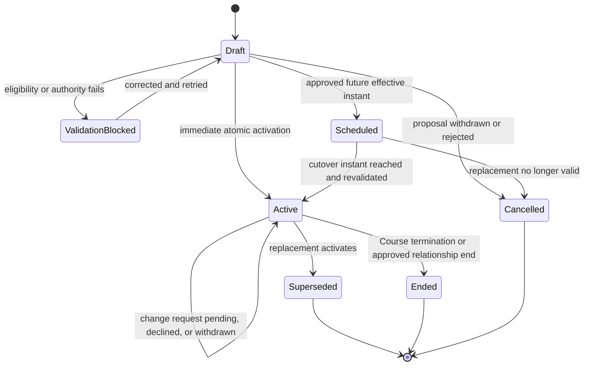

# Phase 6: Tutor assignment, reassignment, and Membership history

**Contract phase:** 6 of 54

**Status:** Final - approved product contract

**Last updated:** 2026-07-20

**Depends on:** [Kelp canonical domain glossary](domain-glossary.md), [Phase 2: Mentor-led Student intake](02-mentor-led-student-intake.md), [Phase 3: Course design and curriculum Schedule](03-course-design-and-curriculum-schedule.md), [Phase 4: Lesson Schedule and recurring meetings](04-lesson-schedule-and-recurring-meetings.md), and [Phase 5: Course wind-down, termination, and archival](05-course-wind-down-termination-and-archival.md)

**Applies to:** Course-scoped Tutor Assignment, assignment requests, reassignment, effective Tutor periods, Classroom Tutor Membership transitions, continuity handoff, former-Tutor history, replacement-Tutor visibility, and assignment audit history

## 1. Purpose

This contract defines how one Tutor becomes responsible for a Course, how that responsibility changes without replacing the Course or Classroom, and how Kelp preserves the authority, access, authorship, and operational history of every Tutor period.

It answers:

- what the Tutor Assignment owns;
- who may request, approve, activate, or override an Assignment change;
- how a replacement Tutor is selected and validated;
- when the outgoing Tutor loses active access;
- what the replacement Tutor may see;
- how Lesson Schedules, Lesson Requests, future Classes, and unfinished work cross a reassignment;
- how the Course's supervisory Mentor changes when necessary;
- what Students, Guardians, Tutors, Mentors, and Quality Assistants see in relationship history;
- how Kelp handles emergency continuity, Independent Tutors, and Group Courses.

Phase 6 does not reopen the Course, Classroom, Class, scheduling, wind-down, Report Card, or archival identities established in Phases 1-5.

## 2. Contract authority

The product owner approved all ten Phase 6 recommendations on 2026-07-20. Rules labeled Settled were inherited from earlier approved contracts; rules labeled Approved were settled in this phase. Both are authoritative.

Items labeled Deferred remain explicit boundaries owned by later contracts and must not be guessed during implementation.

## 3. Settled product rules

1. A Tutor Assignment is scoped to exactly one Course and therefore one Subject.
2. One Course has at most one active Tutor Assignment at a time.
3. Every activated Kelp-managed Course, including access only, has a qualified Kelp staff Tutor Assignment.
4. An Independent Tutor Course remains assigned to its Independent Tutor and creates no Kelp Tutor supervision or lesson-payment relationship.
5. A Mentor creates or approves a Kelp Tutor Assignment through the authorized intake or reassignment process.
6. The Student cannot browse Tutors as a public marketplace or schedule with an unassigned Tutor.
7. A valid Mentor-created Assignment is authoritative when qualification, supervision, capacity, service, and operational checks pass.
8. The assigned Kelp Tutor may request reassignment with a recorded reason but cannot silently ignore or privately reject a valid Assignment.
9. A Student or Guardian may request an Assignment change or relationship end.
10. A Tutor may request an Assignment change or relationship end with a reason.
11. Reassignment preserves the existing Course and Classroom.
12. Reassignment creates a replacement Tutor Assignment and replaces the active Tutor Membership; it does not overwrite the old Assignment's Tutor identifier.
13. The former Tutor loses active Classroom access when the replacement becomes effective.
14. Authored Posts, Files, Assignments, grades, comments, reports, and other records retain their original author attribution.
15. The former Tutor retains limited historical visibility but never the Student's changing live Profile, unrelated Courses, new Tutor relationships, or later private data.
16. The replacement Tutor receives the Course's learning history but not private Support Case content.
17. An active assigned Tutor may see the Student's Tutor-visible Profile and entire active Course information.
18. A report spanning more than one Tutor identifies each Tutor and their effective responsibility period.
19. Tutor reassignment ends the outgoing Tutor-scoped Lesson Schedule and requires a new replacement-Tutor Schedule or on-demand readiness.
20. Course termination ends the active Course-scoped Tutor Assignment.
21. Course termination and Tutor reassignment are different operations.
22. Every Kelp Tutor has exactly one active Supervising Mentor at a time.
23. A Kelp Tutor may teach only inside the intersection of the Tutor's and Supervising Mentor's qualifications.
24. If initial Tutor selection requires a Tutor supervised by another Mentor, the complete Intake Case is handed off before Assignment.
25. Guardian access remains cumulative, read-only for academic action, and constrained to linked children.
26. Historical relationship menus show the person's name, Subject, and effective period without granting current active access.
27. Student Lesson Credits remain account-wide and do not disappear because one Tutor Assignment ends.
28. Relationship complaints and misconduct route to later Support contracts; credit expiration suspension, transfers, reversals, and refund allocation follow Phase 10 without changing Assignment history.

## 4. Scope boundaries

### Included

- initial Tutor Assignment activation boundary inherited from Phase 2;
- Tutor Assignment records and lifecycle;
- Student-, Guardian-, Tutor-, Mentor-, Quality-Assistant-, and system-initiated change requests;
- replacement eligibility and authority checks;
- reassignment cutover;
- outgoing and incoming Classroom Tutor Memberships;
- former and replacement Tutor visibility;
- Lesson Schedule and future-operation handoff boundary;
- unfinished work and reporting responsibility boundary;
- Course supervisory Mentor handoff when a replacement has another Mentor;
- emergency continuity coverage;
- Independent Tutor and Group Course reassignment boundaries;
- history, audit, and Notification Events.

### Deferred

- the Phase 7 role and capability matrix for Guardians, Mentors, Quality Assistants, and support staff, which remains outside Phase 6 but now governs its actors;
- the Phase 8 Tutor application, assessment, Mock Session, approval, suspension, and qualification lifecycle, which remains outside Phase 6 but now governs Assignment eligibility and restriction;
- Phase 9 service-plan, Group Queue Entry, offer, reservation, and activation rules, which remain outside Phase 6 but now govern service continuity; exact Group Course pricing remains a later catalog decision;
- Tutor Availability, Time Off, holidays, and operational capacity formulas;
- Lesson Request and cancellation workflows beyond their reassignment effects;
- attendance, no-show, conduct, safeguarding, and complaint adjudication;
- Support adjudication, money-refund execution, and misconduct remedies; Phase 10 governs credit expiration suspension, transfer, reversal, restriction, and refund allocation;
- Tutor compensation and payout effects;
- database tables, API endpoints, row-level authorization, and frontend implementation.

## 5. Canonical concepts

### Tutor Assignment

The immutable-period Course-scoped relationship granting one Tutor current responsibility for the Student or cohort, Subject, Classroom, and permitted academic operations.

An Assignment identifies:

- stable Assignment ID;
- Course, Classroom, Subject, Student or cohort;
- Tutor and service model;
- Supervising Mentor for a Kelp Tutor;
- effective start and optional end instants;
- current state;
- originating Intake Case or Assignment Change Request;
- predecessor and successor Assignment links;
- qualification and supervision snapshots;
- activation authority and reason;
- Classroom Membership IDs;
- Lesson Schedule boundary;
- timestamps and audit events.

### Assignment Change Request

The auditable request to replace, end, pause, or review a Tutor Assignment. A request is not itself an Assignment change and grants no access.

### Reassignment

The authorized replacement of one active Tutor Assignment with another while preserving the Course and Classroom.

### Effective Tutor period

The non-overlapping interval during which one Tutor Assignment was authoritative for the Course. Reports and historical views use these periods rather than inferring responsibility from message or grade timestamps.

### Active Tutor Membership

The Classroom Membership derived from the active Tutor Assignment. It grants current Tutor visibility and actions permitted by the active Course and service model.

### Former Tutor Membership

The historical, non-active Classroom relationship left after Assignment end. It preserves attribution and the limited historical view defined by this contract but grants no current teaching, scheduling, grading, or Profile access.

### Handoff Snapshot

The server-created educational continuity package pinned to an exact cutover instant. It contains the Course Summary and Schedule Version, progress, upcoming obligations, unresolved academic work, relevant Classroom history, authorized Files, reporting context, and operational blockers. It excludes private Support Cases and unrelated Profile data.

### Supervisory ownership handoff

The audited transfer of Kelp-managed Course oversight from one Supervising Mentor to another when the replacement Tutor belongs to a different Mentor. It prevents one Tutor or Course from being split across incompatible supervisory chains.

### Interim Tutor Assignment

A time-bounded Assignment used to preserve a qualified Kelp staff contact after emergency removal of the ordinary Tutor and before a permanent replacement activates.

## 6. Assignment lifecycle

The lifecycle state never replaces effective start and end instants. Historical responsibility is derived from immutable Assignment periods and transitions.

## 7. Actors and authority

### Student

The Student may:

- see their active Tutor and permitted Assignment status;
- request reassignment or relationship end;
- provide a reason and supporting Support Case reference;
- acknowledge a proposed replacement;
- report a qualification, conduct, communication, or compatibility concern;
- choose early Course ending rather than continue with an approved replacement.

The Student cannot directly assign a Tutor, edit Assignment dates, grant Classroom access, or schedule with a candidate.

### Guardian

The Guardian may perform the same request and acknowledgment actions for a linked child within Guardian authority. They remain academically read-only and cannot impersonate the Student in Classes or assessments.

### Assigned Tutor

The Tutor may:

- accept and perform an effective Assignment;
- request reassignment or relationship end with a reason;
- prepare an educational Handoff Snapshot;
- finish or identify unresolved work assigned to their period;
- participate in a Mentor or Quality Assistant review.

The Tutor cannot silently reject, abandon, transfer, or delegate the Assignment to another Tutor.

### Supervising Mentor

The Mentor:

- approves ordinary Kelp Tutor Assignments and reassignments within scope;
- validates replacement qualification, capacity, and suitability;
- reviews Student, Guardian, and Tutor requests;
- owns continuity of the Course's academic plan;
- confirms the Handoff Snapshot;
- coordinates schedule reset and unresolved work;
- records reasons and effective timing;
- escalates cross-Mentor or exceptional cases to a Quality Assistant.

### Quality Assistant

The Quality Assistant may:

- confirm or override Mentor decisions within authorized scope;
- resolve Tutor-Mentor or inter-Mentor misalignment;
- authorize or verify a Supervisory ownership handoff;
- restrict access immediately for an audited safety or conduct reason;
- arrange emergency continuity;
- inspect the complete Assignment and Membership history required for review.

### Independent Tutor

The Independent Tutor manages their own Course Assignment without a Kelp Supervising Mentor. Transfer to another Independent Tutor follows the approved Phase 6 transfer rule and never transfers private lesson-payment obligations through Kelp.

## 8. Creating the initial Assignment

Phase 2 remains authoritative for initial Kelp Tutor matching and activation.

Before activation, Kelp revalidates:

- active Kelp Tutor Role Assignment created through Phase 8;
- active, unexpired, unsuspended, and undisqualified Tutor Qualification for the Course Subject and required scope;
- one active Supervising Mentor;
- matching Mentor qualifications;
- Operationally Enabled Scope covering the Course Subject and required scope;
- Course, Student, Guardian, and service state;
- Tutor operational capacity;
- blocking leave, conduct, quality, or account state;
- no other active Tutor Assignment for the Course;
- commercial readiness where applicable.

Assignment activation and the Active Tutor Membership are one authorization boundary. A Tutor candidate does not receive the Student's full Profile or active Classroom capabilities merely because they were considered.

## 9. Assignment Change Requests

An Assignment Change Request records:

- request ID and idempotency key;
- Course and active Assignment;
- requester identity and role;
- structured request type;
- structured reason code and optional private explanation;
- urgency and safety flag;
- requested effective timing, when applicable;
- related Support Case;
- attachments or evidence references under later retention rules;
- reviewer and decision;
- replacement selection or Course-ending outcome;
- timestamps and Notification Events.

### Approved request types

- `reassignment_requested`;
- `relationship_end_requested`;
- `temporary_coverage_requested`;
- `qualification_or_scope_review`;
- `conduct_or_safety_review`;
- `tutor_unavailable`;
- `service_model_change`;
- `course_end`.

Submitting a request does not end the current Assignment, cancel Classes, expose candidate Tutors, or consume a cancellation entitlement.

## 10. Replacement eligibility

A Kelp replacement Tutor must pass the same core Assignment checks as the initial Tutor:

- active Kelp Tutor Role Assignment created through Phase 8;
- active, unexpired, unsuspended, and undisqualified Tutor Qualification for the Course Subject and teaching scope;
- Operationally Enabled Scope covering the Course Subject and teaching scope through the Qualification intersection with their sole Supervising Mentor;
- operational capacity and plausible Availability;
- no blocking probation review, leave, conduct, quality, or account restriction;
- service-model compatibility;
- authorized Mentor or Quality Assistant approval.

An active Probationary Tutor Period does not by itself block an initial or replacement Assignment. A restriction or checkpoint outcome blocks only the scope it actually removes, unless Phase 8 requires account-wide suspension.

The Student may request a specific Tutor by full name and Subject, but that is a preference rather than a guaranteed Assignment. Kelp presents an internally selected qualified alternative or an honest review date when the preferred Tutor is unavailable. The Student never receives marketplace ranking or private Tutor details.

## 11. Approved reassignment workflow

1. An authorized actor submits or creates an Assignment Change Request.
2. Kelp classifies urgency and separates private support evidence from educational handoff data.
3. The current Assignment remains active unless immediate restriction is authorized.
4. The Mentor reviews the request and determines reassignment, Course ending, no change, or escalation.
5. Kelp selects and validates a replacement Tutor.
6. If the replacement has another Supervising Mentor, the Quality Assistant confirms Supervisory ownership handoff before replacement activation.
7. Kelp creates a private replacement Assignment and Handoff Snapshot.
8. The Student and Guardian receive the proposed Tutor summary, effective timing, and correction route.
9. The outgoing Tutor identifies unresolved academic and operational work.
10. Kelp revalidates eligibility and that no Class is ongoing at cutover.
11. One atomic transition ends the outgoing Assignment and Membership and activates the replacement Assignment and Membership.
12. Kelp ends the outgoing Lesson Schedule and cancels old-Tutor future operations under the approved decision.
13. The Student completes new Initial Schedule Selection or receives on-demand/access-only readiness with the replacement.
14. All parties receive Assignment and scheduling Notification Events.

## 12. Student and Guardian acknowledgment

### Settled

The Mentor creates or approves the Kelp Tutor Assignment. The Student is the customer and may request relationship termination, reassignment, or correction.

### Approved

The Student or authorized Guardian acknowledges the replacement summary but does not hold an indefinite veto over an otherwise valid qualified Assignment. Before activation, they may:

- identify a factual error or conflict;
- raise a conduct, safety, communication, or prior-relationship concern;
- request the named Tutor be reviewed;
- choose an approved early Course ending instead of continuing.

The Mentor retains final academic Assignment authority, subject to Quality Assistant review. Kelp records acknowledgment, objection, resolution, and reason separately.

## 13. Atomic cutover

### Approved effective-time rule

Reassignment cannot become effective during an ongoing Class. The effective instant is the later of:

- the approved requested instant; or
- completion, cancellation, or administrative closure of the currently ongoing Class.

At cutover, one serialized operation must:

- confirm the Course is active or in wind-down and not terminating;
- confirm the replacement and supervisory chain remain eligible;
- end the outgoing Assignment at the effective instant;
- change the outgoing Active Tutor Membership to Former Tutor Membership;
- activate the replacement Assignment at the same instant;
- activate the replacement Tutor Membership;
- freeze the Handoff Snapshot cutoff;
- end the outgoing Tutor-scoped Lesson Schedule;
- apply approved pending-request and future-Class outcomes;
- emit audit and Notification Events.

The effective periods must neither overlap nor contain an unexplained gap.

## 14. Scheduling and Class effects

Phase 4 remains authoritative: the outgoing Tutor's Lesson Schedule cannot become the replacement Tutor's Schedule because Availability, timezone anchor, buffer, and capacity belong to the Tutor.

### Approved operational rule

At effective reassignment:

- pending Lesson Requests addressed to the outgoing Tutor become `cancelled_due_to_tutor_reassignment`;
- future Classes with the outgoing Tutor become `cancelled_due_to_tutor_reassignment`;
- those cancellations consume no Student late-change entitlement;
- they create no Tutor reliability incident;
- they create no attendance, Lesson Credit charge, or Tutor compensation;
- records and attachments remain readable under their historical and retention rules;
- nothing transfers automatically to the replacement Tutor's calendar;
- the Student selects a new recurring arrangement or books new Standalone Classes from the replacement Tutor's validated Availability.

Completed, ongoing-before-cutover, cancelled, no-show, settled, disputed, and incident-reviewed Classes preserve the Tutor and Assignment period that governed them.

## 15. Educational handoff and replacement visibility

### Settled replacement access

After activation, the replacement Tutor receives:

- the Student's Tutor-visible Profile;
- Course Summary and current Course Schedule Version;
- progress and assessment results permitted to the Tutor role;
- Classroom Forum and educational Post history;
- Assignments, submissions, grades, feedback, and unresolved work;
- authorized shared Files and Course materials;
- Lesson History and Tutor effective periods;
- monthly and final Report Cards;
- current Guardians and Classroom participants visible to the Tutor role;
- operational blockers needed to teach safely.

The replacement Tutor does not receive private Support Cases, payment credentials, full billing data, unrelated Courses, or private staff notes outside Tutor authorization.

### Approved pre-effective handoff access

After the replacement is approved but before cutover, Kelp may grant a time-bounded `handoff_pending` view containing only the Handoff Snapshot. It excludes the Student's changing full Profile, private Support Cases, new Forum activity after snapshot creation, and all teaching or scheduling actions.

Full Tutor access begins only when the replacement Assignment activates.

## 16. Former Tutor visibility

### Settled

The former Tutor loses active access at cutover. Their authored records remain attributed. Their historical view excludes the Student's changing live Profile, unrelated Courses, replacement relationship, and post-cutover private data.

### Approved snapshot boundary

The Former Tutor Membership may read:

- their Assignment identity, Subject, and effective period;
- Classes they taught and their attendance or post-Class records;
- Posts, Files, Assignments, grades, comments, and reports they authored;
- the Handoff Snapshot as it existed at cutover when necessary to explain responsibility;
- later decisions explicitly shared through an authorized Support Case or quality review.

They cannot:

- open the Live Classroom;
- schedule, cancel, reschedule, grade, assign, submit, post, or reply;
- read ordinary Forum activity created after cutover;
- access the Student's current Profile or new Tutor communications;
- download content they were never authorized to see during their effective period.

## 17. Unfinished academic work

Authorship, grading, and operational responsibility remain separate facts.

### Approved rule

- Work authored by the outgoing Tutor retains that authorship.
- A submission made before cutover retains its submission and governing Schedule Version.
- The replacement Tutor may grade unresolved work after activation when the Course rules permit it.
- The grade records the replacement Tutor as grader and the original Tutor as Assignment author when applicable.
- The Mentor may assign a specific unresolved review to the outgoing Tutor through a limited Support Case workflow, but Former Tutor Membership alone grants no grading access.
- No work becomes zero, cancelled, or dismissed merely because reassignment occurred.
- A Course-ending closure still follows Phase 5 rather than this reassignment rule.

## 18. Report Card attribution

### Settled

A monthly or final Report Card spanning multiple Tutor periods identifies every Tutor and their effective period.

### Approved responsibility rule

- Class participation remains attributed to the Tutor who taught the Class.
- Authored feedback remains attributed to its author.
- A grade remains attributed to its grader and identifies the Assignment author separately when different.
- Tutor comments identify their author and applicable period.
- The active Tutor prepares the current report closeout, while the Mentor resolves disputed cross-period inputs.
- Reassignment never averages or divides grades merely because Tutor responsibility changed.

## 19. Supervisory ownership handoff

One Kelp Tutor has one Supervising Mentor. Tutor reassignment must not split a Tutor or Course across incompatible Mentor authority.

### Approved rule

If the replacement Tutor has the same Supervising Mentor, no ownership handoff is required.

If the replacement Tutor belongs to another qualified Mentor:

1. the receiving Mentor reviews the Course, Student needs, Schedule, unresolved work, and requested replacement;
2. the Quality Assistant verifies the complete Course supervisory handoff;
3. current Mentor authority ends at the handoff effective instant;
4. receiving Mentor authority begins at the same instant;
5. the replacement Tutor Assignment activates only after or atomically with the handoff;
6. prior Mentor decisions and attribution remain readable;
7. no two Mentors simultaneously hold ordinary supervisory ownership of the Course.

Quality Assistants may still inspect and intervene without becoming the permanent Supervising Mentor.

## 20. Emergency continuity

Safety, misconduct, compromised-account, sudden unavailability, or qualification-loss events may require immediate Tutor access restriction before ordinary handoff completes.

### Approved rule

- Kelp immediately suspends the outgoing Tutor's active Classroom capabilities with an audited reason.
- The qualified Supervising Mentor receives a time-bounded Interim Tutor Assignment as the Student's named academic contact.
- No new Classes are booked under the interim Assignment until Availability, capacity, commercial, and scheduling checks pass.
- Already Scheduled future Classes with the outgoing Tutor are paused or cancelled under the later incident decision.
- A Quality Assistant may assign another qualified interim Tutor when the Supervising Mentor cannot provide continuity.
- Kelp begins permanent replacement review immediately.
- The Course and Classroom remain the same.
- The Student and Guardian receive a safe explanation that does not disclose private staff or complainant information.

The emergency path must not leave the Student with an inaccessible Course or an unrecorded staff contact.

## 21. Relationship end versus reassignment

An Assignment Change Request must result in one explicit outcome:

- no change;
- replacement Tutor Assignment;
- temporary Interim Tutor Assignment;
- approved Course service pause under Phase 9;
- approved early Course ending under Phase 5;
- Course termination;
- service-model change through Phase 9 wind-down and a linked successor Course.

Ending only the Tutor relationship while the Course continues requires replacement or interim continuity. Ending the Course follows Phase 5 and does not masquerade as reassignment.

Phase 9 governs subscription changes, the two-month no-show freeze, service-path transitions, and linked-successor service-model changes. Phase 10 governs Credit Lot expiration, remaining-lifetime suspension, reversals, transfers, restrictions, and credit-side refund allocation. Misconduct penalties, Support adjudication, and money-refund execution remain later outcomes. Assignment history links to those records without implementing them here.

## 22. Membership transitions

Tutor Assignment and Classroom Membership are related but separate records.

| Assignment event | Outgoing Membership | Incoming Membership | Classroom |
| --- | --- | --- | --- |
| Initial activation | Not applicable | `active_tutor` | Same Course Classroom activates |
| Approved future reassignment | Remains active until cutover | `handoff_pending` if approved | Remains active |
| Effective reassignment | `former_tutor` | `active_tutor` | Preserved |
| Emergency restriction | `access_suspended` then `former_tutor` | `interim_tutor` or later `active_tutor` | Preserved |
| Course termination | Historical under Phase 5 | None active | Becomes inactive |

Membership state must be derived from authorized lifecycle transitions, not edited directly through the Classroom UI.

## 23. Historical relationship views

### Student and Guardian

The Course and Profile history may show:

- current and former Tutor names;
- Subject;
- effective start and end dates;
- relationship state;
- reason category when safe and appropriate;
- link to the authorized Course or historical Classroom view.

### Tutor

The Tutor's relationship history may show former Student or cohort names, Subject, effective period, and authorized historical Course link. It does not restore active Profile or Classroom access.

### Mentor and Quality Assistant

Authorized staff may see Assignment, Mentor, Membership, handoff, request, and decision history within operational scope. Private Support Case visibility remains separately authorized.

Historical views use stable identifiers and readable name, Subject, and period snapshots so later Profile or taxonomy changes do not make the record unintelligible.

## 24. Independent Tutor boundary

An Independent Tutor Course has an Independent Tutor Assignment but no Kelp Supervising Mentor or Kelp Tutor compensation relationship.

### Approved transfer rule

Transfer to another Independent Tutor requires:

- Student or Guardian request or affirmative acceptance;
- outgoing Independent Tutor acknowledgment unless access is being restricted for cause;
- incoming Independent Tutor acceptance;
- Kelp structural, Membership, safety, and account validation;
- an immutable reassignment and Handoff Snapshot;
- preserved Course, Classroom, authored history, and effective Tutor periods;
- explicit notice that private lesson pricing, balances, refunds, and payment obligations do not transfer through Kelp.

Kelp may refuse or suspend a transfer for platform safety or authorization reasons without adjudicating the Tutors' private payment dispute.

## 25. Group Course boundary

### Approved rule

A Tutor Assignment belongs to the Group Course, not separately to each cohort member. Reassignment therefore changes the Tutor for the whole cohort atomically.

- Every Student and Guardian receives notice.
- The Course and Classroom remain the same.
- The replacement Tutor receives cohort educational history under the same access boundaries.
- A member concern is reviewed, but one member cannot assign a different Tutor inside the same Group Course.
- A Student who cannot continue with the replacement may request withdrawal or another Course under the later Group Course contract.
- Reports preserve Tutor effective periods for the cohort and Student-specific results.

## 26. Notifications

Phase 6 creates server-side Notification Events for at least:

- Assignment activated;
- Assignment Change Request received;
- more information required;
- request approved, declined, withdrawn, or escalated;
- replacement proposed;
- Student or Guardian acknowledgment required;
- Tutor handoff required;
- Supervisory ownership handoff required or completed;
- reassignment scheduled;
- Tutor access restricted;
- interim coverage activated;
- reassignment completed;
- outgoing pending requests or future Classes cancelled;
- new Schedule selection required;
- Assignment ended;
- historical relationship available.

Email and Twilio SMS delivery remain later channel work. The authoritative Notification Event exists independently of channel delivery.

## 27. Data and audit requirements

The conceptual model must retain:

- Tutor Assignment IDs and immutable effective periods;
- Course, Classroom, Subject, Student or cohort, and service model;
- Tutor and Supervising Mentor identities and readable snapshots;
- qualification and supervision snapshots used for activation;
- Assignment Change Requests, requesters, reasons, evidence links, and decisions;
- predecessor and successor Assignment links;
- Handoff Snapshot Version and cutoff instant;
- outgoing and incoming Membership transitions;
- Lesson Schedule, Lesson Request, and Class outcomes;
- unfinished academic-work ownership and grader history;
- report Tutor-period attribution;
- emergency restriction and Interim Assignment events;
- Independent Tutor and Group Course boundary decisions;
- idempotency keys, retry attempts, and failures;
- Notification Events;
- actor, authority, reason, and timestamp for every privileged action.

Assignment, Membership, handoff, scheduling, access, and reporting history is append-only. A correction creates a successor event or record and never rewrites who held responsibility during a prior period.

## 28. Failure and concurrency requirements

- Two replacement activations racing for one Course cannot both become active.
- Repeating an Assignment activation does not create duplicate Memberships.
- Repeating cutover does not cancel the same Class or request twice.
- Candidate eligibility is revalidated at effective time.
- An ongoing Class blocks ordinary cutover until its operational closure.
- A Course termination racing reassignment wins once the Course lifecycle enters `terminating`; no replacement activates afterward.
- A replacement becoming ineligible before cutover leaves the current Assignment active unless emergency restriction applies.
- A Supervisory ownership handoff and cross-Mentor replacement activate atomically or not at all.
- Failure to create a replacement Lesson Schedule does not restore outgoing Tutor access; it creates explicit scheduling readiness or a continuity blocker.
- Every unresolved failure appears in an operational queue with owner and audit history.

## 29. Phase 6 invariants

The following invariants are authoritative:

1. A Tutor Assignment belongs to exactly one Course and Subject.
2. A Course has at most one active Tutor Assignment at a time.
3. Reassignment preserves the Course and Classroom.
4. Reassignment creates a successor Assignment rather than overwriting the outgoing Tutor.
5. Assignment effective periods never overlap.
6. Assignment activation and active Tutor Membership activation share one authorization boundary.
7. A candidate Tutor has no full Student or Classroom access.
8. A valid Kelp Assignment is Mentor-authoritative and cannot be silently rejected by the Tutor.
9. Student and Guardian requests do not directly assign a Tutor.
10. A replacement Kelp Tutor must satisfy Tutor and Supervising Mentor qualification intersection.
11. One Kelp Tutor has one active Supervising Mentor.
12. Cross-Mentor replacement requires an atomic Supervisory ownership handoff.
13. The outgoing Tutor loses active Classroom capabilities at cutover.
14. Authored records never lose original attribution because of reassignment.
15. The replacement Tutor receives educational Course history but no private Support Cases.
16. Former Tutor history excludes the Student's changing live Profile, unrelated Courses, new relationships, and ordinary post-cutover activity.
17. A Handoff Snapshot has an exact cutoff instant and excludes private Support Cases.
18. Reassignment cannot become effective during an ongoing Class.
19. The outgoing Lesson Schedule never becomes the replacement Tutor's Lesson Schedule.
20. Pending Lesson Requests and future Classes with the outgoing Tutor are never silently transferred.
21. Reassignment cancellations consume no Student late-change entitlement and create no Tutor-reliability or financial event.
22. Completed and historical Classes retain the governing Tutor Assignment.
23. Reassignment alone never zeroes, cancels, or dismisses academic work.
24. Grades identify their grader even when the Assignment author is another Tutor.
25. Reports spanning multiple Tutor periods identify every Tutor and period.
26. Ending a Tutor relationship while the Course continues requires replacement or interim continuity.
27. Course termination and Tutor reassignment remain distinct transitions.
28. Emergency restriction is audited and preserves a named qualified Kelp staff continuity contact.
29. Membership states follow Assignment transitions and cannot be edited directly by the Classroom UI.
30. Historical relationship views preserve stable IDs plus readable name, Subject, and period snapshots.
31. Independent Tutor transfer creates no Kelp lesson-payment or payout transfer.
32. Group Course reassignment applies to the whole cohort, not one member.
33. Assignment, Membership, handoff, and decision history is append-only.
34. Browser state, a route, or possession of an Assignment ID never grants Tutor access.

## 30. Approved Phase 6 decisions

The product owner approved all ten recommendations on 2026-07-20.

### Approved decision 1: Assignment Change Request taxonomy

Use one auditable request object with structured types and reasons. Submitting it never changes access, scheduling, or Assignment state by itself.

### Approved decision 2: Student and Guardian acknowledgment

Notify them before ordinary replacement activation and let them report factual, safety, compatibility, or prior-relationship concerns or choose early Course ending. The Mentor retains final academic Assignment authority, subject to Quality Assistant review.

### Approved decision 3: effective cutover

Prohibit ordinary cutover during an ongoing Class and atomically end the outgoing Assignment/Membership while activating the replacement at one effective instant.

### Approved decision 4: pending requests and future Classes

Cancel outgoing-Tutor requests and future Classes without entitlement, reliability, credit, or payout consequences. Never transfer them automatically; require new scheduling with the replacement.

### Approved decision 5: handoff access

After approval, give the replacement only a time-bounded Handoff Snapshot before cutover. Full Profile, Classroom, scheduling, and teaching access begins at Assignment activation.

### Approved decision 6: unfinished work and reports

Preserve original authorship, allow the replacement to grade unresolved work with separate grader attribution, and list all Tutors plus effective periods in reports.

### Approved decision 7: replacement under another Mentor

Require Quality-Assistant-confirmed Course supervisory ownership handoff before or atomically with replacement activation. Never split the Course across two ordinary Supervising Mentors.

### Approved decision 8: emergency continuity

Restrict the outgoing Tutor immediately, assign the qualified Supervising Mentor as a time-bounded interim academic contact, block new interim Classes until validation, and escalate to a Quality Assistant when another interim Tutor is required.

### Approved decision 9: Independent Tutor transfer

Require Student or Guardian acceptance, both Tutors' participation unless access is restricted for cause, and Kelp structural validation. Preserve the Course and Classroom but never transfer private lesson-payment obligations through Kelp.

### Approved decision 10: Group Course reassignment

Reassign the whole Course cohort atomically. A member may raise concerns or request withdrawal or another Course, but cannot install a different Tutor inside the same Group Course.

## 31. Phase 6 completion and handoff

Phase 6 is final and authoritative. Phase 7 governs the Role Assignments, relationship scope, Quality Assistant chain, teaching-Mentor separation, and exceptional access used by these workflows. Phase 8 governs Tutor activation, Qualification state, Operationally Enabled Scope, probation restrictions, renewal, suspension, and disqualification. Phase 9 governs service continuity, plan transitions, and Group Course formation. Phase 10 governs the account-wide credit state and Case-specific expiration suspension that may accompany Kelp-caused Tutor replacement. Later phases must consume these contracts rather than infer Tutor responsibility, credit remediation, or authority from Classroom UI state.

No database, API, RLS, notification-provider, payment, or frontend implementation is authorized by this contract.
