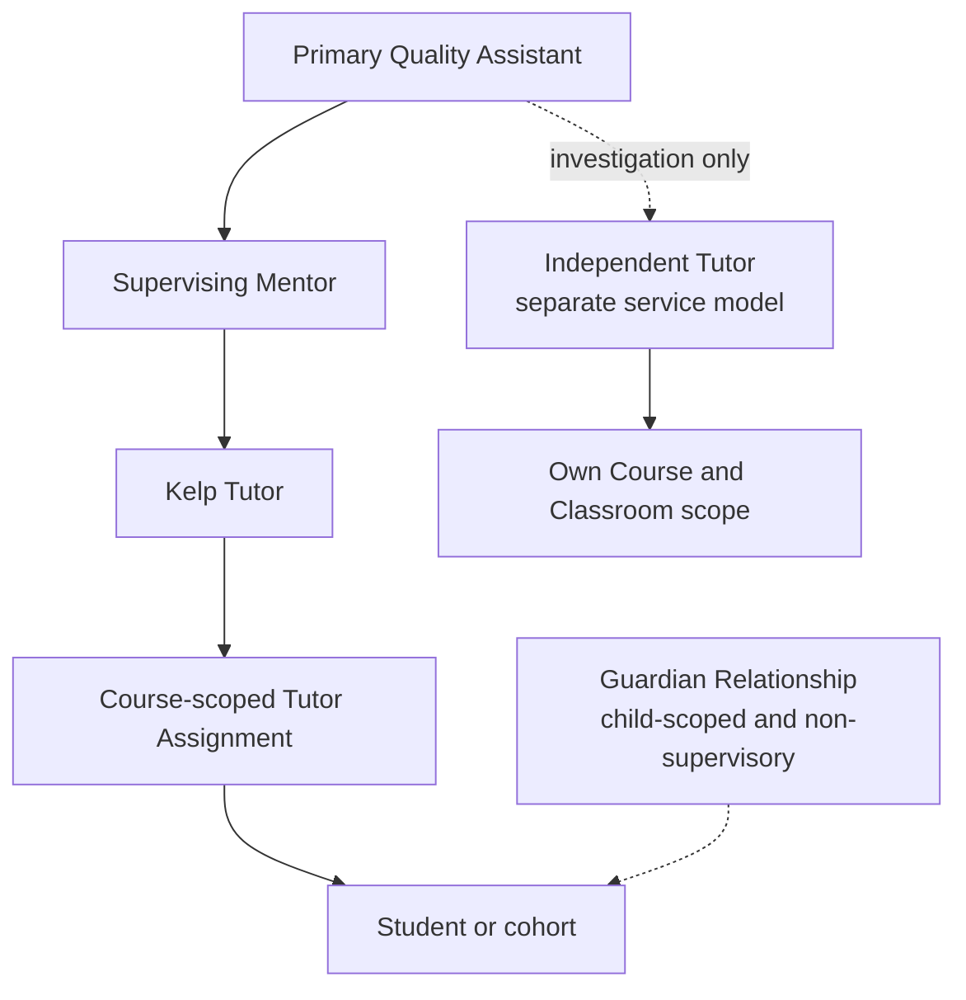

# Phase 7: Roles, Guardians, Mentors, Quality Assistants, and supervisory hierarchy

**Contract phase:** 7 of 54  
**Status:** Final approved contract  
**Last updated:** 2026-07-20  
**Depends on:** canonical glossary and approved Phases 2-6  
**Applies to:** cumulative Account roles, scoped capabilities, Guardian Relationships, Kelp Tutor supervision, Mentor authority, Quality Assistant oversight, Independent Tutor boundaries, Administrator safeguards, role lifecycle, visibility, and audit

## 1. Purpose

This contract defines who may see and do what in Kelp before database policies or interface controls are designed. It converts the approved role meanings into relationship-scoped authority without treating a dashboard, workspace, browser value, or single role string as authorization.

The central distinctions are:

- a **Role** describes how a person participates;
- a **Capability** describes one permitted action;
- a relationship defines the people and resources to which that capability applies;
- a resource lifecycle may further limit an otherwise valid capability;
- choosing a workspace changes presentation, never authority.

This phase also separates educational visibility from academic authority. In particular, a Guardian may receive broad child-scoped educational visibility without becoming a Tutor, author, grader, scheduling authority, or member of Kelp's staff hierarchy.

## 2. Contract authority and approval record

The canonical glossary and final Phases 2-6 remain authoritative. This contract does not weaken their Course, Classroom, Tutor Assignment, Membership, history, or supervision rules.

The product owner approved all ten Phase 7 recommendations on 2026-07-20. The settled rules, approved rules, authority matrix, and Phase 7 invariants in this document are authoritative. Items explicitly marked **Deferred** remain owned by later contracts.

## 3. Settled product rules

The following decisions were settled before Phase 7 and remain authoritative:

1. An Account may participate in more than one role; roles are cumulative.
2. An Account, Profile, Role, dashboard, and workspace are not interchangeable concepts.
3. Authorization must be based on server-authoritative capabilities and relationships rather than a browser-stored role.
4. Student, Guardian, Tutor, Mentor, Quality Assistant, Administrator, and Independent Tutor are distinct product meanings.
5. **Teacher** is an alias for Tutor, not a separate role.
6. A Mentor is a Tutor who may also supervise other Kelp Tutors.
7. A Quality Assistant sits above Mentors in Kelp's operational supervision structure.
8. A Guardian is linked only through an explicit Guardian Relationship; shared address, surname, payment method, or age does not create one.
9. Guardian is not an age-only role. A Guardian Relationship may continue into adulthood according to the relationship rules approved in this phase.
10. A Guardian may also be a Student and may purchase for themselves or linked children.
11. A Guardian is constrained to linked children.
12. A Guardian may see the linked child's Class states, Course and Classroom, Forum, Assignments, Files, schedule, lesson history, and Report Cards.
13. A Guardian is academically read-only and cannot impersonate the Student in a Class, Assessment, Goals Submission, assignment, or exam.
14. Guardian statements and requests remain separately attributed and are never silently merged with the Student's work.
15. A Guardian may submit or acknowledge permitted requests for a linked child, but a request is not a direct academic or scheduling mutation.
16. A Guardian may purchase Lesson Credits or services for a linked child and may configure permitted child-specific payment settings under later financial contracts.
17. Guardian notification preferences exist independently for each Guardian.
18. The Guardian may choose not to reveal their Guardian Profile to the child, subject to the safeguarding rule approved in this phase.
19. Every active Kelp Tutor has exactly one active Supervising Mentor at a time.
20. A Kelp Tutor may teach only within the intersection of the Tutor's approved qualifications and the Supervising Mentor's approved qualifications.
21. A Kelp Tutor cannot be split among different active Supervising Mentors.
22. Mentor capabilities apply only to assigned Tutors, Students, applicants, Intake Cases, Courses, and Classrooms in the Mentor's operational scope.
23. A valid Mentor-approved Tutor Assignment is academically authoritative. The Tutor may request reassignment with a reason but cannot silently reject or abandon it.
24. A Quality Assistant may confirm or override an Intake Mentor proposal, resolve Tutor-Mentor or inter-Mentor misalignment, verify supervisory handoff, investigate concerns, restrict access for cause, and arrange continuity.
25. Quality Assistant oversight is not constrained by Subject qualification when the Quality Assistant is supervising or investigating rather than teaching.
26. An Independent Tutor is a Tutor service model, not a Mentor and not a Kelp Tutor merely because they use Kelp tools.
27. An Independent Tutor has no Supervising Mentor and receives no Mentor-wide authority.
28. An Independent Tutor may operate their own Courses and Classrooms, administer Assessments, and issue Kelp Report Cards for their Students.
29. Kelp does not process Independent Tutor lesson prices, Student payments, Lesson Credits, Tutor payouts, or private payment disputes.
30. A Quality Assistant may investigate an Independent Tutor for conduct, safety, content, academic quality, or platform misuse without becoming the Tutor's permanent supervisor.
31. Administrator access remains auditable and must not replace ordinary product capabilities.
32. A Tutor Candidate or Tutor Applicant is not an active Tutor and receives no active Tutor access merely by applying.
33. Course, Classroom, Tutor Assignment, Guardian Relationship, and staff-supervision history must remain attributable after an active relationship ends.
34. Active Classroom access follows active Membership and relationship state. Possession of an identifier or an already-open page never preserves authority after access ends.

## 4. Scope boundaries

### Included

Phase 7 defines:

- cumulative role composition and workspace behavior;
- relationship-scoped capability evaluation;
- Student and Guardian authority boundaries;
- Guardian Relationship visibility, hiding, adulthood transition, suspension, and end;
- Kelp Tutor, Mentor, and Quality Assistant supervisory hierarchy;
- the special case in which a Mentor teaches a Course;
- Quality Assistant assignment, intervention, and authority limits;
- Independent Tutor capabilities and coexistence with other Tutor service models;
- Administrator and Support boundaries;
- role and relationship effective periods, suspension, revocation, and audit;
- minimum privacy boundaries and failure behavior required for later authorization design.

### Deferred

Phase 7 does not settle:

- the database schema, row-level security policies, claims, tokens, or API design;
- password, multifactor-authentication, session, and account-recovery architecture;
- exact Profile edit rules and every individual Profile field;
- legal verification of parentage, custody, majority, or jurisdiction-specific safeguarding duties;
- the Phase 8 Tutor application, exams, Mock Sessions, and qualification lifecycle, which remains outside Phase 7 but now governs Kelp Tutor activation and teaching scope;
- Phase 9 subscription and Phase 10 Lesson Credit contracts, which remain outside Phase 7 but now govern commercial authority; payout, money-refund adjudication, and Stripe implementation remain later;
- Support Case queues and financial incident decisions, owned by later support and payment phases;
- notification channel delivery through email, Twilio SMS, or push notifications;
- staff hiring, employment, contract, tax, or legal classification;
- authored-product ownership and the deferred two-percent revenue-share problem;
- final retention and account-deletion periods;
- frontend navigation and dashboard layout.

## 5. Phase 7 concepts

### Role Assignment

The effective, auditable record that a person holds a named Role. It has a start, optional end, status, granting authority, and reason. It is distinct from the person's Account and does not by itself grant access to every resource associated with the Role name.

### Capability Grant

A server-authoritative permission to perform a named action within a defined scope. A Capability Grant may arise from a Role Assignment plus a verified relationship, but it remains constrained by resource state and explicit prohibitions.

### Workspace Context

The interface context a multi-role user chooses to view, such as Student, Guardian, Tutor, or Mentor. It may organize navigation and defaults. It never creates, broadens, or transfers authority.

### Operational Scope

The set of people and resources connected to an actor through effective relationships. Examples include a Guardian's linked children, a Tutor's assigned Courses, a Mentor's supervised Tutors, and a Quality Assistant's assigned Mentors or active investigations.

### Supervisory Relationship

The effective relationship connecting one Kelp Tutor to one Supervising Mentor. It is broader than a Course-specific Tutor Assignment and determines the qualification intersection and ordinary Mentor oversight for all of that Tutor's Kelp work.

### Primary Quality Assistant Assignment

The effective relationship connecting one Mentor to the Quality Assistant responsible for ordinary operational oversight. One Quality Assistant may oversee many Mentors. Additional Quality Assistants receive access only through an explicit investigation, handoff, leave-coverage, or emergency scope.

### Guardian Relationship state

The lifecycle and visibility condition of the relationship between one Guardian and one Student. The relationship is never inferred and may be active, transition-limited, suspended, ended, or historically retained.

### Temporary Intervention Scope

A time-bounded, reasoned grant allowing a Quality Assistant or another authorized staff actor to review or act on a particular Case, Tutor, Mentor, Course, or safety event without receiving permanent global access.

### Role Suspension

The reversible prevention of some or all capabilities belonging to a Role Assignment while its history remains intact. Suspension does not erase authorship, prior actions, or relationship periods.

### Break-glass Access

Exceptional, time-bounded Administrator access used to protect safety, security, availability, or data integrity when the ordinary capability path cannot resolve the event in time. It requires a recorded reason and heightened audit.

## 6. Authorization evaluation model

The approved conceptual authorization check is:

```text
active Account
+ effective Role Assignment
+ permitted Capability
+ effective relationship and Operational Scope
+ compatible resource lifecycle state
+ any required approval or qualification
- suspension, restriction, or explicit prohibition
= authorized action
```

Every term is checked by Kelp's trusted server-side authorization layer. Interface hiding improves usability but is not security. Browser local storage, URL parameters, dashboard labels, Profile IDs, cached pages, and client-submitted role names are never authoritative.

When one Account holds several roles, Kelp evaluates the actor's actual relationship to the target resource. It does not combine unrelated scopes. For example, being both a Guardian of Student A and a Tutor of Student B does not create access to Student B through the Guardian workspace or Student A through the Tutor workspace.

## 7. Authority matrix

This matrix is authoritative. Rows sourced from earlier phases restate prior settled boundaries; rows sourced from Phase 7 express the approved relationship and authority rules.

| Actor | Ordinary scope | Educational read | Academic or operational action | Explicit boundary | Source |
|---|---|---|---|---|---|
| Student | Own Profile, Memberships, Courses, and Classrooms | Own permitted records | Submit work, participate, request changes, manage own permitted settings | Cannot grant staff access or directly assign a Tutor | Earlier phases |
| Guardian | Linked children and their permitted educational records | Tutor-equivalent learning visibility within child scope | Request, acknowledge, purchase, download, and manage Guardian-owned preferences where explicitly allowed | No teaching, grading, Student impersonation, direct scheduling mutation, staff notes, or unrelated data | Phase 7 |
| Assigned Kelp Tutor | Effective assigned Courses, Students, and cohort | Current educational record required to teach | Teach, communicate, grade, draft changes, publish where a later contract allows | No unrelated Courses, private Support Cases, Mentor-wide access, or post-cutover live Profile access | Earlier phases and Phase 7 |
| Supervising Mentor | Assigned Tutors and connected academic resources | Educational and supervisory record required for oversight | Intake, Course approval, Tutor Assignment, review, continuity, and authorized change approval | No global access and no teaching-Mentor self-approval | Phase 7 |
| Quality Assistant | Assigned Mentors plus explicit Case or intervention scope | Records necessary for supervision or investigation | Confirm, override, restrict, hand off, extend, investigate, and arrange continuity | Cannot teach or grade without a separate qualified Tutor Assignment; cannot silently rewrite history | Phase 7 |
| Independent Tutor | Own externally billed Students, Courses, and Classrooms | Educational record needed to provide their service | Assess, teach, schedule, create Courses, grade, report, and manage their Classroom | No Mentor/QA/global powers and no Kelp lesson-payment authority | Phase 7 |
| Support | Support Cases and non-academic account steps assigned to them | Minimum Case data needed | Receive, route, communicate, and perform explicitly delegated non-academic actions | Cannot interpret Assessments, grade, design Courses, or assign Tutors | Earlier phases and Phase 7 |
| Administrator | System configuration plus approved operational or break-glass scope | Minimum data required for the action | Audited configuration, correction, recovery, or exceptional status action | Not an ordinary academic, supervisory, or support decision-maker | Phase 7 |

## 8. Cumulative roles and workspace switching

### Settled

One person may simultaneously be, for example:

- a Student and Guardian;
- a Tutor and Mentor;
- a Guardian and Tutor;
- a Student and Independent Tutor.

Their Profile is shared where appropriate, but their Role Assignments, relationships, preferences, and action attribution remain distinct.

### Approved rule

Use separate effective Role Assignments and relationship-scoped capabilities. Do not maintain one mutable `role` value that is overwritten when a person gains another function.

Workspace switching changes navigation, labels, and default resource lists only. Every write records the actual actor, active relationship, capability, and target; the selected workspace is helpful context but never the source of permission.

Where a person could act through more than one legitimate role, the action must be attributed to the specific authority used. A Mentor posting as the assigned Tutor is attributed as Tutor activity. The same person approving a Course revision is attributed as Mentor activity.

## 9. Student authority boundary

The Student remains the primary academic participant. The Student may view and act on their own resources according to the applicable Course, Classroom, scheduling, grading, and payment contracts.

No other role may impersonate the Student. Assistance, Guardian context, staff correction, and accessibility support must be separately identified. The Student's Assessment Attempt, primary Goals Submission, attendance, Posts, assignment submissions, and acknowledgments retain their true actor.

Student access to another participant's data is limited to what the shared Course or Classroom intentionally exposes. A Group Course Membership does not expose other Students' Profiles, Guardian Relationships, private grades, submissions, payment state, Support Cases, or notification preferences.

## 10. Guardian educational visibility

The phrase "same access as the Tutor" is interpreted as the same relevant **educational visibility** into the linked child's Course and Classroom, not the Tutor's authorship, staff, supervisory, or mutation capabilities.

### Approved visible information

A Guardian with an active relationship may read or download, where the underlying object permits it:

- the child's Course Summary, Subject, Subtopics, Content, dates, and active state;
- Course Schedule and Lesson Schedule views;
- Class dates, times, status, attendance outcome, and visible educational notes;
- the Forum and its child-visible Posts and Threads;
- Assignments, the child's submissions, deadlines, grades, and Tutor feedback;
- Files and Course materials available to the child;
- draft and published Report Cards, including downloadable PDFs;
- lesson history and Tutor effective periods;
- the active Tutor and Supervising Mentor identities made visible to participants;
- the child's learning goals, hobbies, timezone, and country/state/city when included in the educational Profile view;
- the child's birthday display allowed to the Tutor role, but not a hidden full birthdate value;
- request and support status for requests the Guardian is authorized to see.

### Approved exclusions

A Guardian does not receive:

- staff-only supervision, safeguarding, investigation, or quality notes;
- private Support Cases to which the Guardian is not a party;
- another Guardian's private Profile or contact details;
- another Student's private data in a Group Course;
- Tutor employment, qualification-review, reliability, or compensation records;
- the child's or another payer's full payment method or Stripe-held billing address;
- internal risk, fraud, security, or access-control data;
- Courses, Classrooms, or Students outside the linked child's scope;
- deleted, sealed, or legally restricted information merely because it once appeared in a Classroom.

Guardian read access never implies a right to change grades, weights, Course content, due dates, Class status, attendance, Tutor Assignment, or Student-authored work. A Guardian may submit a request through a defined workflow and may manage their own notification and payment permissions where a later contract allows it.

## 11. Hidden Guardian identity

### Settled intent

A Guardian may choose not to reveal their Guardian Profile to the linked child. Kelp must still preserve the actual Guardian Relationship and cannot falsify who viewed, purchased, requested, or acted.

### Approved safeguarding rule

"Hidden" means hidden from ordinary child-facing identity and relationship UI, not hidden from Kelp's authorization, audit, safeguarding, or authorized staff views.

A hidden Guardian:

- keeps permitted read-only child-scoped visibility;
- remains visible to the child's assigned Tutor, Supervising Mentor, authorized Quality Assistant, and audited Administrator or Support actor when required;
- cannot post, reply, grade, edit, or perform another action that would require Kelp to conceal or misattribute a visible author;
- may submit a private request or Support Case under their own identity to authorized staff;
- may purchase for the child, although Kelp must not promise that the resulting service or credit change will be invisible to the child;
- receives their own Notifications without changing the child's preferences;
- never disappears from audit, billing records, or access history.

If safety, law, a verified dispute, or staff review requires disclosure or suspension, an authorized Quality Assistant controls that decision and records the reason. Kelp must not let either party use a simple browser setting to create or remove a verified relationship.

## 12. Guardian Relationship lifecycle

### Approved states

| State | Meaning | New child activity visible? | Guardian action |
|---|---|---:|---|
| `pending_verification` | A link was requested but has not been verified | No | Complete verification only |
| `active_visible` | Verified and visible in child-facing relationship UI | Yes | Permitted Guardian actions |
| `active_hidden` | Verified and hidden from ordinary child-facing identity UI | Yes | Read-only plus private requests and permitted purchases |
| `adult_transition` | Student adulthood transition requires continuation choice | No new activity by default | Guardian may consent or end; Student may consent or decline |
| `suspended` | Access temporarily blocked during correction, safety, or authority review | No | Support interaction only |
| `ended` | Forward-looking relationship access ended | No | Own records and permitted historical notices only |

The state names are conceptual, not approved database enum values.

### Approved creation and verification rule

A Student, Guardian, or authorized staff member may request a relationship. The request never grants access by itself. Kelp verifies the relationship through a later safeguarding process, records who verified it and why, and activates only the approved scope.

An assigned Tutor and Supervising Mentor may view the child-scoped relationship, raise a concern, and request correction or suspension. They do not treat the Guardian as a subordinate employee and cannot secretly manufacture or delete the relationship. A Quality Assistant resolves disputes, safety restrictions, forced suspensions, and exceptional endings.

### Relationship end

Ending future Guardian access does not erase:

- the Guardian's identity and effective relationship period;
- actions and requests they authored;
- their own purchases, invoices, receipts, or Support Cases;
- access and decision audit required by the retention contract.

Historical educational visibility after relationship end is limited to what a later retention, legal, safeguarding, or dispute decision explicitly permits. It is not automatically equivalent to an active Guardian Relationship.

## 13. Adulthood transition

Guardian is not defined by age, but reaching the applicable adulthood threshold is a material privacy transition.

### Approved rule

Kelp asks both parties how they wish to continue. Either party may end the relationship. Continuing access to **new** academic activity requires the now-adult Student's affirmative consent; the Guardian also confirms willingness to continue.

While the choice is unresolved:

- the relationship enters `adult_transition`;
- the Guardian receives no new Course, Classroom, Forum, schedule, grade, attendance, or Report Card activity;
- the Student continues using Kelp normally;
- the Guardian retains their own payment and communication records;
- previously downloaded information cannot be technically recalled, but Kelp does not expose additional history through the active relationship;
- a Support Case may resolve disputed identity, safety, or legal constraints.

This rule creates no universal legal age in the product contract. Jurisdiction and legal verification are deferred, but the privacy-preserving transition behavior can remain consistent.

## 14. Kelp Tutor authority

An assigned Kelp Tutor receives Course- and Classroom-scoped teaching access only for the effective Tutor Assignment period, plus the limited pre- and post-period views approved in Phase 6.

The Tutor may:

- teach and participate in scheduled Classes;
- read the educational Profile and history needed to teach;
- communicate through the Classroom;
- create or manage permitted academic materials;
- assign and grade work;
- complete post-lesson participation scoring;
- draft Course or Schedule changes;
- produce Report Cards according to the reporting contract;
- request Assignment change, relationship end, Mentor review, or support.

The Tutor may not:

- grant themselves a Course, Student, Guardian, Mentor, or Quality Assistant scope;
- teach outside the Tutor-Mentor qualification intersection;
- silently reject, abandon, transfer, or delegate a Tutor Assignment;
- see unrelated Students, Courses, Guardians, Support Cases, or payment records;
- use former-Tutor history as current Student Profile access;
- exercise Mentor approval merely because the same Account also holds the Mentor role.

## 15. Mentor authority and supervision

A Mentor combines two possible functions:

1. **Tutor function:** teaching under a Tutor Assignment.
2. **Mentor function:** supervising Tutors and exercising academic approval within assigned scope.

The Mentor function may:

- lead Intake Cases and Orientation;
- interpret Assessments and Goals Submissions;
- create and approve Student-specific Course plans;
- assign or reassign qualified Kelp Tutors;
- approve Course and Schedule changes assigned to Mentor authority;
- supervise Tutor quality, continuity, and operational readiness;
- review Guardian and Student requests;
- manage ordinary Tutor-Student relationship concerns;
- escalate misalignment, safety, cross-Mentor, or exceptional issues to a Quality Assistant.

Mentor access is downward and relationship-scoped. A Mentor does not receive every Kelp Student, Tutor, Course, Classroom, Support Case, or authored product.

## 16. When a Mentor teaches

Phase 7 settles this hierarchy edge case. A Mentor remains a Kelp Tutor when personally assigned to teach a Kelp-managed Course. The same person cannot supervise and approve all their own teaching actions because that would weaken the qualification-intersection and review rules.

### Approved rule

- A teaching Mentor must have a **different**, active, qualified Supervising Mentor for the Tutor function.
- A person cannot be their own Supervising Mentor.
- Supervisory relationships cannot form direct or indirect cycles.
- The teaching Mentor's authorized Subject scope remains the intersection of their qualifications and the distinct Supervising Mentor's qualifications.
- The distinct Supervising Mentor performs approvals that would otherwise be self-approval.
- The Quality Assistant confirms the arrangement, resolves conflict, and may restrict access, but does not substitute for Subject qualification merely because the Quality Assistant is above both Mentors.
- Actions clearly belonging to the assigned Tutor remain attributed to the person as Tutor; supervisory approvals remain separately attributed.

This preserves the rule that every Kelp Tutor has exactly one Supervising Mentor without making a Mentor their own approver.

## 17. Quality Assistant hierarchy

### Approved ordinary structure

Each active Mentor has exactly one active Primary Quality Assistant Assignment for ordinary oversight. One Quality Assistant may oversee many Mentors. This gives every Kelp Tutor a single ordinary escalation chain:



The Quality Assistant is not an ordinary co-Mentor. Temporary access by another Quality Assistant requires a Case, handoff, leave-coverage, audit, or emergency reason with defined scope and duration.

### Quality Assistant capabilities

Within authorized scope, a Quality Assistant may:

- confirm or override Intake Mentor selection;
- review Mentor decisions and recorded reasoning;
- coordinate Mentor and Course supervisory handoffs;
- investigate conduct, safety, content, quality, access, and platform-misuse concerns;
- access Support Cases specifically assigned to them;
- suspend a Role or relationship capability when policy and urgency allow;
- arrange emergency Tutor continuity;
- extend a Course during wind-down;
- require correction through an append-only successor decision;
- supervise or investigate an Independent Tutor without creating a permanent supervisory relationship.

## 18. Quality Assistant authority limits

### Approved rule

A Quality Assistant may override a decision but must never silently rewrite the original actor, evidence, effective period, grade, status, or reason. A correction is a new attributed event linked to the record it corrects.

A Quality Assistant does not automatically gain authority to:

- teach a Class;
- impersonate a Tutor, Mentor, Guardian, or Student;
- author Student work;
- grade or publish academic work without a separate qualified Tutor or applicable reporting assignment;
- approve private Independent Tutor payment disputes;
- access unrelated payment methods, billing addresses, or Support Cases;
- create global surveillance of all Tutors or Students without operational scope;
- erase complaints, authorship, or access history.

Direct Tutor oversight by a Quality Assistant is temporary and exceptional. It does not convert the Quality Assistant into the Tutor's permanent Supervising Mentor or expand the Tutor's teachable qualification scope.

## 19. Supervisory changes and continuity

Changing a Kelp Tutor's Supervising Mentor affects every Kelp Course in which the Tutor's authority depends on that relationship. It is therefore broader than changing one Course's Tutor Assignment.

The later implementation must:

1. validate the receiving Mentor's qualifications against all affected active Tutor Assignments;
2. prevent overlapping active Supervising Mentor periods;
3. prevent a gap that leaves an active Kelp Tutor without a named escalation owner;
4. identify Courses the receiving Mentor cannot support;
5. require Tutor reassignment, Course change, temporary restriction, or another explicit resolution for incompatible Courses;
6. preserve prior Mentor periods and decisions;
7. notify affected staff and Students or Guardians when their Course oversight changes in a user-relevant way.

Phase 6 remains authoritative for Course-specific supervisory ownership handoff during Tutor reassignment.

## 20. Independent Tutor capability boundary

An Independent Tutor receives Tutor capabilities only within their own externally billed Student, Course, Classroom, and authored-resource scope. Their ability to create or use Kelp Courses, Assessments, schedules, assignments, Forum Posts, Files, grades, and Report Cards does not grant Mentor, Quality Assistant, Support, Administrator, or global catalog authority.

### Approved mixed-role rule

One Account may hold both Kelp Tutor and Independent Tutor service relationships, but each Course is permanently explicit about its service model for every effective period. The person uses separate workspace contexts, and authorization plus financial behavior follows the Course, not the last workspace selected.

For a Kelp-managed Course, the person requires a Supervising Mentor, qualification intersection, Kelp billing, reliability rules, commission, settlement hold, and payout rules. For an Independent Tutor Course, lesson payment remains outside Kelp and no Kelp Lesson Credit, commission, Tutor accrual, or payout is created.

Phase 9 prohibits in-place conversion of an active Course between the two models. The current Course winds down under its existing model, financially closes, and preserves historical access; a linked successor Course activates under the new model only after explicit Student or Guardian acceptance and the new model's validation.

## 21. Administrator and Support boundaries

### Support

Support may receive and route requests, help with non-academic Account steps, communicate in assigned Support Cases, and carry out narrowly delegated actions. Support cannot interpret an Assessment, design or approve a Course, assign a Tutor, grade work, or change a Class outcome unless the actor separately holds and uses the required capability.

### Administrator

An Administrator manages system configuration, authorized data correction, access recovery, and exceptional operational actions. The user has settled that an Administrator may correct ongoing or completed Class status when an ordinary actor no longer may. That correction must preserve the prior status and record the Administrator, reason, evidence, timestamp, and resulting financial or academic review state.

### Approved break-glass safeguards

- Ordinary Administrator capabilities are explicit and narrower than unrestricted impersonation.
- Break-glass Access is time-bounded, reason-coded, and limited to the affected resources.
- High-risk actions require strong re-authentication and, where operationally possible, a second authorized reviewer.
- The system notifies or queues review for affected internal owners unless doing so would create a documented safety or security risk.
- An Administrator cannot make an action look as though it was performed by another user.
- Break-glass access cannot silently alter authorship, historical effective periods, payment evidence, or audit logs.
- Every use appears in a reviewable security record.

## 22. Role and relationship lifecycle

### Approved general lifecycle

Every privileged Role Assignment and relationship records:

- subject Account and Role;
- granting or verifying actor and authority;
- effective start and optional end;
- active, suspended, or ended state;
- scope and source relationship;
- reason and supporting Case when applicable;
- capability restrictions or temporary additions;
- predecessor and successor when changed;
- audit timestamps.

Granting, suspending, restoring, and ending authority are separate events. Historical assignments are never overwritten to make it appear that a person never held access.

### Approved granting authority

- Student participation arises from the applicable enrollment or service activation.
- Guardian access arises only from a verified Guardian Relationship.
- Kelp Tutor status arises only after the Phase 8 qualification and approval lifecycle.
- Mentor status and Supervisory Relationships require Quality Assistant authorization.
- Primary Quality Assistant Assignments and Quality Assistant Role Assignments require authorized organizational administration.
- Administrator Role Assignments require the highest internal security and governance process, outside ordinary product self-service.
- Independent Tutor access requires the applicable platform subscription and service onboarding, without creating Kelp staff status.

No user may grant themselves a privileged Role by changing Profile data, choosing a workspace, subscribing to a plan, or calling an unprotected endpoint.

## 23. Suspension, restriction, and ending access

Suspension and relationship end remove future authorization but do not erase prior activity.

The approved enforcement order is:

1. record the authorized decision and effective instant;
2. invalidate or re-evaluate active server sessions and grants;
3. stop new reads and writes outside any explicit historical scope;
4. cancel or reroute pending operational work under the governing Course, Assignment, or support contract;
5. preserve attribution, effective periods, and evidence;
6. create continuity ownership where a Student or active Course would otherwise be abandoned;
7. notify appropriate participants without disclosing protected investigation details.

A suspended interface is insufficient. A stale tab, downloaded link, client cache, or previously fetched identifier must not authorize another server request.

## 24. Profile and sensitive-data boundaries

Phase 7 establishes minimum role boundaries while deferring the exhaustive Profile-field contract.

- Kelp stores country, state, and city for the Student Profile, not a full street address.
- Stripe-held billing addresses and payment methods are not general Profile fields.
- Assigned Tutors and authorized Guardians receive only the educational Profile view approved for their relationship.
- The Tutor-facing birthday view must not expose the full stored birthdate when the product rule permits only birthday display.
- Mentors and Quality Assistants see additional information only when needed for their assigned academic, supervisory, safeguarding, or Case scope.
- Private Support Cases, security events, payment credentials, staff notes, and unrelated relationship data require separate capabilities.
- Hidden Guardian configuration is server-held and never trusted from the browser.
- Download permission does not imply authority to redistribute data outside the service or retain it beyond applicable policy.

## 25. Notification boundaries

Phase 7 defines Notification recipients, not Twilio or email delivery.

Kelp should create Notification Events for:

- Role Assignment activation, suspension, restoration, and end;
- Guardian Relationship request, verification, visibility change, adulthood transition, suspension, and end;
- Supervising Mentor or Primary Quality Assistant change;
- temporary Quality Assistant intervention when disclosure is appropriate;
- Independent Tutor/Kelp Tutor workspace or service-state changes;
- Administrator correction or break-glass review when notice is permitted;
- access denied because a relationship or Role ended.

Each person controls their own channel preferences when the event is optional. A Guardian cannot silently modify the Student's notification choices, and the Student cannot modify the Guardian's. Critical safety, security, billing, and legal notices may later receive mandatory-delivery rules.

## 26. Data and audit requirements

The conceptual model must retain:

- Account and stable person identifiers;
- Role Assignments and immutable effective periods;
- Capability, scope, restriction, suspension, and restoration events;
- Guardian Relationship requester, verifier, state, visibility mode, scope, and effective period;
- adulthood-transition decisions from both parties;
- Kelp Tutor, Supervising Mentor, and Primary Quality Assistant effective relationships;
- Tutor and Mentor qualification snapshots used for authorization;
- temporary intervention and Case scope;
- Independent Tutor versus Kelp Tutor service model per Course;
- workspace used for presentation and authority actually used for each privileged action;
- Administrator ordinary and break-glass actions;
- prior and corrected values for privileged corrections;
- actor, authority, reason, evidence reference, timestamp, and affected resources;
- Notification Events and delivery-independent recipient decisions;
- idempotency keys, conflicts, retries, and failures.

Role, relationship, supervision, restriction, correction, and access history is append-only. Retention length and lawful deletion are deferred, but no active contract may depend on destructive overwriting of authority history.

## 27. Failure and concurrency requirements

- Two concurrent grants must not create duplicate active instances of a logically unique relationship.
- One Kelp Tutor cannot acquire two overlapping active Supervising Mentors.
- One Mentor cannot acquire two overlapping Primary Quality Assistant Assignments.
- Role removal during an active session must affect the next trusted authorization check and must not wait for the user to switch workspaces.
- A Guardian Relationship ending while a page is open blocks later server reads and writes outside explicitly retained scope.
- A hidden Guardian state cannot be inferred or changed solely by client-submitted data.
- A Tutor-to-Mentor or Mentor-to-Quality-Assistant handoff either establishes the valid successor scope or leaves an explicit continuity blocker; it must not create silent orphaned authority.
- A Mentor teaching personally cannot approve the same protected action through a second workspace context.
- Cyclic Supervising Mentor relationships are rejected.
- A Quality Assistant opening an unrelated Student or Independent Tutor record receives no access without operational or Case scope.
- A Course cannot create both Kelp-billed and externally billed lesson effects because one Account holds both Tutor service models.
- Repeating suspension, restoration, or break-glass commands is idempotent and never duplicates notifications or correction history.
- A failed audit write prevents the associated privileged state change from being treated as successful.
- Emergency restriction may precede ordinary notice, but it never precedes creation of the authorized decision record.
- Every unresolved authorization transition appears in an operational queue with an owner and safe default denial.

## 28. Relationship to the existing implementation

The repository already contains a useful cumulative-role foundation in `supabase/migrations/202607180003_multi_role_authorization.sql`, `src/auth/authorization.js`, and `src/auth/workspaces.js`. It correctly moves away from trusting signup metadata and treats the Profile's primary role as a workspace hint rather than the complete authorization source.

That implementation predates this contract and is not yet the Phase 7 model:

- `teacher` currently exists as a separate stored role even though the canonical domain defines Teacher only as an alias for Tutor;
- Guardian, Quality Assistant, and Independent Tutor role/service concepts are not represented;
- `user_roles` retains one current row per user and role, so repeated effective periods and suspension history need a later architecture decision;
- current role capabilities are broad role-level grants and do not yet prove Guardian, Tutor Assignment, Mentor, Quality Assistant, Course, Classroom, or Case scope;
- a selected primary role and workspace are still useful navigation preferences but cannot authorize resource access;
- current Mentor and Administrator publishing grants do not replace the self-approval, relationship-scope, and break-glass rules approved here;
- no existing client helper substitutes for server-side relationship checks or future row-level-security policies.

Phase 7 does not authorize changing those files. The later authorization-architecture and implementation phases must reconcile them deliberately, preserve existing user-owned work, and migrate historical data rather than reinterpret legacy rows silently.

## 29. Approved Phase 7 decisions

The product owner approved all ten recommendations on 2026-07-20.

### Decision 1: cumulative Role Assignments

**Approved rule:** represent each role as a separate effective Role Assignment and evaluate relationship-scoped capabilities. Let workspace switching change presentation only; record the authority actually used for each action.

**Why:** a Guardian may also be a Student, and a Mentor is also a Tutor. A single mutable role would destroy history or accidentally combine unrelated access.

### Decision 2: Guardian educational-visibility boundary

**Approved rule:** interpret Tutor-equivalent Guardian access as child-scoped educational visibility. Include the child's Course, Classroom, Forum, Assignments, submissions, Files, schedules, history, draft and published reports, permitted Profile view, and active staff identities. Exclude authorship powers, direct academic/scheduling changes, staff-only notes, unrelated Support Cases, other Students, private payment methods, and internal staff records.

**Why:** this gives Guardians the oversight requested without turning them into Tutors or exposing data Tutors themselves do not need.

### Decision 3: hidden Guardian identity

**Approved rule:** allow a verified Guardian to hide their identity from ordinary child-facing UI while remaining visible to authorized staff and immutable audit. Keep the hidden Guardian read-only, apart from private requests and permitted purchases; prohibit visible interactions that would require concealed or false attribution.

**Why:** this supports the requested discretion without creating untraceable surveillance or misleading authorship.

### Decision 4: adulthood re-consent

**Approved rule:** when the applicable adulthood threshold is reached, require both parties to choose whether the relationship continues. New educational activity becomes visible to the Guardian only after the adult Student affirmatively consents; either party may end the relationship. Preserve the Guardian's own payment and communication records during transition.

**Why:** Guardian is not age-defined, but forward-looking adult educational access should not continue by inertia.

### Decision 5: Guardian Relationship governance

**Approved rule:** allow Student, Guardian, or authorized staff to request a relationship, but require server-side verification before access. Tutors and Mentors may monitor the child-scoped relationship and request review; a Quality Assistant decides disputed, safety-driven, or forced suspension/end cases. Guardians are not staff subordinates.

**Why:** this gives the Tutor and Mentor the requested oversight without letting them manufacture or erase family relationships.

### Decision 6: a Mentor teaching a Course

**Approved rule:** treat a teaching Mentor as a Kelp Tutor for that Course. Require a different qualified Supervising Mentor, prohibit self-supervision and supervisory cycles, and keep teaching and approval attribution separate. The Quality Assistant oversees conflict but does not replace Subject qualification.

**Why:** this preserves the one-Mentor and qualification-intersection rules and prevents self-approval.

### Decision 7: Primary Quality Assistant Assignment

**Approved rule:** give each Mentor one active Primary Quality Assistant for ordinary oversight, while one Quality Assistant may oversee many Mentors. Additional Quality Assistant access must be Case-, coverage-, handoff-, or emergency-scoped and time-bounded.

**Why:** this creates one clear escalation chain without making every Quality Assistant a global observer.

### Decision 8: Quality Assistant intervention boundary

**Approved rule:** permit scoped investigation, override, access restriction, handoff, Course extension, and continuity actions. Make every correction append-only. Do not allow teaching, grading, impersonation, unrelated Case access, or permanent direct Tutor supervision without the separate role and qualification required for that action.

**Why:** Quality Assistants need real authority above Mentors, but oversight should not erase academic attribution or create universal access.

### Decision 9: combined Kelp Tutor and Independent Tutor status

**Approved rule:** allow one Account to use both models, but require every Course to declare its service model and keep the authorization, billing, commission, payout, and supervision rules separate. Never infer the model from the selected workspace or silently convert a Course.

**Why:** this avoids unnecessary duplicate Accounts while preventing Independent work from bypassing Kelp Tutor supervision or creating financial effects in the wrong system.

### Decision 10: role lifecycle and Administrator break-glass access

**Approved rule:** effective-date every privileged role and relationship; use explicit suspension, restoration, and end events; preserve history. Limit Administrator emergency access by target, time, reason, strong authentication, audit, and review, and never impersonate another actor or overwrite history.

**Why:** ordinary role rules are only trustworthy if exceptional access cannot silently bypass them.

## 30. Phase 7 invariants

The following invariants are authoritative:

1. One Account may hold multiple non-destructive Role Assignments.
2. A Workspace Context changes presentation and never authority.
3. Authorization is evaluated server-side from Capability, relationship, Operational Scope, resource state, and restrictions.
4. Browser state, a route, a role label, or a resource identifier never grants access.
5. Every privileged action identifies the authority actually used.
6. Guardian access exists only through a verified Guardian Relationship.
7. Guardian access is constrained to linked children.
8. Tutor-equivalent Guardian access means educational visibility, not Tutor action authority.
9. A Guardian cannot teach, grade, impersonate the Student, or directly mutate academic and scheduling records.
10. Guardian and Student submissions and decisions remain separately attributed.
11. A hidden Guardian remains visible to authorized staff and audit.
12. A hidden Guardian cannot create visible activity under concealed or false attribution.
13. Adult forward-looking Guardian access requires affirmative Student consent and Guardian continuation choice.
14. Ending a Guardian Relationship does not erase its period or authored actions.
15. Tutors and Mentors may request Guardian review but do not unilaterally manufacture or erase a verified relationship.
16. Every active Kelp Tutor has exactly one active Supervising Mentor.
17. A Kelp Tutor's teachable scope is the Tutor-Mentor qualification intersection.
18. A person cannot be their own Supervising Mentor.
19. Supervising Mentor relationships cannot form cycles.
20. A Mentor teaching a Course uses Tutor authority for teaching and separate Mentor authority for supervision.
21. A teaching Mentor cannot approve their own protected academic action.
22. Each Mentor has one active Primary Quality Assistant.
23. Quality Assistant ordinary access follows assigned Mentors or explicit Temporary Intervention Scope.
24. Quality Assistant supervisory action does not require Subject qualification, but teaching does.
25. A Quality Assistant correction appends a new attributed decision and never rewrites history.
26. Direct Quality Assistant oversight of a Tutor is exceptional and time-bounded.
27. Independent Tutor capability is limited to their own Students, Courses, Classrooms, and authorized products.
28. Independent Tutor access does not confer Mentor, Quality Assistant, Support, Administrator, or global catalog authority.
29. One person may use both Kelp Tutor and Independent Tutor models, but one Course cannot silently combine them.
30. Course service model, not Workspace Context, controls supervision and financial behavior.
31. Support cannot perform academic work without a separate valid academic capability.
32. Administrator correction preserves prior values, actor, evidence, reason, and effects.
33. Break-glass Access is explicit, time-bounded, scoped, reasoned, and audited.
34. No privileged actor may impersonate another person or erase authorship.
35. Role and relationship suspension removes future authority without erasing history.
36. Role, relationship, supervision, and access history is append-only.
37. Failed audit persistence prevents a privileged state change from being considered successful.
38. Ending or suspending access is enforced at the next trusted authorization check, regardless of an open page.

## 31. Phase 7 completion and Phase 8 integration

Phase 7 is final and authoritative. Later phases must consume its Role Assignments, relationship-scoped capabilities, Guardian visibility, supervisory hierarchy, Quality Assistant scope, Independent Tutor boundary, role lifecycle, and exceptional-access safeguards rather than infer authority from role labels or workspace UI.

Phase 8 now defines how a Tutor Applicant becomes qualified and active, including application, Assessment, Mock Session, Subject scope, approval, probation, suspension, renewal, and disqualification. Phase 7 and Phase 8 together require Role Assignments, supervisory relationships, Qualification-dependent authority, Operationally Enabled Scope, and audit boundaries rather than parallel role models.

Phase 9 now defines Account- and Course-scoped service authority, Payer boundaries, Independent Tutor subscription effects, linked-successor model conversion, and Group Course entry without expanding any Phase 7 Role or Capability.

Phase 10 now defines Student Credit Accounts, Payer-scoped purchase visibility, and the Support, Quality Assistant, and Administrator credit-audit boundaries without granting Tutors or Mentors balance visibility or creating any new Phase 7 Role.

Phase 11 now defines child-scoped Guardian attendance visibility, Quality Assistant incident review, and Administrator-only post-transition correction of Ongoing or completed Class status. It consumes Phase 7 authority without allowing a route, workspace, role label, or ordinary Tutor action to rewrite attendance or financial outcomes.

No database, API, row-level-security, identity-provider, notification-provider, payment, Docker, Supabase, or frontend implementation is authorized by this contract.
