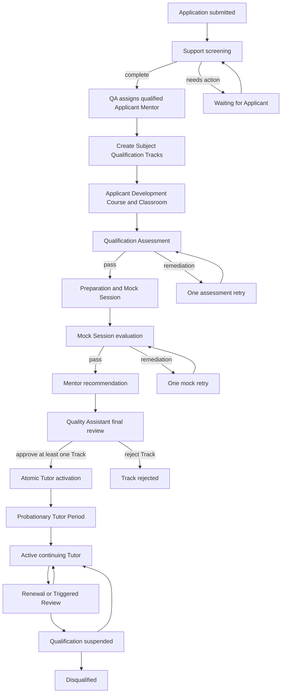

# Phase 8: Tutor application, qualification, and approval lifecycle

**Contract phase:** 8 of 54  
**Status:** Final approved contract  
**Last updated:** 2026-07-20  
**Depends on:** canonical glossary and approved Phases 2-7  
**Applies to:** Kelp Tutor applications, screening, Applicant learning environments, Subject Qualification Tracks, assessments, preparation, mock sessions, Mentor evaluation, Quality Assistant approval, Tutor activation, probation, renewal, suspension, disqualification, appeals, and Independent Tutor verification boundaries

## 1. Purpose

This contract defines how a person applying through Kelp's public landing page becomes an active, qualified Kelp Tutor and how that authority is maintained or removed over time.

It separates four questions that must never be collapsed:

1. **Did Kelp receive and screen the application?**
2. **Has the Applicant demonstrated knowledge and teaching ability for a specific taxonomy scope?**
3. **Does one qualified Supervising Mentor cover that scope?**
4. **Has Kelp activated the Tutor Role Assignment and operational teaching authority?**

Passing an exam alone does not create Tutor access. Uploading a degree does not create a Qualification. Selecting a Tutor workspace does not create authority. Kelp teaching authorization exists only when the approved Qualification, sole Supervising Mentor, Role Assignment, account state, and applicable Course Assignment all remain valid.

## 2. Contract authority and approval record

The canonical glossary and approved Phases 2-7 remain authoritative. In particular, Phase 8 preserves:

- cumulative, effective Role Assignments;
- server-authoritative, relationship-scoped capabilities;
- one active Supervising Mentor for every active Kelp Tutor;
- the Tutor-Mentor qualification intersection;
- no self-supervision or supervisory cycles;
- one active Primary Quality Assistant for each Mentor;
- append-only corrections and access history;
- no Tutor Candidate access to a Student's full Profile or Classroom;
- the distinction between Kelp Tutor and Independent Tutor service models.

The product owner approved all ten Phase 8 recommendations on 2026-07-20. The settled rules, approved rules, lifecycle, thresholds, decision chain, and Phase 8 invariants in this document are authoritative. Items explicitly marked **Deferred** remain assigned to later contracts.

## 3. Settled product rules

1. Prospective Kelp Tutors apply through a section of Kelp's landing page.
2. Support checks the application for completeness and walks the Applicant through non-academic steps.
3. An Applicant is not an active Tutor and receives no Tutor authority merely by applying.
4. Kelp may work with an Applicant in a student-like educational environment for preparation, exams, and a mock session.
5. Kelp Tutor qualification is domain-specific rather than one global Tutor flag.
6. A person may qualify for multiple Subjects when they separately satisfy the requirements for each scope.
7. A Kelp Tutor must pass an applicable assessment exam and mock session.
8. A Kelp Tutor must have one active Supervising Mentor who is also qualified for the teaching scope.
9. A Kelp Tutor may teach only within the intersection of the Tutor's and Supervising Mentor's approved qualifications.
10. A Kelp Tutor cannot be split among multiple active Supervising Mentors.
11. A Mentor teaching personally requires a different qualified Supervising Mentor.
12. A Quality Assistant sits above Mentors and may resolve qualification, supervision, conduct, or safety concerns without needing Subject qualification for oversight.
13. A Quality Assistant cannot teach or grade a qualification assessment without the separate qualification and assignment required for that academic action.
14. Support cannot interpret assessment results, approve Qualifications, or grant the Tutor role.
15. A Tutor Candidate considered for a Student Course is already an active Kelp Tutor; Tutor Applicant and Tutor Candidate are different concepts.
16. A valid Tutor Assignment requires active Tutor status, approved applicable Qualifications, one valid Supervising Mentor, capacity, and no blocking account, conduct, leave, or quality state.
17. Qualification and Role history is append-only and cannot be reconstructed from the current role label alone.
18. Independent Tutors are not Kelp Tutors, have no Supervising Mentor, and receive no Mentor-wide capabilities.
19. A Quality Assistant may investigate an Independent Tutor for conduct, safety, content, academic quality, or platform misuse without creating permanent Kelp supervision.
20. Teacher is a human-language alias for Tutor and must not become a separate canonical role.

## 4. Scope boundaries

### Included

Phase 8 defines:

- Kelp Tutor Application entry and lifecycle;
- one Application with one or more Subject Qualification Tracks;
- Support screening and Applicant guidance;
- identity, credential, integrity, and safeguarding readiness boundaries;
- Applicant Development Courses and Classrooms;
- qualified Mentor assignment for Applicant development;
- Qualification Assessment evidence and scoring;
- preparation and remediation;
- Mock Session structure and evaluation;
- per-taxonomy Qualification scope;
- Qualification approval and operational enablement;
- atomic Kelp Tutor activation;
- initial probation and review;
- Qualification renewal and triggered review;
- scope-specific and account-wide suspension;
- rejection, disqualification, reapplication, and appeal;
- privacy, Notifications, data, audit, and failure handling;
- the Independent Tutor verification boundary.

### Deferred

Phase 8 does not define:

- exact database tables, RLS policies, RPCs, APIs, or frontend pages;
- the complete application-form question set or visual design;
- exact identity-verification, background-check, criminal-record, right-to-work, or sanctions providers;
- jurisdiction-specific employment, contractor, labor, safeguarding, or discrimination rules;
- Kelp Tutor contract signature, tax onboarding, bank account, Stripe Connect, or payout setup;
- Tutor compensation, commission, deductions, or probationary pay;
- detailed Mentor workload and Applicant caseload limits;
- the exact Question Bank content used in each assessment;
- remote-exam proctoring provider and anti-cheating implementation;
- Class observation or recording consent mechanics;
- Support Case retention and legal hold;
- authored-product ownership or revenue share;
- public Tutor Profile presentation and marketing copy;
- Phase 9 service-plan restriction and ending for delinquent Independent Tutor subscriptions, which remain outside Phase 8 but now govern platform-service continuity.

## 5. Phase 8 concepts

### Tutor Application

The top-level, auditable request by one person to become a Kelp Tutor. It stores the Applicant, requested Subjects, application evidence, lifecycle, assigned staff, blockers, decisions, and links to one or more Qualification Tracks.

### Qualification Track

The Subject-specific evaluation path within one Tutor Application. Each Track has its own taxonomy scope, assessment, preparation, Mock Session, evidence, result, and decision. One Track may succeed while another fails unless a shared integrity, safety, identity, or conduct event blocks the entire Application.

### Application Screening

The non-academic completeness and eligibility review performed before academic evaluation. It checks identity readiness, contact data, required declarations, requested Subject, evidence presence, terms, and blocking risk indicators without deciding whether the Applicant knows the Subject.

### Applicant Development Course

The staff-training Course through which Kelp prepares and evaluates an Applicant. It uses Kelp's educational structures but does not create Student subscription fees, Lesson Credits, Tutor compensation, or a commercial Student-Tutor relationship.

### Applicant Classroom

The Classroom belonging to an Applicant Development Course. It may contain orientation material, preparation, practice, Qualification Assessments, feedback, Files, Mock Session preparation, and decision notices.

### Applicant Membership

The limited Membership granting an Applicant learner-like access to their Applicant Classroom. It is not an ordinary Student subscription and grants no Tutor, Mentor, grader, Student Profile, or customer Classroom authority.

### Applicant Mentor

The Subject-qualified Mentor assigned to guide and academically evaluate one or more Qualification Tracks. If the Applicant activates as a Kelp Tutor, this Mentor becomes the Supervising Mentor unless an approved handoff occurs before activation.

### Qualification Assessment

The versioned, immutable exam and associated manually reviewed evidence used to evaluate Subject, Subtopic, and Content knowledge for a Qualification Track.

### Assessment Blueprint

The approved mapping from an Assessment Version to the taxonomy nodes, required sections, coverage weights, critical items, scoring rules, and minimum evidence needed to support a Qualification scope.

### Mock Session

The live evaluated lesson in which an Applicant teaches through Kelp's Classroom tools under a standardized scenario and rubric. It is not a paid Class, consumes no Lesson Credits, and creates no Tutor compensation.

### Mock Session Rubric

The versioned evaluation of content accuracy, explanation, diagnostic questioning, adaptation, structure, pacing, communication, professional conduct, tool use, and safeguarding behavior.

### Qualification Evidence Set

The immutable references used for one decision, including the Application snapshot, verified credentials, Assessment Blueprint and Attempt, manual grading, preparation record, Mock Session and rubric, integrity events, reviewer identities, and Applicant responses.

### Tutor Qualification

The effective, approved record of the canonical Subject, Subtopics, and Content a Tutor has demonstrated they may teach. It stores the evidence basis, approval, effective period, review date, status, and history.

### Operationally Enabled Scope

The portion of an approved Tutor Qualification that the Kelp Tutor may currently teach because it is also covered by the sole active Supervising Mentor and is not suspended, expired, or otherwise restricted.

### Probationary Tutor Period

The initial active Kelp Tutor review period after activation. The Tutor may teach inside Operationally Enabled Scope, while the Mentor and Quality Assistant apply the additional review checkpoints approved in this phase.

### Qualification Renewal Review

The scheduled review before a Tutor Qualification reaches its review deadline. It determines whether to renew, narrow, suspend, or end the Qualification using current evidence and, when required, reassessment.

### Triggered Qualification Review

An unscheduled review caused by a complaint, repeated poor outcomes, curriculum change, expired evidence, integrity concern, conduct event, extended inactivity, or Mentor/Quality Assistant request.

### Qualification Suspension

The temporary prevention of teaching through one Qualification or all Qualifications while history remains intact. It may be scope-specific or account-wide.

### Disqualification

The authoritative end of one or more Tutor Qualifications after review. It removes future teaching authority in the affected scope but never erases prior Classes, authorship, Tutor Assignments, decisions, or evidence.

## 6. Approved lifecycle model

The diagram is conceptual. Database enum names are deferred.

## 7. Approved Application states

| State | Meaning | Applicant authority |
|---|---|---|
| `draft` | Applicant started but has not submitted | Edit own draft |
| `submitted` | Immutable submission snapshot exists | View and respond to requests |
| `screening` | Support checks completeness and non-academic prerequisites | Provide requested evidence |
| `waiting_for_applicant` | Applicant action is required | Edit only requested response fields |
| `mentor_assignment` | Quality Assistant is selecting a qualified Applicant Mentor | Read status only |
| `in_evaluation` | At least one Track is active | Use Applicant Classroom |
| `final_review` | Mentor recommendation awaits Quality Assistant decision | Read status and respond if requested |
| `approved` | At least one Track approved and activation completed | Use active Tutor authority separately |
| `partially_approved` | Some Tracks approved and others remain rejected, paused, or waiting | Teach only activated scope |
| `rejected` | No Track approved and ordinary evaluation ended | View decision and appeal route |
| `withdrawn` | Applicant ended the Application | Historical access only as permitted |
| `closed_inactive` | Applicant did not respond within the approved inactivity period | Start a linked future Application |
| `cancelled_for_cause` | Kelp ended the Application for integrity, safety, eligibility, or policy reason | Support or appeal access only |

An Application state summarizes the top-level process. Qualification Track states and evidence remain separately authoritative.

## 8. Approved Qualification Track states

| State | Meaning |
|---|---|
| `requested` | Applicant requested the Subject scope |
| `scope_review` | Mentor is validating taxonomy and prerequisites |
| `assessment_assigned` | Immutable Assessment Version and Blueprint are assigned |
| `assessment_in_progress` | Attempt is open or grading is incomplete |
| `assessment_remediation` | First Attempt failed and one retry may be prepared |
| `mock_preparation` | Assessment passed and Mock Session is being prepared |
| `mock_scheduled` | Scenario, rubric, evaluators, and time are pinned |
| `mock_remediation` | First Mock failed and one retry may be prepared |
| `mentor_recommended` | Applicant Mentor recommends approval |
| `qa_review` | Quality Assistant performs final process and authority review |
| `approved_inactive` | Qualification approved but not currently enabled by Role or Mentor scope |
| `active` | Qualification contributes to Operationally Enabled Scope |
| `renewal_pending` | Tutor completed required renewal actions and Kelp's timely decision remains pending |
| `suspended` | Teaching authority is temporarily blocked |
| `expired` | Renewal deadline passed without valid renewal |
| `rejected` | Track did not satisfy the current Application requirements |
| `disqualified` | Previously approved Qualification was authoritatively ended |

## 9. Actors and authority

### Tutor Applicant

The Applicant may:

- create and submit their own Application;
- request one or more Subjects;
- upload required evidence and credentials;
- use their Applicant Classroom;
- complete their own Assessments and preparation;
- participate in Mock Sessions;
- read attributed feedback and decisions permitted by this contract;
- withdraw, request correction, or appeal through the approved route.

The Applicant cannot grade their own work, alter immutable Attempts, select themselves as Tutor, assign a Mentor, view other Applicants, or use Tutor capabilities before activation.

### Support

Support may:

- receive the landing-page Application;
- check completeness and readable evidence;
- help with Account, upload, scheduling, and non-academic steps;
- request missing non-academic information;
- route safety or integrity concerns;
- create a Support Case;
- communicate status without revealing private reviewer notes.

Support cannot decide academic sufficiency, grade an Assessment, evaluate a Mock Session, approve a Qualification, choose the final Qualification scope, or grant the Tutor role.

### Applicant Mentor

The Applicant Mentor:

- must be qualified for every Track they academically evaluate;
- reviews requested taxonomy scope and prerequisites;
- selects or assigns approved Assessment Versions and Blueprints;
- reviews manually graded evidence;
- provides or assigns preparation;
- defines the Mock Session scenario from an approved template;
- conducts or reviews the Mock Session;
- records rubric scores and feedback;
- recommends approval, narrowing, remediation, or rejection;
- becomes the Supervising Mentor at activation unless an authorized pre-activation handoff occurs.

The Mentor cannot approve a scope they do not hold, hide failed evidence, rewrite an Attempt, grant the Tutor Role Assignment, or self-review their own application.

### Quality Assistant

The Quality Assistant:

- owns ordinary operational oversight of the Applicant Mentor;
- assigns or confirms the Applicant Mentor;
- validates that one Mentor can supervise the intended enabled scope;
- reviews screening, identity, integrity, assessment, Mock, and recommendation completeness;
- makes the final Qualification and Kelp Tutor activation decision;
- resolves conflicts, appeals, and cross-Mentor handoffs;
- may restrict or suspend access for an urgent audited reason;
- records the final reason and effective timing.

The Quality Assistant does not grade Subject content or teach the Mock unless they separately hold the required Qualification and assignment. The final approving Quality Assistant cannot also be the Applicant Mentor or Mock grader for the same Track. Process approval never substitutes for academic evidence.

### Administrator

The Administrator may execute the authorized Role Assignment or correct exceptional system data through the Phase 7 audited path. Administrator capability does not replace the Applicant Mentor recommendation or Quality Assistant decision.

### Independent Tutor

The Independent Tutor is outside the Kelp Tutor activation chain unless they separately apply to become a Kelp Tutor. Their verification boundary is a Phase 8 decision in Section 31.

## 10. Application entry and submission

The public landing-page route may explain requirements before authentication, but submission must resolve to one authenticated Account and trusted Profile.

The Application snapshot should include:

- stable Applicant and Application identifiers;
- legal/display-name boundary defined by the later Profile contract;
- verified contact methods;
- country, state, city, and confirmed IANA timezone;
- requested Subjects and initial claimed Subtopics/Content;
- teaching experience and education evidence;
- languages and communication availability;
- scheduling availability for evaluation;
- declarations, terms, and consent versions;
- accessibility requests kept separate from academic scoring;
- conflict-of-interest and prior-Kelp-relationship disclosures;
- evidence Files and integrity acknowledgments;
- submission timestamp and version.

The Applicant may correct factual Profile information through an attributed correction path. Submitted answers and evidence are versioned rather than silently overwritten.

## 11. Screening and readiness

### Approved screening rule

Before academic evaluation, Support verifies completeness and routes the Application. Kelp then requires server-confirmed readiness for:

- identity verification;
- required contact verification;
- applicable terms and privacy acknowledgment;
- required safeguarding and background screening where Kelp policy or law requires it;
- absence of an unresolved duplicate, suspended, or prohibited Account;
- readable required evidence;
- at least one canonical Subject request;
- no unresolved integrity or safety blocker.

External degrees, certificates, and employment history are evidence. They do not replace Kelp's Subject Assessment or Mock Session. Exact providers and jurisdiction-specific standards remain deferred.

## 12. Multi-Track Application structure

### Approved rule

One Tutor Application may contain multiple Subject Qualification Tracks. Each Track has independent taxonomy, evidence, Attempts, Mock, reviewers, and outcome.

An Applicant may be approved for Mathematics and rejected for Physics without losing the Mathematics result. A shared identity, integrity, safety, falsification, or serious conduct event may block all Tracks because it affects the person rather than one Subject.

Adding a new Subject after Kelp Tutor activation creates a new Qualification Track linked to the existing Tutor history. It does not create a second Account or replace existing Qualifications.

## 13. Applicant Development Course and Classroom

### Approved rule

Kelp works with Applicants through an Applicant Development Course and Applicant Classroom, reusing the Course/Classroom learning structure with a distinct staff-training service model and Applicant Membership.

Because the canonical Student concept includes a person enrolled in a Course, the Applicant may simultaneously receive a learner-scoped Student Role Assignment for this environment. That scope grants only the Applicant Development Course and Classroom capabilities. It is not a paid Student service and does not broaden access to customer learning resources.

The qualified Applicant Mentor serves as the instructional Tutor for the Applicant Development Course. That staff-training assignment does not make the Applicant an active Tutor, create a customer Tutor Assignment, or affect the Mentor's commercial Class compensation.

This environment may contain:

- Kelp orientation and conduct expectations;
- Subject preparation and reference material;
- practice activities;
- assigned Qualification Assessments;
- Mentor feedback;
- Mock Session scenario preparation;
- Applicant-facing decision summaries;
- private Applicant-Mentor Forum communication;
- Files and evidence links permitted by the retention contract.

It must not:

- charge Student platform fees or Lesson Credits;
- create Tutor compensation or Tutor reliability events;
- count as a commercial Student Course;
- grant the Applicant access to real Students;
- expose another Applicant's work;
- treat the Applicant's learner-like Membership as proof of a Student subscription or Tutor Role.

## 14. Applicant Mentor assignment

### Approved rule

After screening, Kelp proposes an Applicant Mentor using requested Subject coverage, Mentor Qualification, workload, timezone, conflicts, and expected continuity. The Mentor's Primary Quality Assistant confirms or overrides the proposal.

The Applicant cannot choose or privately recruit the Mentor. They may disclose a conflict or prior relationship and request review.

One Applicant Mentor must cover every Track being evaluated at the same time. If no qualified Mentor covers all requested Subjects, the Quality Assistant asks the Applicant to choose a compatible subset or pauses the remaining Tracks. Kelp does not split the Applicant across concurrent Applicant Mentors.

The Applicant Mentor becomes the Supervising Mentor at activation. If the enabled scope or continuity requires another Mentor, Kelp completes an audited pre-activation handoff before Tutor authority begins. Two Mentors never split the active Tutor.

## 15. Qualification scope and taxonomy

A Qualification is not merely `math = true`. It identifies:

- canonical Subject;
- approved Subtopics;
- approved Content nodes or coverage rule;
- taxonomy Version or stable IDs plus readable snapshots;
- Assessment Blueprint coverage;
- Mock Session focus;
- limits, exclusions, and prerequisites;
- evidence and reviewer decision;
- effective date, review deadline, and state.

The Mentor may approve a narrower scope than requested. Kelp must not infer an untested parent Subject from a passed child node or infer every descendant from a broad label unless the Assessment Blueprint explicitly supports that rule.

## 16. Qualification Assessment

### Approved standard

Each Track uses an immutable Assessment Version and Blueprint. To pass the knowledge gate, the Applicant must:

- score at least 80% overall;
- score at least 70% in every required Blueprint section;
- pass every separately identified integrity, safeguarding, or critical-content gate;
- complete all required manually reviewed items;
- have no unresolved Attempt-integrity event.

Automatic grading may produce provisional results. A qualified Mentor owns manual academic review. Every result stores the Assessment, Question, answer-key, grading-engine, rubric, and taxonomy snapshots required to reproduce the decision.

### Approved retake rule

One failed first Attempt permits one remediation cycle and one new Attempt no sooner than 14 calendar days later. The retry uses a different approved Assessment snapshot with equivalent Blueprint coverage.

If the second Attempt fails, the Track is rejected. A new linked Track for the same Subject may begin after 90 days. A confirmed cheating, identity, or evidence-falsification event bypasses ordinary retake eligibility and enters a Quality Assistant integrity review.

## 17. Preparation and remediation

Preparation is educational support, not a guarantee of approval. The Applicant Mentor may assign:

- targeted Course material;
- practice questions without exposing the live assessment bank;
- Kelp Classroom tool exercises;
- explanation and questioning practice;
- lesson-structure exercises;
- policy, conduct, and safeguarding modules;
- a remediation plan tied to failed Blueprint sections or Mock rubric dimensions.

Preparation content and feedback remain distinct from scored Qualification evidence. Completing preparation alone never creates a pass.

## 18. Mock Session

### Approved standard

The ordinary Mock Session is a 60-minute live theory lesson conducted in Kelp's Classroom. The Applicant teaches a standardized scenario to the Applicant Mentor or another authorized adult evaluator acting as the Student. An ordinary customer Student or child never serves as the Mock learner.

The rubric scores each dimension from 0 to 5:

1. Subject and Content accuracy.
2. Explanation and conceptual clarity.
3. Diagnostic questioning and response to misconceptions.
4. Adaptation to the learner.
5. Lesson structure, pacing, and completion.
6. Communication and professional conduct.
7. Use of relevant Kelp Classroom tools.
8. Safeguarding, boundaries, and integrity.

To pass, the Applicant must average at least 4.0, receive no dimension below 3, and receive at least 4 in content accuracy and safeguarding/integrity.

The Mock uses a pinned scenario and rubric Version. Any recording requires the later consent and retention rule; the decision must remain reproducible from the rubric and evaluator evidence even when raw media cannot be retained indefinitely.

### Approved retry and review rule

One failed first Mock permits one remediation cycle and one new Mock no sooner than 14 calendar days later. A different qualified Mentor reviews an appealed failure or a result within 0.25 points of the passing average. The Quality Assistant reviews procedure and conflict, not Subject content unless separately qualified.

## 19. Qualification decision

The Qualification Evidence Set freezes before the decision. The Applicant Mentor submits one recommendation per Track:

- approve requested scope;
- approve narrower scope;
- require permitted remediation;
- reject;
- pause for a named blocker;
- escalate an integrity, conduct, safety, or conflict concern.

The Quality Assistant makes the final process and operational decision. Approval records the exact taxonomy scope, evidence set, Applicant Mentor, intended Supervising Mentor, effective date, review deadline, and any restriction.

No reviewer may change an Assessment Attempt, Mock rubric, credential result, or failed evidence to make the final decision appear different. Corrections create linked successor records.

## 20. Atomic Kelp Tutor activation

### Approved rule

Kelp activates the person as a Kelp Tutor only when all of the following can become valid together:

- active Account and trusted Profile;
- at least one approved Tutor Qualification;
- one different, active Supervising Mentor;
- non-empty Operationally Enabled Scope within the Qualification intersection;
- required screening and integrity readiness;
- required contractor, tax, payment, and terms readiness once those contracts exist;
- no blocking suspension, conduct, safety, leave, or security state;
- Quality Assistant approval;
- auditable Tutor Role Assignment and capability grants.

Activation is atomic: either the Role Assignment, Supervisory Relationship, enabled scope, and required audit become effective together, or none does. The primary workspace preference may be updated afterward but is not part of authority.

Approval of a Track before all activation requirements produces `approved_inactive`, not Tutor authority.

## 21. Multiple Subjects and one Supervising Mentor

A Tutor may retain approved Qualifications that exceed the current Supervising Mentor's scope, but those Qualifications remain operationally inactive.

Example:

- Tutor Qualification: Mathematics and Physics.
- Supervising Mentor Qualification: Mathematics only.
- Operationally Enabled Scope: Mathematics only.

Kelp may later enable Physics after an authorized Mentor change to one qualified for both Subjects, or after the existing Mentor becomes qualified. Kelp must not assign separate Mathematics and Physics Mentors to the same Tutor.

If no single Mentor covers any approved Track, the Applicant cannot activate as a Kelp Tutor until Kelp resolves supervision.

If an active Tutor later has no Operationally Enabled Scope, Kelp suspends teaching capabilities and begins explicit supervision or Qualification remediation. The Tutor Role history remains; Kelp does not pretend the person was never a Tutor.

## 22. Probationary Tutor Period

### Approved rule

Every newly activated Kelp Tutor begins a Probationary Tutor Period covering their first eight completed Kelp Classes, with a formal checkpoint no later than 90 calendar days after activation.

The first eight Classes are person-wide, but evidence must cover every Subject actually taught during probation. A Subject not taught during that period receives its own four-Class scope checkpoint when first used. A Subject enabled after ordinary probation also receives a four-Class scope checkpoint without restarting the entire person-wide probation.

The Supervising Mentor reviews at least:

- readiness before the first Tutor Assignment;
- the first-Class post-lesson evidence;
- Student feedback and operational incidents available under later contracts;
- participation scoring and required records;
- a midpoint review around the fourth completed Class;
- an eighth-Class or 90-day review, whichever review comes first;
- any complaint, no-show, outage handling, or scope concern.

At the 90-day checkpoint, the Quality Assistant records confirmation, an attributed extension with requirements, scope restriction, suspension, or triggered review. Fewer than eight completed Classes do not silently end probation.

Probation does not weaken Student safety, Qualification scope, Tutor attribution, or ordinary payment evidence. Exact compensation is deferred.

## 23. Qualification renewal

### Approved rule

Each Tutor Qualification receives a 24-month review deadline. Kelp opens renewal 90 days before that deadline.

Renewal considers:

- Classes taught in scope;
- Mentor reviews and observed quality;
- Student outcomes and permitted feedback;
- complaints and Support Cases within reviewer scope;
- curriculum/taxonomy changes;
- conduct, integrity, and reliability history;
- continuing Mentor coverage;
- targeted reassessment where evidence is stale or the scope changed.

A full exam and Mock are not automatically repeated when continuing evidence remains representative. The Mentor recommends renewal, narrowing, or reassessment; the Quality Assistant confirms the decision.

If the deadline passes without renewal, the Qualification becomes expired and stops contributing to Operationally Enabled Scope. Existing Course continuity follows Phase 6; expiry never silently leaves Students assigned to an ineligible Tutor.

If the Tutor completed every required renewal action on time and only Kelp's review is delayed, the Qualification enters `renewal_pending` and may remain operational for up to 60 calendar days unless a safety, conduct, integrity, or competence concern requires restriction. The Quality Assistant must decide or create an explicit restriction before that administrative extension ends. Tutor-caused incompleteness receives no automatic extension.

## 24. Evidence reuse and new scope

### Approved rule

- Verified identity and common onboarding evidence may be reused while still valid under its own policy.
- Common conduct, integrity, and safeguarding modules may be reused for 12 months unless a triggered review invalidates them.
- A Subject Assessment may support added Subtopics or Content only when its Blueprint explicitly covered them and the evidence is no more than 12 months old.
- A Mock may support closely related added Subtopics or Content within the same Subject for 12 months when the Applicant Mentor records why it remains representative.
- A new Subject always requires its own Qualification Track, Subject Assessment, and Subject-representative Mock Session.
- Evidence reuse never bypasses the sole-Supervising-Mentor intersection.

## 25. Triggered Qualification Review

A review may be triggered by:

- a Student, Guardian, Tutor, Mentor, Quality Assistant, or Support Case concern;
- repeated content errors or grading corrections;
- a serious complaint or safeguarding event;
- suspected cheating, plagiarism, falsification, or identity mismatch;
- repeated reliability failures relevant to teaching fitness;
- a material taxonomy or curriculum change;
- loss or expiry of required credential or screening evidence;
- extended inactivity;
- Supervising Mentor loss or scope incompatibility;
- security or Account compromise.

Opening a review does not always suspend teaching. The authorized reviewer records whether the safe interim state is active with monitoring, scope-restricted, or suspended.

## 26. Suspension and restriction

### Approved rule

Suspension is as narrow as safety permits:

- a knowledge gap may suspend one Subject, Subtopic, or Content scope;
- loss of Mentor intersection disables only unsupported scope when other scope remains valid;
- integrity, identity, safeguarding, serious conduct, or compromised-account events may suspend all Tutor capabilities;
- an urgent Quality Assistant restriction may take effect immediately with recorded reason and later review;
- an Administrator uses Break-glass Access only when the ordinary Quality Assistant path cannot protect people or data in time.

Suspension prevents new Tutor Assignments, Classes, grading, and ordinary current Classroom access in affected scope. Phase 6 governs active Assignment restriction, continuity, reassignment, future Classes, and former-Tutor history.

## 27. Disqualification and reapplication

Disqualification requires an attributed decision identifying:

- affected Qualifications and scope;
- evidence and Support Case references;
- decision maker and authority;
- effective instant;
- active Tutor Assignments and continuity actions;
- whether the decision is scope-specific or account-wide;
- reapplication eligibility date or reason reapplication is prohibited;
- appeal deadline;
- Notification Events.

A disqualified Tutor loses future authority but keeps historical attribution and access only within the former-Tutor and retention contracts.

### Approved reapplication rule

An ordinary academic disqualification may set a new Qualification Track no sooner than 90 days later after a remediation plan. Serious integrity, identity, safety, or conduct outcomes may set a longer period or prohibit reapplication, but permanent prohibition requires a second authorized Quality Assistant or Administrator governance review.

## 28. Rejection and appeal

### Approved rule

The Applicant or Tutor may submit one appeal within 14 calendar days of a Track rejection, Qualification suspension, expiry decision, or disqualification.

The appeal:

- identifies the disputed decision and claimed factual, procedural, conflict, or evidence error;
- does not edit the original evidence;
- does not create an additional Assessment or Mock Attempt;
- is reviewed by a Quality Assistant who did not make the original decision;
- uses a second qualified Mentor when Subject judgment is disputed;
- does not automatically restore suspended teaching authority;
- creates an immutable uphold, modify, remand, or reverse decision.

## 29. Applicant inactivity and withdrawal

### Approved rule

When waiting for Applicant action, Kelp sends Notification Events after 3, 7, and 14 elapsed days, pauses evaluation after 14 days, and closes the Application after 30 days. Kelp-caused delays, unavailable assigned staff, and unresolved Kelp technical failures do not count.

Returning after closure creates a linked Application. Still-valid identity, credential, and evidence records may be reused only under Section 24.

The Applicant may withdraw at any time before activation. Withdrawal blocks future evaluation but does not erase submitted evidence, review history, integrity events, or records retained under later legal and operational contracts.

## 30. Visibility and privacy

### Applicant

May see their own Application, requested scope, actions due, completed evidence, Applicant-facing feedback, decisions, review dates, and appeal route. They do not see answer banks, private reviewer deliberation, another Applicant, whistleblower identity, or protected Support Case information.

### Applicant Mentor

May see the Application, Track, credentials, academic evidence, Mock evidence, and relevant screening result needed for assigned evaluation. They do not receive unrelated medical, payment, security, or Support Case data.

### Quality Assistant

May see assigned Mentor and Applicant evidence required for final review, intervention, or appeal. Subject answer-bank access still requires the academic capability and scope required by the exam contract.

### Support

May see contact, completeness, requested actions, upload status, scheduling needs, and assigned Case information. Support does not see answer keys or private academic scoring beyond the status needed to communicate next steps.

### Students and Guardians

Do not see Applications, scores, failed Attempts, Mock recordings, probation deliberation, credentials, or private review notes. Later public Profile contracts may expose only active approved teaching scope and deliberately published credentials.

## 31. Independent Tutor boundary

An Independent Tutor does not become a Kelp Tutor by subscribing, self-declaring a Subject, creating a Course, administering an Assessment, or issuing a Kelp-generated Report Card.

### Approved rule

- Independent Tutor onboarding verifies identity, service terms, and platform/conduct readiness but does not require the Kelp Tutor Applicant Mentor or Supervising Mentor chain.
- Independent Tutors may self-declare teaching scope for their own private service, clearly distinguished from Kelp-approved Tutor Qualifications.
- A Kelp-generated Independent Tutor Report Card indicates that Kelp generated the document; it is not a Kelp endorsement of the Tutor's qualification.
- An Independent Tutor may optionally complete a separate Kelp verification Track evaluated by a qualified Mentor and confirmed by a Quality Assistant. The Evaluating Mentor relationship ends with the verification decision and does not become permanent supervision. A verified badge or record does not create Kelp Tutor employment, commission, Lesson Credit, or payout effects.
- To teach a Kelp-managed Course, the person must separately complete ordinary Kelp Tutor activation and use that Course's Kelp Tutor service model.
- Quality Assistant investigations may restrict platform use without retroactively claiming that Kelp supervised private teaching.

## 32. Notification Events

Kelp should create delivery-independent Notification Events for:

- Application received and screening action required;
- Applicant Mentor assigned or changed;
- Applicant Classroom ready;
- Assessment assigned, graded, remediation available, passed, or failed;
- Mock scheduled, changed, evaluated, or eligible for retry;
- Track scope narrowed, recommended, approved, rejected, suspended, expired, renewed, or disqualified;
- Tutor activation and probation checkpoints;
- evidence or renewal approaching expiry;
- Triggered Review opened and safe interim state;
- appeal received and decided;
- inactivity reminders, pause, closure, withdrawal, or cancellation.

Email and Twilio SMS delivery remain later channel work. Notification preference and critical-message exceptions remain governed by later notification contracts.

## 33. Data and audit requirements

The conceptual model must retain:

- Tutor Application identifiers, Applicant, Versions, requested Subjects, lifecycle, and blockers;
- Qualification Track identifiers and independent states;
- Applicant Development Course, Classroom, and Membership;
- Support screening actions and requested corrections;
- identity, credential, background/safeguarding readiness status without unnecessary sensitive duplication;
- Applicant Mentor, Primary Quality Assistant, and handoff periods;
- canonical taxonomy identifiers, labels, Versions, and requested/approved scope;
- Assessment Version, Blueprint, Attempt, responses, grading engine, manual grades, and integrity events;
- preparation and remediation records;
- Mock scenario, rubric Version, evaluators, scores, feedback, timing, and permitted media references;
- immutable Qualification Evidence Set;
- Mentor recommendation and Quality Assistant decision;
- Tutor Qualification effective period, review date, state, restrictions, and predecessors/successors;
- Tutor Role Assignment, Supervisory Relationship, and Operationally Enabled Scope at activation;
- probation checkpoints and outcome;
- renewal, Triggered Review, suspension, disqualification, and appeal history;
- active Course and Tutor Assignment continuity actions;
- Independent Tutor self-declared versus Kelp-verified scope;
- Notification Events;
- actor, authority, reason, evidence, timestamp, idempotency key, retries, and failures.

Evidence, decisions, effective periods, and access history are append-only. A correction creates a linked successor and never rewrites the evidence used for an earlier decision.

## 34. Failure and concurrency requirements

- Repeated Application submission does not create duplicate Applications or evidence snapshots.
- Two Qualification Tracks for the same Applicant and identical Subject scope cannot both become the ordinary active Track for the same evaluation period.
- An Assessment Attempt pins its Version and Blueprint before opening.
- Repeating grading or final review does not create duplicate Qualification decisions.
- Two Quality Assistants racing to decide one Track cannot both create effective final decisions.
- A Qualification cannot activate before its Evidence Set is complete and frozen.
- Tutor Role Assignment, Supervisory Relationship, and first Operationally Enabled Scope activate atomically or not at all.
- A Mentor becoming ineligible before activation blocks activation and creates an explicit handoff or supervision blocker.
- A Qualification approval racing with a suspension or integrity event resolves to safe denial pending review.
- A Qualification expiry or suspension immediately stops new authorization checks even when the Tutor has an open workspace.
- Scope reduction identifies every affected active Tutor Assignment and invokes Phase 6 continuity.
- One active Tutor never receives overlapping Supervising Mentors because different Tracks have different reviewers.
- Retried Assessment or Mock actions never overwrite prior failed Attempts.
- A failed audit write prevents activation, suspension, disqualification, appeal, or role change from being considered successful.
- Every unresolved failure appears in an operational queue with an owner and safe default state.

## 35. Relationship to existing implementation

The repository contains useful foundations:

- `user_credentials` stores user-submitted credential metadata and basic pending/verified/rejected/expired review state;
- `credentials.review` can protect a future credential-review operation;
- cumulative `user_roles` and authorization events provide an early Role foundation;
- the Exam Builder, immutable exam snapshots, Attempts, manual review, and publication audit may support Qualification Assessments;
- Course, form, taxonomy, and question-bank foundations may support Applicant Development Courses and Blueprint-linked evidence.

They are not the Phase 8 lifecycle:

- one credential row is not a Tutor Application or Tutor Qualification;
- credentials are not canonical Subject/Subtopic/Content authorization;
- there is no Qualification Track, Blueprint, Mock Session, Evidence Set, probation, renewal, suspension, disqualification, or appeal model;
- current `user_roles` overwrites one user-role row on regrant and cannot represent all effective periods required by Phase 7;
- the stored `teacher` role conflicts with the canonical rule that Teacher is only an alias for Tutor;
- current role capabilities are broad and do not prove Supervising Mentor intersection or Course scope;
- `viewerRole` and browser storage in exam pages are interface hints, not authorization;
- Administrator credential review must not replace the Applicant Mentor and Quality Assistant decision chain.

Phase 8 does not authorize modifying those assets. Later architecture must map or migrate them deliberately without granting Tutor authority from legacy credentials or role labels.

## 36. Approved Phase 8 decisions

The product owner approved all ten recommendations on 2026-07-20.

### Decision 1: one Application with independent Subject Tracks

**Approved rule:** use one Tutor Application containing independent Subject Qualification Tracks. Let one Track pass while another fails unless a person-wide identity, integrity, safety, or conduct event blocks all Tracks. Reuse the 3/7/14/30-day inactivity cadence.

**Why:** Subject competence is separable, while identity and integrity belong to the person.

### Decision 2: Applicant learning environment

**Approved rule:** create an Applicant Development Course and Applicant Classroom with a limited Applicant Membership and, where required by the shared Course model, a learner-scoped Student Role Assignment. Let the qualified Applicant Mentor serve as the instructional Tutor. Do not create an ordinary Student subscription, Tutor authority, credits, fees, compensation, or reliability events.

**Why:** this fulfills the student-like onboarding model without corrupting commercial Student or Tutor data.

### Decision 3: reviewer and supervision chain

**Approved rule:** Support screens completeness; the Primary Quality Assistant confirms one Applicant Mentor qualified for every simultaneously active Track; the Mentor owns academic evaluation and recommends; the Quality Assistant makes the final process and activation decision without also acting as Applicant Mentor or Mock grader. Pause incompatible Tracks rather than split the Applicant across Mentors. The Applicant Mentor becomes Supervising Mentor unless handoff completes before activation.

**Why:** academic judgment remains qualified, operational approval remains independently supervised, and the one-Mentor rule starts cleanly.

### Decision 4: screening and external credentials

**Approved rule:** block academic evaluation or activation on missing identity, required terms, applicable safeguarding/background readiness, duplicate/prohibited Account review, or unresolved integrity concerns. Treat degrees and work history as evidence that never replaces Kelp's Subject Assessment or Mock Session.

**Why:** credentials are useful context but do not prove current Kelp-specific teaching scope or Classroom conduct.

### Decision 5: Assessment thresholds and retakes

**Approved rule:** require at least 80% overall, at least 70% in every required Blueprint section, all critical gates passed, and complete manual review. Allow one retry after at least 14 days of remediation; after a second failure, wait 90 days for a new linked Track.

**Why:** the combined threshold prevents a high aggregate score from hiding a dangerous weakness while leaving one structured remediation opportunity.

### Decision 6: Mock Session standard

**Approved rule:** use one 60-minute live theory lesson with an authorized adult evaluator, never an ordinary customer Student or child, and the eight-dimension 0-5 rubric. Require average 4.0, no dimension below 3, and at least 4 in accuracy and safeguarding. Allow one retry after 14 days; require a second qualified Mentor for an appeal or score within 0.25 of passing.

**Why:** Subject knowledge and the ability to teach safely are distinct gates.

### Decision 7: atomic activation and probation

**Approved rule:** activate Tutor Role, Supervisory Relationship, Qualification scope, and audit atomically after Quality Assistant approval. Place every new Kelp Tutor in person-wide probation for the first eight completed Classes, with a mandatory 90-day checkpoint when eight Classes have not yet occurred. Give every Subject not represented in those Classes a four-Class scope checkpoint when first used.

**Why:** approval should never create an unsupervised or scope-less Tutor, and early real-Class evidence deserves explicit review.

### Decision 8: renewal and evidence reuse

**Approved rule:** review each Qualification every 24 months, opening renewal 90 days early. Reuse common modules and same-Subject Blueprint-supported recent evidence for 12 months; require a new Track, Subject Assessment, and representative Mock for every new Subject. Use targeted reassessment when continuing evidence remains representative. If the Tutor finished on time but Kelp's decision is late, allow an audited `renewal_pending` extension of up to 60 days unless risk requires restriction.

**Why:** this balances current competence with the cost of unnecessary full requalification.

### Decision 9: suspension, disqualification, and appeal

**Approved rule:** make restrictions as scope-specific as safety permits, but allow account-wide urgent suspension for identity, integrity, safeguarding, serious conduct, or security events. Allow one appeal within 14 days to an uninvolved Quality Assistant, with a second qualified Mentor for disputed Subject judgment. Permanent reapplication prohibition requires a second governance review.

**Why:** Students receive immediate protection while the Tutor keeps a fair, immutable review route.

### Decision 10: Independent Tutor verification boundary

**Approved rule:** do not require ordinary Kelp Tutor qualification for Independent Tutor platform use. Label their scope as self-declared unless they complete an optional separate Kelp verification Track. A Kelp-generated Report Card is not a Kelp endorsement, and verification creates no Kelp supervision, employment, commission, credits, or payout relationship.

**Why:** this preserves the independent service model while preventing Kelp tools from implying staff approval that did not occur.

## 37. Phase 8 invariants

The following invariants are authoritative:

1. A Tutor Applicant is not an active Tutor.
2. Applying, uploading a credential, passing one exam, or selecting a workspace never grants Tutor authority.
3. One Tutor Application may contain multiple independent Subject Qualification Tracks, and every new Subject requires its own Track, Subject Assessment, and representative Mock.
4. Person-wide identity, integrity, safety, or conduct blockers may affect all Tracks.
5. One failed Subject Track does not automatically invalidate an unrelated passed Track.
6. Support screens completeness but never makes academic Qualification decisions.
7. An Applicant Development Course and Classroom create no Student fee, Lesson Credit, Tutor compensation, or commercial Tutor relationship.
8. Applicant Membership grants no access to real Students or customer Classrooms.
9. One Applicant Mentor must be qualified for every simultaneously active Track, and the Applicant is never split across concurrent Applicant Mentors.
10. The Applicant Mentor becomes Supervising Mentor unless an authorized handoff completes before activation.
11. A Quality Assistant different from the Applicant Mentor and Mock grader makes the final Qualification and activation decision without replacing Subject-qualified academic review.
12. A Tutor Qualification identifies canonical Subject, Subtopic, Content, evidence, effective period, review deadline, and state.
13. A Qualification Assessment pins an immutable Version and Blueprint.
14. Passing requires 80% overall, 70% in each required section, all critical gates, complete manual review, and no unresolved integrity event.
15. A failed first Assessment permits one retry after at least 14 days of remediation.
16. A second Assessment failure closes the Track for at least 90 days.
17. Preparation completion alone never creates a Qualification pass.
18. A Mock Session is not a paid Class, uses no ordinary customer Student or child, and creates no Lesson Credit or Tutor compensation event.
19. A Mock passes only with average 4.0, no dimension below 3, and at least 4 in accuracy and safeguarding.
20. A failed first Mock permits one retry after at least 14 days of remediation.
21. A second qualified Mentor reviews an appealed or near-threshold Mock result.
22. External credentials supplement but never replace Kelp Subject Assessment and Mock evidence.
23. Qualification approval may be narrower than the requested taxonomy scope.
24. Tutor activation requires at least one approved Qualification and non-empty Operationally Enabled Scope.
25. Tutor Role Assignment, Supervisory Relationship, Operationally Enabled Scope, and activation audit become effective atomically.
26. Every active Kelp Tutor has exactly one different active Supervising Mentor.
27. A Kelp Tutor teaches only within the Tutor-Mentor Qualification intersection.
28. Approved Qualifications outside the current Mentor's scope remain operationally inactive.
29. A Tutor cannot be split among Mentors to activate different Subjects.
30. Every newly activated Kelp Tutor enters the approved probation process.
31. Fewer than eight completed Classes at 90 days cannot silently end probation, and every Subject not represented during person-wide probation receives a later four-Class scope checkpoint.
32. Every Tutor Qualification receives a 24-month review deadline.
33. A timely complete renewal delayed only by Kelp may remain `renewal_pending` for at most 60 days unless risk requires restriction.
34. Expired, suspended, rejected, or disqualified scope does not authorize teaching.
35. Qualification loss invokes explicit Phase 6 continuity for affected active Courses.
36. An active Tutor with no Operationally Enabled Scope has no teaching authority.
37. Suspension removes future authority without erasing history.
38. Disqualification never rewrites prior Classes, Assignments, grades, reports, authorship, or evidence.
39. One appeal is permitted within 14 days and does not automatically restore authority.
40. A permanent reapplication prohibition requires a second authorized governance review.
41. Independent Tutor self-declared scope is not a Kelp Tutor Qualification.
42. A Kelp-generated Independent Tutor Report Card is not by itself Kelp endorsement of the Tutor.
43. Kelp Tutor and Independent Tutor authority follow the Course service model, not Workspace Context.
44. Evidence, decisions, effective periods, and access history are append-only.
45. Browser role values, `viewerRole`, routes, or identifiers never grant Applicant, grader, Mentor, or Tutor authority.
46. Failed audit persistence prevents activation, suspension, disqualification, appeal, or Role change from being successful.

## 38. Phase 8 completion and Phase 9 integration

Phase 8 is final and authoritative. Later phases must consume its Tutor Application, Qualification Track, Applicant learning environment, Assessment and Mock evidence, approval chain, Operationally Enabled Scope, probation, renewal, restriction, appeal, and Independent Tutor verification outputs rather than infer Tutor fitness from credentials or role labels.

Phase 9 now defines recurring, on-demand, access-only, Independent Tutor, and Group Course entry and queue behavior. It consumes Phase 8's active Kelp Tutor, approved scope, Supervising Mentor, probation, and restriction outputs rather than inferring Tutor fitness from a Profile or workspace.

No database, API, row-level-security, identity-provider, background-check provider, payment, Docker, Supabase, or frontend implementation is authorized by this contract.
