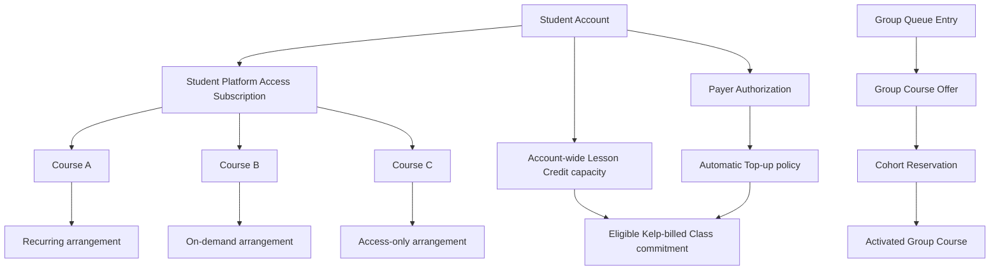

# Phase 9: Service plans, subscriptions, transitions, and Group Course entry

**Contract phase:** 9 of 54  
**Status:** Final approved contract  
**Last updated:** 2026-07-20  
**Depends on:** canonical glossary and approved Phases 2-8  
**Applies to:** Kelp Student platform access, recurring tutoring, on-demand tutoring, access only, Independent Tutor platform service, Course-scoped service arrangements, payer authority, plan changes, service freezes, and Group Course queue entry and formation

## 1. Purpose

This contract defines which Kelp services a person may use, how those services are attached to Accounts and Courses, and what changes when a service arrangement starts, pauses, changes, or ends.

It separates six questions that must never be collapsed:

1. **Does the Student currently have platform access?**
2. **What service path applies to this specific Course?**
3. **Who is authorized to pay and set funding limits?**
4. **Does the Student have enough Lesson Credit capacity for a proposed Class?**
5. **Is this a Kelp-managed or Independent Tutor Course?**
6. **Has a Group Course merely been requested, offered, or actually activated?**

A payment-method screen does not create platform access. A platform subscription does not book a Class. A recurring Course arrangement does not itself charge Lesson Credits. A Group Queue Entry does not create a Course or expose other Students.

## 2. Contract authority and approval record

The canonical glossary and approved Phases 2-8 remain authoritative. In particular, Phase 9 preserves:

- the Course, Classroom, Class, Tutor Assignment, and service-model identities;
- Mentor-led intake and atomic Kelp-managed Course activation;
- recurring Lesson Schedule and fixed-date on-demand/access-only behavior;
- Course wind-down, termination, and archival;
- Tutor reassignment and Classroom Membership history;
- cumulative Role Assignments and relationship-scoped authority;
- Kelp Tutor Qualification and Operationally Enabled Scope;
- the separation of Lesson Credits, money, platform fees, and Tutor compensation.

The product owner approved all twelve Phase 9 recommendations on 2026-07-20. The settled rules, approved rules, lifecycle boundaries, prices, decision chain, and Phase 9 invariants in this document are authoritative. Items explicitly marked **Deferred** remain assigned to later contracts.

## 3. Settled baseline from earlier phases

The following rules are already settled and are not reopened here:

1. Recurring tutoring, on-demand tutoring, and access only are different Kelp-managed Course service paths.
2. Every activated Kelp-managed Course has one active qualified Kelp Tutor Assignment, including access-only Courses.
3. Recurring tutoring has one or more weekly Recurring Slots and at least one 60- or 90-minute Theory Slot.
4. On-demand tutoring has no recurring Lesson Schedule and permits Standalone Class requests.
5. Access only has no Lesson Schedule and no Class-booking ability.
6. On-demand and access-only Course Schedule dates remain fixed until an authorized successor Course Schedule Version changes them.
7. Independent Tutor Classes are externally billed and create no Kelp Lesson Credit charge, Kelp commission, Tutor accrual, or Tutor payout.
8. An Independent Tutor pays a flat USD 10 monthly platform fee regardless of Student count.
9. Students taught only through the Independent Tutor model do not pay Kelp's USD 5 Student platform fee.
10. Kelp Student platform access is paid in money, not Lesson Credits.
11. Kelp-billed tutoring uses integer Lesson Credits: 10 for 30 minutes, 20 for 60 minutes, and 30 for 90 minutes.
12. Lesson Credits belong to the Student account, not a Tutor or Classroom, and a Tutor relationship ending does not erase them.
13. Recurring commercial readiness requires an active platform subscription and reusable payment readiness before activation.
14. Intake completion does not itself charge Lesson Credits.
15. A recurring Lesson Credit shortfall is funded only when the first actual Class commitment requires it.
16. An Automatic Top-up buys exactly the shortfall for a recurring commitment; a larger package is a separate manual purchase.
17. A self-paying Student controls their own top-up limit; a Guardian controls a separate limit for each funded child.
18. One failed Automatic Top-up is retried once. If it still fails, the proposed Class is not booked.
19. A balance cannot become negative.
20. Three consecutive Student no-shows account-wide trigger a two-month Subscription Freeze; an attended Class resets the streak.
21. During that freeze, recurring billing, Automatic Top-ups, and Credit Lot expiration clocks pause while Course and platform-tool access remain available.
22. If the freeze remains unresolved for two months, service changes to access plus Standalone Classes.
23. Guardian purchases and payment authority never grant Guardian access to an unrelated child or make the Guardian the Student.
24. One Account may use both Kelp Tutor and Independent Tutor service models, but each Course has an explicit model.
25. Group Classes exist only through a Group Course formed for a defined cohort, never by converting an individual Class into an ad-hoc multi-Student meeting.

## 4. Scope

### Included

Phase 9 defines:

- the distinction between Student platform access and Course service paths;
- the scope of recurring, on-demand, access-only, and Independent Tutor subscriptions;
- Course-scoped service-arrangement states and history;
- payer identity, consent, and per-Student funding limits;
- the commercial gate between projection, commitment, top-up, and booking;
- service-path activation, pause, downgrade, upgrade, and ending;
- the two-month no-show Subscription Freeze outcome;
- Independent Tutor subscription delinquency behavior;
- Kelp-managed and Independent Tutor model-conversion boundaries;
- Group Queue Entry, matching, offer, acceptance, cohort formation, and failure states;
- privacy, concurrency, audit, and Notification Events for these workflows.

### Deferred

Phase 9 does not define:

- Stripe API objects, webhooks, Checkout, Billing, Connect, tax, invoice, or receipt implementation;
- exact database tables, RLS policies, RPCs, APIs, or frontend pages;
- final consumer terms, jurisdiction-specific cancellation rights, tax treatment, or mandatory notice periods;
- provider refund formulas, processor-fee deductions, disputes, chargebacks, and money-refund execution; Phase 10 governs credit-side reversals and refund allocations;
- the Phase 10 Credit Lot ledger, posting, expiration, transfer, promotion, and administrative-adjustment mechanics, which remain outside Phase 9 but now govern credit authority;
- which approved 40-credit multiples are actively offered and any package discounts; Phase 10 governs the 40-credits-per-month formula and the 480-credit, 12-month cap;
- Lesson Request forms, Tutor acceptance, Hold Window, cancellation, attendance, or settlement implementation;
- Group Course lesson pricing, cohort-specific Lesson Credit mapping, scholarships, or revenue allocation;
- the initial minimum and maximum cohort sizes for each Group Course Offering;
- Group Course curriculum authoring and academic cohort-progress rules beyond entry and activation;
- notification delivery through email, Twilio SMS, push, or another provider;
- Independent Tutor private Student billing, refund, or dispute rules;
- Authored Product ownership or revenue share.

## 5. Phase 9 concepts

### Service Plan Offering

A versioned commercial catalog definition describing one available service, its eligibility, currency, prices, billing cadence, included capabilities, restrictions, and effective sales period. An Offering is not a user's subscription or Course.

### Service Plan Version

The immutable version of a Service Plan Offering accepted for a subscription, Course arrangement, or Group Course offer. Later catalog edits do not silently rewrite an accepted Version.

### Student Platform Access Subscription

The Account-scoped monetary service that permits a Kelp-managed Student to use the applicable Course and platform tools. It is separate from Course service paths, Lesson Credits, and Class commitments.

### Course Service Arrangement

The effective-dated Course-scoped record selecting `recurring`, `on_demand`, or `access_only` for a Kelp-managed Course. One Student may have different active arrangements for different Courses.

### Recurring Tutoring Arrangement

A Course Service Arrangement that permits a weekly Lesson Schedule, ordinary Recurring Classes, recurring-price funding, and theory-gated Course progression.

### On-demand Tutoring Arrangement

A Course Service Arrangement that permits Standalone Class requests with the assigned Kelp Tutor but creates no recurring Lesson Schedule.

### Access-only Arrangement

A Course Service Arrangement that provides the Course, Classroom, assigned Kelp Tutor, and platform tools without Class-booking authority or a Lesson Schedule.

### Independent Tutor Platform Subscription

The Account-scoped USD 10 monthly service allowing an Independent Tutor to use Kelp within their permitted Students, Courses, Classrooms, schedules, Assessments, and reports. It creates no Kelp staff role, supervision, lesson-payment, commission, or payout relationship.

### Payer

The verified Account or external customer identity legally and technically responsible for a monetary service. The Payer may be the Student or an authorized Guardian and is distinct from the service beneficiary.

### Payer Authorization

The server-authoritative record of the Payer's consent for a specific Student subscription, manual purchase, or Automatic Top-up policy. It records scope, payment-method reference, limits, effective period, terms Version, and revocation history without storing raw payment credentials.

### Funding Cycle

The monthly period used to measure a Payer's Automatic Top-up spending limit. It is separate from the platform-subscription renewal period unless their anchors happen to match.

### Service Plan Change

An effective-dated request and decision to upgrade, downgrade, pause, resume, or end one Student Platform Access Subscription or Course Service Arrangement. It never rewrites earlier service history.

### Payment Action Required

The safe state used when payment readiness, consent, or a funding attempt fails. It blocks the new paid capability or Class commitment without pretending that access or booking succeeded.

### Group Course Offering

A versioned proposal for a future Group Course. It identifies the Subject scope, level or Assessment band, language where applicable, timezone and schedule window, Course Template Version, minimum and maximum cohort size, service model, price, Tutor requirements, and acceptance rules.

### Group Queue Entry

One Student's private, effective request to be considered for a compatible Group Course Offering. It is not a Course, Classroom Membership, Class booking, Tutor Assignment, or payment charge.

### Cohort Candidate Set

The internal, privacy-preserving set of mutually compatible Group Queue Entries being evaluated for one Group Course Offering. Members do not see one another merely because they are candidates.

### Group Course Offer

The time-bounded offer sent to a Student or authorized Guardian after Kelp identifies a viable cohort, Tutor, schedule, and price. Acceptance reserves that Student's place but does not activate the Course until all activation conditions pass.

### Cohort Reservation

The temporary reservation created by an accepted Group Course Offer. It prevents the same learning need from being committed into multiple cohorts while formation completes.

## 6. Approved boundaries consumed by Phase 9

Phase 9 must not use a subscription or payment status as a substitute for:

- a Role Assignment;
- a Guardian Relationship;
- a Tutor Qualification;
- an Operationally Enabled Scope;
- a Tutor Assignment;
- a Classroom Membership;
- a Course state;
- a Lesson Schedule;
- a Class commitment, hold, attendance result, or charge.

Commercial readiness is one required input to an authorized action. It never creates academic or relationship authority by itself.

## 7. Approved domain model

The diagram is conceptual. Database names and foreign keys remain deferred.

## 8. Scope and cardinality rules

The approved model uses these boundaries:

- one Student Account has at most one current Student Platform Access Subscription;
- one Student Platform Access Subscription may support multiple active Kelp-managed Courses;
- one Course has exactly one current Course Service Arrangement for an effective instant;
- one Student may use recurring tutoring in one Course and on-demand or access only in another;
- one Course Service Arrangement never changes another Course automatically;
- one Payer Authorization is scoped to a Student and funding purpose;
- a Guardian uses separate limits and consent per child;
- one Group Queue Entry belongs to one Student learning need and one compatible Offering family;
- one learning need has at most one active Cohort Reservation;
- Kelp-managed and Independent Tutor service models are never inferred from Workspace Context.

## 9. Service Plan Offering and Version rules

Every sellable or renewable service should reference an immutable Service Plan Version containing at least:

- canonical Offering identifier and Version;
- service audience;
- Account or Course scope;
- Kelp-managed or Independent Tutor model;
- currency and money amounts in minor units;
- billing cadence and renewal rule;
- platform capabilities;
- Class-booking capabilities;
- recurring or standalone pricing basis where applicable;
- Payer consent requirements;
- sales start and end instants;
- replacement Version, if any;
- terms and policy references;
- audit timestamps.

Existing accepted service periods retain their pinned Version. A new Version may govern a future renewal only after the applicable notice and acceptance rules. No price edit is retroactive.

## 10. Settled initial individual pricing

The product owner has settled USD as the initial currency and these individual lesson prices:

| Kelp-billed service | 30 minutes | 60 minutes | 90 minutes |
| --- | ---: | ---: | ---: |
| Recurring tutoring | USD 20 | USD 40 | USD 60 |
| Standalone Class | USD 25 | USD 50 | USD 75 |

Each duration still commits and charges the settled Lesson Credit quantity:

| Scheduled duration | Full Lesson Credit quantity |
| --- | ---: |
| 30 minutes | 10 |
| 60 minutes | 20 |
| 90 minutes | 30 |

Money and Lesson Credits remain different ledgers. The price paid for a Credit Lot is stored with that lot and never reconstructed by multiplying a universal credit-to-money rate.

The settled platform-fee examples are:

- USD 5 per month for one Kelp-managed Student Platform Access Subscription where required;
- USD 10 per month for one Independent Tutor Platform Subscription, regardless of Student count;
- no separate USD 5 Kelp Student platform fee for Students served only through the Independent Tutor model.

Group Course pricing is versioned in its Group Course Offering and remains a separate product decision. It must not silently inherit the individual recurring price.

## 11. Student Platform Access Subscription

The approved Student platform subscription is Account-scoped rather than Course-scoped.

It provides the authorized Student with access to:

- active Course and Classroom views;
- Course tools permitted by Membership and role;
- Assessments and Course Schedule views;
- assignments, Files, Forum, reports, and historical access as governed elsewhere;
- Support entry points;
- the service-path capabilities separately granted by each Course Service Arrangement.

The platform subscription does not itself:

- create a Course or Classroom;
- assign a Tutor;
- grant a Role or Membership;
- create a Lesson Schedule;
- buy Lesson Credits;
- book or charge a Class;
- keep a terminated Course active.

The approved initial commercial rule is one USD 5 monthly Student platform fee regardless of the number of simultaneous Kelp-managed Courses. If a recurring checkout displays platform access and tutoring funding together, the internal records and invoice lines remain separate.

## 12. Course Service Arrangement matrix

| Capability | Recurring | On-demand | Access only |
| --- | :---: | :---: | :---: |
| Active Kelp Tutor Assignment | Required | Required | Required |
| Course and Classroom | Required | Required | Required |
| Active Student platform access | Required | Required | Required |
| Weekly Lesson Schedule | Required | No | No |
| At least one Theory Slot | Required | No | No |
| Ordinary Recurring Classes | Yes | No | No |
| Standalone Class requests | Yes, as Extra Classes | Yes | No |
| Recurring-price Automatic Top-up | Eligible | No | No |
| Standalone-price funding | Extra Classes | All requested Classes | Not applicable |
| Class-driven curriculum progression | Theory-gated | No | No |
| Tutor-routed Course Schedule changes | Yes | Yes | Yes |

An access-only Tutor Assignment is a real educational relationship. It provides a qualified staff contact but does not imply unpaid tutoring or Class availability.

## 13. Recurring Tutoring Arrangement

A recurring arrangement becomes active only after Phase 2 activation requirements and Phase 4 Initial Schedule Selection succeed.

It records:

- Course and Student;
- current Lesson Schedule Version;
- accepted Service Plan Version;
- recurring price Version;
- Payer and reusable payment readiness;
- Automatic Top-up consent and limit, if enabled;
- effective period;
- pause, freeze, and ending history;
- current commercial blockers.

The approved funding model follows the product owner's Automatic Top-up instruction:

- recurring service is a schedule commitment and discounted lesson-price arrangement;
- it does not deposit a fixed Lesson Credit bundle every calendar month;
- existing eligible Student credits fund a commitment first;
- only the exact remaining shortfall is purchased automatically;
- a larger manual package requires a separate purchase;
- the first Automatic Top-up starts the recurring Funding Cycle used for that Payer's monthly limit;
- unused Lesson Credits remain in their traceable Credit Lots and retain their applicable expiration rules.

A Projected Meeting creates no payment or credit effect. A Class materializes only after service, Tutor, Course, schedule, capacity, and commercial revalidation.

## 14. On-demand Tutoring Arrangement

An on-demand arrangement requires:

- active Student platform access;
- active Course and Classroom;
- active eligible Kelp Tutor Assignment;
- fixed Course Schedule dates;
- no recurring Lesson Schedule.

The Student may submit Standalone Class requests only to their assigned Tutor and only within the Tutor's enabled taxonomy scope. Each accepted request uses the Standalone Class price and ordinary Lesson Credit commitment rules.

On-demand activation does not require an initial Lesson Credit purchase. Insufficient capacity blocks only the proposed Class, not Course reading or ordinary platform access.

## 15. Access-only Arrangement

An access-only arrangement requires active Student platform access, a Course, Classroom, and assigned qualified Kelp Tutor.

It permits academic communication, Course tools, assignments, reports, and Tutor-routed Course Schedule change requests within later capability contracts. It does not permit:

- creating or accepting a Lesson Request;
- booking a Standalone or Extra Class;
- generating Recurring Classes;
- consuming Lesson Credits;
- treating informal Tutor messages as an unpaid Class commitment.

An upgrade to on-demand or recurring tutoring returns to a new or resumed Mentor triage so qualification, capacity, schedule, and commercial readiness are revalidated.

## 16. Payer and beneficiary separation

The Student is the beneficiary of Student platform access and Lesson Credits even when a Guardian pays.

A Payer Authorization must identify:

- Payer Account or payment-customer reference;
- beneficiary Student;
- authorized service or purchase type;
- payment-method token or provider reference, never raw credentials;
- maximum amount and currency;
- Funding Cycle anchor;
- effective and revoked instants;
- consent and terms Versions;
- actor who created or changed it;
- Guardian Relationship when applicable;
- audit and Notification Events.

Payment authority never grants educational access. Ending a Guardian Relationship ends future Guardian-funded authority unless another lawful payment obligation remains, but it does not erase invoices, receipts, or already accepted commitments.

## 17. Automatic Top-up boundary

An Automatic Top-up is permitted only when:

- the server has an active Payer Authorization for that Student and purpose;
- the payment method remains provider-ready;
- the proposed Class is otherwise eligible;
- existing spendable capacity is insufficient;
- the exact shortfall and money price are calculated from pinned Versions;
- the proposed purchase stays within the Payer's remaining Funding Cycle limit;
- the idempotency key has not already succeeded.

The server, not the browser, calculates the shortfall. A successful processor response creates the payment and Credit Lot records before the Class commitment. The browser callback is never sufficient authority.

Phase 10 governs the atomic Lot issuance, deterministic allocation, fully funded Commitment, idempotency, and reconciliation needed after the Phase 9 Payer Authorization check.

After one failed attempt and one retry:

- no Class commitment or booking is created;
- no negative balance is permitted;
- the recurring arrangement enters `payment_action_required` for new commitments;
- further automatic attempts pause until the Payer resolves or reauthorizes payment;
- the Student and Payer receive a safe explanation and Support route;
- the Lesson Schedule remains preserved unless a later ending rule applies.

## 18. Credit portability across service paths

Lesson Credits remain Student-account-wide. Changing Course service path or Tutor does not convert, erase, or transfer them.

The approved rule is that an eligible purchased Lesson Credit may fund any later Kelp-billed individual Class, regardless of whether the Credit Lot originated from recurring or manual Standalone funding. Source, price, expiration, promotion, and refund history remain attached to the Credit Lot.

This portability is bounded by:

- expiration at the proposed Class time;
- existing commitments and holds;
- promotional-use restrictions, if any;
- administrative or dispute restrictions;
- no use for Independent Tutor Classes;
- no assumption that Group Course pricing uses the same mapping.

## 19. Approved service lifecycles

### Student Platform Access Subscription states

| State | Meaning | Paid capability |
| --- | --- | --- |
| `draft` | Selection or payer setup is incomplete | None |
| `pending_activation` | Terms and payment readiness are under validation | None |
| `active` | Current paid access period is valid | As authorized by Courses and Memberships |
| `payment_action_required` | Renewal or payment readiness failed | Safe status, payment, export, and Support access only unless a grace rule applies |
| `frozen_no_show` | The settled two-month conduct freeze is active | Course and platform-tool access continue under the freeze rule |
| `change_pending` | A future pause, payer change, or ending is scheduled | Current Version remains active until effective instant |
| `ending` | Paid access will not renew and dependent Courses need explicit outcomes | Current authorized access until effective instant |
| `ended` | No current paid platform entitlement | Historical access only where another contract permits it |

### Course Service Arrangement states

| State | Meaning |
| --- | --- |
| `proposed` | Intake or change request selected a path |
| `pending_activation` | Academic, relationship, scheduling, or commercial prerequisites remain |
| `active` | The Course path currently governs capabilities |
| `payment_action_required` | New paid Class commitments are blocked pending payer action |
| `paused` | New path operations are paused while history and planned configuration remain |
| `frozen_no_show` | The account-wide no-show freeze applies |
| `change_pending` | A successor Arrangement is approved for a future effective instant |
| `ended` | The Arrangement no longer grants forward-looking service capability |

A state label is never sufficient by itself. The server also checks effective period, Course state, Role, relationship, Membership, Tutor eligibility, restrictions, and required payment records.

## 20. Service Plan Change workflow

A Service Plan Change records:

- request ID and idempotency key;
- Student, affected Account subscription, and affected Course or Courses;
- requester and authority used;
- old and proposed Service Plan Versions;
- old and proposed Course Service Arrangements;
- requested and approved effective instants;
- Payer acknowledgment where money or consent changes;
- Tutor, Mentor, or Quality Assistant review when academic continuity changes;
- affected Lesson Schedule, Lesson Requests, and Scheduled Classes;
- credit commitments to retain, release, or review;
- reason and private Support Case link where applicable;
- decision, actor, and audit history;
- Notification Events.

The workflow follows these approved rules:

1. The browser submits a request; it never changes the current plan directly.
2. Kelp identifies every dependent Course and future Class.
3. Academic, scheduling, and commercial consequences are shown before confirmation.
4. The Payer confirms new money authority; the Student or Guardian confirms the service choice.
5. Kelp validates the effective instant against Hold Window and existing commitment rules.
6. One atomic transition ends the prior Arrangement and activates the successor.
7. Failures leave the earlier valid Arrangement active or produce an explicit safe blocker.
8. History, accepted prices, and payer attribution remain immutable.

## 21. Course-path transitions

### Access only to on-demand

Requires new or resumed Mentor triage, eligible Tutor and Course validation, active platform access, and booking readiness. It does not buy credits until a Standalone Class requires them.

### Access only to recurring

Requires triage, Tutor capacity, a valid recurring Lesson Schedule, at least one Theory Slot, reusable payment readiness, and a new active Recurring Tutoring Arrangement.

### On-demand to recurring

Requires Initial Schedule Selection and commercial revalidation. Pending Standalone Classes remain one-off Classes and do not become Recurring Classes.

### Recurring to on-demand

Ends future recurrence from the approved effective instant while preserving the Course, Classroom, Tutor Assignment, fixed Course Schedule, and Student credits. The old Lesson Schedule becomes ended or paused according to the selected change; it is not silently deleted.

### Recurring or on-demand to access only

Removes future Class-booking capability. Pending Lesson Requests that have not become accepted obligations are cancelled. Already accepted or Held Classes follow their own cancellation and transition rules rather than disappearing.

### One Course versus all Courses

A Course-path change affects only the named Course. Ending Student Platform Access affects all Kelp-managed Courses supported by that subscription and therefore requires an explicit outcome for each Course.

## 22. Future Classes during ordinary plan changes

Phase 9 defines this boundary:

- Projected Meetings not yet materialized simply stop materializing after the effective change;
- accepted future Classes outside the Hold Window may be cancelled by the approved plan change, with commitments released and no reliability or late-change entitlement effect;
- a Class already inside the Hold Window remains governed by the later cancellation and entitlement contract unless Kelp applies a separately authorized protective freeze;
- an Ongoing or completed Class is never changed by a service-plan transition;
- Extra Classes and individually rescheduled Classes are evaluated explicitly and never silently moved into a new series;
- the Lesson Schedule, Class revisions, and reasons remain readable in history.

The final Class-cancellation contract may refine financial consequences but must preserve these identity and audit boundaries.

## 23. Voluntary pause and cancellation

A voluntary recurring pause is not the same as the conduct-based Subscription Freeze.

The approved ordinary pause behavior is:

- stop new recurring materialization from an approved effective instant;
- preserve the Course, Classroom, Tutor Assignment, and Lesson Schedule history;
- require explicit handling of already Scheduled Classes;
- keep the USD 5 Student Platform Access Subscription active when the Student wants Course tools and on-demand readiness;
- continue ordinary Credit Lot expiration unless another approved rule pauses it;
- revalidate Tutor, Availability, price Version, payment readiness, and Slots before resumption.

Cancelling only recurring tutoring may downgrade one Course to on-demand or access only. Cancelling Student platform access does not silently leave active Kelp-managed Courses without a commercial state. Each affected Course must enter early ending, receive another valid payer, or reach another explicitly permitted outcome.

Exact minimum pause duration, maximum duration, notice, and consumer-law cancellation timing remain deferred.

## 24. Account-wide no-show Subscription Freeze

The settled trigger is three consecutive Student no-shows across the Account. Phase 11 now supplies the append-only Student No-show Streak Events: a final Kelp-managed Student no-show increments the streak, an attended final Kelp-managed outcome resets it, and unrelated outcomes remain neutral. The third consecutive increment triggers this freeze exactly once.

At the freeze instant, Kelp should atomically:

- mark the Student Platform Access Subscription and every active recurring Arrangement `frozen_no_show`;
- pause recurring billing and Automatic Top-ups;
- preserve the remaining lifetime of every Credit Lot for up to two months;
- stop new Recurring Class materialization;
- cancel or pause future Scheduled recurring Classes under a distinct service-freeze reason;
- release eligible commitments without consuming a Student late-change entitlement;
- preserve Course, Classroom, assignments, Forum, reports, and platform-tool access;
- notify the Student, applicable Guardians/Payers, Tutors, Mentors, and operational owner;
- create a reactivation route rather than requiring a new Account.

### Reactivation during the two months

The Student or authorized Guardian may choose recurring or on-demand tutoring with an assigned Tutor:

- recurring reactivation revalidates the Tutor, old Slots, current Availability, Course state, platform payment readiness, and current price Version;
- old Recurring Classes are not recreated retroactively;
- existing eligible credits are used before any new Automatic Top-up;
- no new Lesson Credits are purchased merely because the plan reactivates;
- the platform fee resumes under its accepted billing rule;
- on-demand reactivation ends recurring materialization and enables later Standalone requests.

### Unresolved after two months

The approved canonical interpretation of the settled phrase "access plus Standalone Classes" is `on_demand`:

- each recurring Arrangement becomes an On-demand Tutoring Arrangement;
- the recurring Lesson Schedule ends without erasing history;
- existing Tutor Assignments and Course access remain when otherwise valid;
- Credit Lot expiration resumes with the unused lifetime preserved at freeze start;
- platform billing resumes if prior authorization remains valid;
- failed platform renewal creates `payment_action_required` rather than a false active state;
- returning to recurring later requires the ordinary recurring upgrade workflow.

## 25. Student Platform Access ending

When the Student Platform Access Subscription ends for a reason other than the special no-show freeze:

- new paid platform operations stop at the effective instant;
- recurring materialization and new Lesson Requests stop;
- each active Kelp-managed Course receives an explicit continuity or early-ending outcome;
- future Classes are processed under the approved transition and cancellation rules;
- already acquired Lesson Credits remain Student-owned until expiration, refund, transfer, or adjustment policy says otherwise;
- invoices, receipts, commitments, and service history remain attributed;
- terminated Course and Inactive Classroom history follows the Phase 5 access and retention contract;
- payment restoration alone does not silently reactivate a terminated Course.

A new Payer may take over the platform subscription before the effective ending instant through a separately consented Payer Authorization change.

## 26. Independent Tutor Platform Subscription

The Independent Tutor Platform Subscription is Account-scoped and flat-priced at USD 10 per month regardless of Student count.

While active, it permits only the capabilities otherwise granted by Role, relationship, Course, Classroom, and product authorization. It does not:

- create Kelp Tutor status;
- create a Supervising Mentor;
- verify self-declared teaching scope;
- make Kelp responsible for private Student lesson payments;
- charge the Independent Tutor's Students a Kelp Student platform fee;
- create Lesson Credit, commission, accrual, or payout events.

The Independent Tutor may use recurring, on-demand, or access-only educational patterns in their Courses, but those labels do not create Kelp billing for the Classes.

### Approved delinquency handling

Phase 9 requires:

1. Retry a failed monthly renewal once within three days.
2. Keep ordinary service active during a seven-day grace period while notifying the Independent Tutor.
3. After day 7, enter `payment_action_required`, block new Courses, new Class scheduling, and new paid platform operations, and preserve export, status, Support, and historical reading.
4. Do not create Kelp Lesson Credit or payout effects for affected private Classes.
5. At day 30 unresolved, end the platform subscription and stop future platform-hosted Class access.
6. Preserve Classrooms and authored history under retention and export rules rather than deleting them.
7. Notify affected Students without disclosing the Tutor's private payment details.
8. Require current terms and payment readiness before reactivation.

Quality Assistant investigation and Support Cases remain available for conduct, safety, academic quality, content, or platform misuse even when payment service is restricted.

## 27. Kelp-managed and Independent Tutor model conversion

The financial, supervision, Qualification, and Tutor Assignment boundaries differ too much for an active Course to change models in place safely.

The approved conversion rule is:

- end or wind down the current Course under its existing model;
- financially close its Kelp commitments or record that private payment remains outside Kelp;
- preserve its Classroom and reports under historical access;
- create a linked successor Course under the new service model;
- require Student or Guardian acceptance;
- run Kelp intake and qualified Tutor Assignment when entering the Kelp-managed model;
- validate Independent Tutor subscription, Tutor participation, and external-billing acknowledgment when entering the Independent model;
- never convert old credit, commission, payout, or private-payment history.

The successor may reference reusable Assessment, Course Template, Schedule, and educational history only where those contracts permit it.

## 28. Group Course entry prerequisites

A Student or authorized Guardian may request Group Course service through the ordinary Kelp entry route. A valid Group Queue Entry requires:

- authenticated requester and trusted Student Profile;
- verified Guardian Relationship when a Guardian acts;
- canonical Subject and requested taxonomy scope;
- Assessment Result or level evidence current enough for the Offering;
- current Goals Submission where required;
- Student timezone and compatible schedule windows;
- language or accessibility requirements when relevant;
- requested Group Course Offering family;
- acknowledgment that no Course exists yet;
- consent to private compatibility matching;
- accepted queue terms Version;
- no incompatible active Cohort Reservation for the same learning need.

Joining the queue does not require a Lesson Credit charge and should not require the first Class purchase. Platform-payment readiness is required only before Group Course activation, consistent with Phase 2.

## 29. Group Queue Entry states

| State | Meaning |
| --- | --- |
| `draft` | Request is incomplete |
| `eligibility_review` | Profile, Assessment, goals, and constraints are being validated |
| `waiting` | Eligible and waiting for compatible candidates |
| `matching` | Kelp is building a possible Cohort Candidate Set |
| `offer_pending` | A Group Course Offer is ready for delivery |
| `offered` | A time-bounded offer awaits Student or Guardian response |
| `reserved` | The offer was accepted and one Cohort Reservation exists |
| `returned_to_queue` | A formation attempt failed without Student fault |
| `converted` | The Student activated into the Group Course |
| `withdrawn` | Student or authorized Guardian left before activation |
| `expired` | The Student did not answer an offer in time |
| `closed_ineligible` | Current Offering requirements were not met |
| `closed` | Kelp ended the queue family or request for a recorded reason |

The Queue Entry state does not grant Classroom or cohort visibility.

## 30. Group matching and fairness

Kelp should match Group Queue Entries by required compatibility before using queue age. Compatibility may include:

- Subject, Subtopic, and Assessment band;
- Course Template or curriculum scope;
- Student goals;
- timezone and overlapping recurring Availability;
- Course start window;
- language and accessibility needs;
- age or safeguarding band where required;
- service and price Version;
- maximum cohort size;
- qualified Tutor and Supervising Mentor capacity.

Within an equally compatible set, the oldest continuously eligible Queue Entry receives priority. Payment speed, public popularity, advertising, or another Student's identity must not determine academic matching.

A Student may express interest in more than one compatible schedule option, but one learning need may hold only one active Cohort Reservation. Accepting one offer releases competing offers atomically.

The Student-facing queue may show broad progress, an estimated review date, or an anonymized count range. It must not reveal names, Profiles, exact ages, contact details, grades, Guardian identities, or private reasons for another person's eligibility state.

## 31. Group Course Offer and acceptance

A Group Course Offer pins:

- Offering and Service Plan Versions;
- Subject, taxonomy, and Course Template Version;
- proposed Tutor and Supervising Mentor chain;
- proposed cohort size range;
- recurring schedule and anchor timezone;
- start and expected end dates;
- monetary price and Lesson Credit treatment;
- platform fee treatment;
- acceptance deadline;
- minimum formation condition;
- withdrawal and underfill explanation;
- terms and privacy Versions.

The approved acceptance window is 72 hours.

Acceptance:

- must come from the Student or authorized Guardian under the applicable age rules;
- creates one Cohort Reservation, not an active Course;
- records the accepted immutable offer Version;
- does not reveal other candidates;
- does not charge a Class before the first valid commitment;
- may establish payment readiness for later activation;
- releases competing reservations for the same learning need.

An expired or declined offer may return the Student to the queue with their original eligibility timestamp when their preferences remain valid. Repeated non-response may require confirmation before another offer but must not silently create a Course.

## 32. Group Course activation and underfill

One Group Course may activate only when:

- the Offering's minimum accepted cohort size is met;
- no accepted reservation exceeds the maximum cohort size;
- every Student remains eligible for the pinned academic band;
- every required Student or Guardian acceptance remains valid;
- one qualified Kelp Tutor Assignment covers the whole cohort;
- the Tutor's Operationally Enabled Scope covers the Course;
- one valid Supervising Mentor chain exists;
- the Group Course Schedule and recurring Lesson Schedule are valid;
- platform-payment readiness exists for every paying Student;
- price and terms Versions remain effective;
- safeguarding and accessibility requirements are satisfied;
- Course, Classroom, Memberships, Tutor Assignment, and converted queue records can activate atomically.

At activation, Kelp creates one Group Course, one Classroom, cohort Student Memberships, applicable Guardian Memberships, one Tutor Assignment, and the approved schedules. A Tutor Assignment belongs to the Group Course, not separately to each member.

If the cohort falls below its minimum before activation:

- no Course or Classroom is partially activated;
- no Class is charged;
- accepted reservations are released or extended with fresh consent;
- the Student may return to the queue, choose another compatible offer, or withdraw;
- original queue priority is preserved when the failure was not caused by that Student;
- the next honest review date is communicated;
- payment authorizations remain bounded and revocable.

Withdrawal after Course activation belongs to the later Group Course participation, pricing, and refund contract.

## 33. Concurrency, audit, privacy, and notifications

### Concurrency and idempotency

The server must prevent:

- two current Student Platform Access Subscriptions for one Student;
- overlapping active Course Service Arrangements for one Course;
- duplicate Automatic Top-ups for one Class shortfall;
- one learning need accepting two Group Course Offers;
- the last Group Course seat being reserved twice;
- activation below the minimum cohort size;
- activation above the maximum cohort size;
- price or terms changing between acceptance and activation without renewed consent;
- a payment success callback granting access twice;
- an ended or frozen plan continuing recurrence because a browser remained open.

If payment succeeds but the intended Class commitment or service activation fails, the money and Credit Lot records enter an operational reconciliation queue. Kelp must not fabricate the dependent Class or silently discard the purchase.

### Audit

Persist at least:

- Offering and Plan Versions;
- subscription and Arrangement effective periods;
- Payer identity, beneficiary, consent, limits, and revocation;
- price, currency, money amount, and provider reference;
- automatic and manual funding attempts with idempotency keys;
- old and new service states;
- transition reason and affected Courses, Schedules, Requests, and Classes;
- Subscription Freeze trigger and resolution;
- Group Queue eligibility, matching inputs, offers, responses, reservations, and activation;
- all staff decisions and overrides;
- Notification Events;
- prior values for every correction.

Audit persistence is part of each privileged state change. If required audit fails, the service activation, transition, top-up, freeze, queue conversion, or override is not considered successful.

### Privacy

- Payers see their own transactions and authorizations, not unrelated Student educational data.
- Students do not see another Group Queue member before Course activation.
- Guardians see only linked children and their own payment records.
- Tutors do not see payment credentials or unrelated queue candidates.
- Independent Tutor Students do not see the Tutor's subscription payment details.
- Support sees payment and queue data only through assigned capability and Case scope.
- Quality Assistants see the minimum needed for oversight, investigation, or exception handling.

### Notification Events

Create server-side events for at least:

- platform subscription activated, renewal due, renewed, failed, or ended;
- Course service path activated, changed, paused, resumed, or ended;
- Automatic Top-up consent changed, limit approached, attempted, succeeded, or failed;
- Class not booked because funding failed;
- no-show Subscription Freeze started, approaching resolution date, reactivated, or downgraded;
- Independent Tutor renewal failed, grace period ending, service restricted, or service ended;
- Group Queue Entry accepted, status changed, offer issued, offer expiring, offer accepted, returned to queue, or converted;
- Group Course formation delayed, activated, or cancelled;
- Payer changed or authorization revoked.

Delivery channel preferences and critical-message exceptions belong to the later notification contract.

## 34. Approved Phase 9 decisions

The product owner approved all twelve recommendations on 2026-07-20.

### Decision 1: Account-level access versus Course-level service

**Approved rule:** use one USD 5 monthly Student Platform Access Subscription per Kelp-managed Student Account and one separate effective-dated Course Service Arrangement per Course. Allow different Courses to use different paths simultaneously.

**Why:** this avoids charging platform access once per Course and prevents a change in Mechanics from rewriting a separate Physics Course.

### Decision 2: Versioning and billing anchors

**Approved rule:** pin every accepted price and entitlement to a Service Plan Version. Anchor the platform renewal to its activation date, anchor the recurring Funding Cycle to the first Automatic Top-up date, and reserve the 10th of the month for Tutor payout rather than Student subscription renewal. Give at least 30 days' notice for a future renewal price increase unless applicable law requires more.

**Why:** platform access, top-up limits, and Tutor payout are different clocks and should not share an accidental date.

### Decision 3: Recurring funding model

**Approved rule:** treat recurring tutoring as a weekly commitment plus discounted lesson price, not a fixed monthly credit deposit. Use existing credits first and buy exactly the shortfall when a real recurring Class commitment requires it.

**Why:** this follows the latest top-up instruction, avoids unused mandatory deposits, and preserves the separation between projected meetings and real Classes.

### Decision 4: Credit portability

**Approved rule:** let eligible purchased Lesson Credits remain usable across Kelp-managed Tutors, Courses, and individual recurring or Standalone Classes. Keep source, price, expiration, and refund attribution in the Credit Lot, and never use those credits for Independent Tutor Classes.

**Why:** credits are already Student-account-wide and survive Tutor relationship changes. Restricting them to an old Course would contradict that ownership model.

### Decision 5: Course-path transition boundary

**Approved rule:** make every transition effective-dated and Course-scoped. Stop future projection, cancel eligible future Classes outside the Hold Window without reliability or entitlement effects, and leave Held, Ongoing, and completed Classes to their own contracts.

**Why:** a plan label should not erase accepted obligations or rewrite history.

### Decision 6: No-show freeze resolution

**Approved rule:** interpret the settled two-month unresolved outcome as an automatic change from recurring to `on_demand`. Cancel future recurring Classes under a service-freeze reason, preserve Course access and Tutor Assignment, resume each Credit Lot with its remaining lifetime, and resume the USD 5 platform fee when the freeze ends.

**Why:** `on_demand` is the existing canonical service path for access plus Standalone Classes; inventing another plan would duplicate it.

### Decision 7: Independent Tutor delinquency

**Approved rule:** retry once within three days, provide a seven-day full-service grace period, restrict new operations after day 7, and end future platform-hosted service after day 30 while preserving history, export, and Support access.

**Why:** this provides a recovery window without allowing indefinite unpaid platform operation or deleting Student records.

### Decision 8: Course service-model conversion

**Approved rule:** prohibit in-place conversion of an active Course between Kelp-managed and Independent Tutor models. Wind down the current Course and create a linked successor with explicit Student or Guardian consent and the new model's activation checks.

**Why:** the models use different supervision, Qualification, payment, credit, commission, and dispute boundaries.

### Decision 9: Group queue fairness and privacy

**Approved rule:** match academic and schedule compatibility first, then use the oldest continuously eligible Queue Entry as the tie-breaker. Show only anonymized progress or count ranges to Students.

**Why:** Group Course entry is not a marketplace, popularity contest, or public Student directory.

### Decision 10: Group offer and reservation

**Approved rule:** use a 72-hour immutable Group Course Offer and allow only one active Cohort Reservation per Student learning need. Preserve original queue priority when Kelp's formation attempt fails.

**Why:** time-bounded offers let cohorts form while preventing one Student from blocking several possible groups.

### Decision 11: Group activation and underfill

**Approved rule:** store minimum and maximum cohort size in each Group Course Offering rather than one global constant. Activate atomically only after the minimum number accepts and every academic, Tutor, schedule, consent, and commercial gate passes. Underfill creates no Course or Class charge and returns unaffected Students to the queue.

**Why:** different Subjects and formats need different cohort sizes, while the activation safety rule can remain universal.

### Decision 12: Payer authority

**Approved rule:** allow one current renewal Payer and one current Automatic Top-up Payer per Student and purpose, with Guardian limits stored separately per child. Allow other authorized Guardians to make explicit manual purchases without silently replacing the renewal Payer.

**Why:** this supports shared families without creating racing automatic charges or letting a Student raise a Guardian-funded limit.

## 35. Phase 9 invariants

The following invariants are authoritative:

1. A platform subscription is not a Course, Classroom, Tutor Assignment, Membership, Lesson Schedule, Class, or Credit Lot.
2. Student platform access is Account-scoped; recurring, on-demand, and access-only arrangements are Course-scoped.
3. One Student may use different service paths in different Courses at the same time.
4. One Course has at most one active Course Service Arrangement at an effective instant.
5. A Course-path change never changes another Course automatically.
6. Money, Lesson Credits, Tutor accruals, and Independent Tutor private payments remain separate ledgers.
7. The USD 5 Student platform fee never consumes Lesson Credits.
8. The USD 10 Independent Tutor platform fee never creates Kelp Tutor status or Student Lesson Credits.
9. Students served only through an Independent Tutor Course owe no Kelp Student platform fee for that service.
10. Every accepted service period pins an immutable Service Plan Version.
11. A later catalog or price edit never rewrites an accepted prior Version.
12. A browser payment callback never grants access, credits, or booking authority.
13. A recurring arrangement creates no fixed monthly Lesson Credit deposit under the approved model.
14. A Projected Meeting creates no payment, credit commitment, charge, or Tutor compensation.
15. An Automatic Top-up buys only the exact recurring Class shortfall.
16. Existing eligible Lesson Credits fund a Class before an Automatic Top-up.
17. A larger credit package requires a separate manual purchase.
18. Automatic Top-up authority is server-validated against Payer consent and the remaining per-Student limit.
19. A Student cannot raise a Guardian-funded limit.
20. One failed Automatic Top-up and one failed retry create no Class booking.
21. A failed top-up cannot produce a negative Student balance.
22. Lesson Credits survive Tutor and Course service-path changes subject to their own expiration and restriction rules.
23. Lesson Credits never fund an Independent Tutor Class.
24. Access only grants no Class-booking authority.
25. On-demand tutoring creates no recurring Lesson Schedule.
26. Recurring tutoring requires a valid Lesson Schedule and at least one Theory Slot.
27. A plan transition is effective-dated and append-only.
28. A plan transition never rewrites an Ongoing or completed Class.
29. Projected Meetings stop materializing after the effective end of recurring service.
30. Held Classes remain governed by the cancellation and entitlement contract unless a separately authorized protective freeze applies.
31. Three consecutive account-wide Student no-shows trigger the two-month Subscription Freeze.
32. An attended Class resets the no-show streak before the freeze trigger.
33. The no-show freeze pauses recurring billing, Automatic Top-ups, and Credit Lot expiration clocks.
34. The no-show freeze preserves Course and platform-tool access.
35. No unresolved freeze may silently continue recurring service beyond two months.
36. The unresolved two-month outcome becomes the canonical on-demand path.
37. Freeze reactivation never recreates missed Classes retroactively.
38. Independent Tutor Classes remain externally billed regardless of educational scheduling pattern.
39. Independent Tutor delinquency never creates Kelp Lesson Credit, commission, accrual, or payout entries.
40. Ending an Independent Tutor subscription never deletes Course, Classroom, Class, report, or authorship history.
41. An active Course never converts in place between Kelp-managed and Independent Tutor service models.
42. A Group Queue Entry is not a Course, Classroom, Membership, Tutor Assignment, Class booking, or payment charge.
43. Group Queue matching reveals no candidate identity to another candidate.
44. Academic and schedule compatibility precede queue age.
45. Queue age breaks ties only among mutually compatible eligible entries.
46. One Student learning need has at most one active Cohort Reservation.
47. Accepting one Group Course Offer releases competing offers for the same learning need.
48. A Group Course activates only after its minimum cohort size and every academic, staffing, consent, schedule, and commercial condition pass.
49. A Group Course never activates above its maximum cohort size.
50. Group Course activation creates one Course, one Classroom, one cohort Membership set, and one Tutor Assignment atomically.
51. Group Course underfill before activation creates no Class charge.
52. Kelp-caused Group Course formation failure preserves the Student's eligible queue priority.
53. A Group Course Offering pins price, cohort, schedule, taxonomy, and terms Versions.
54. Payer authority never creates educational access.
55. Guardian payment authority remains scoped to the linked child and funding purpose.
56. Revoking future payer consent does not erase an already accepted lawful obligation.
57. Workspace Context never changes service model, plan authority, or Payer identity.
58. Browser state, route, role label, payment-method token, or resource identifier never grants paid capability.
59. Service, payer, queue, offer, reservation, and transition history is append-only.
60. Failed required audit persistence prevents service activation, transition, top-up, freeze, queue conversion, or override from being successful.

## 36. Relationship to existing implementation

The repository does not yet contain the complete Phase 9 domain model:

- the current Profile and multi-role structures do not represent Student Platform Access Subscriptions, Course Service Arrangements, or Payer Authorizations;
- no authoritative Lesson Credit, commitment, top-up, price-Version, or service-transition ledger exists;
- no Group Course Offering, Queue Entry, Cohort Reservation, or atomic cohort activation workflow exists;
- current frontend routes and local state are not payment, plan, queue, or authorization evidence;
- current Course and schedule prototypes must not be renamed into these records without the required lifecycle and audit behavior;
- existing Stripe references are design intentions, not an implemented server-authoritative billing contract.

Phase 9 does not authorize a migration, Stripe integration, Docker run, Supabase change, or frontend wiring. Later architecture must implement approved contracts with server-side authorization, idempotency, reconciliation, and audit.

## 37. Phase 9 completion and Phase 10-11 integration

Phase 9 is final and authoritative. Later phases must consume its Student Platform Access Subscription, Course Service Arrangement, Service Plan Version, Payer Authorization, Funding Cycle, service-transition, Subscription Freeze, Independent Tutor delinquency, Group Queue Entry, Group Course Offer, and Cohort Reservation outputs rather than infer service authority from UI state or a payment callback.

Phase 10 now consumes service state and Payer Authorization to create Credit Lots, calculate spendable capacity, allocate Commitments, convert them to Holds, and reconcile credit outcomes. It does not reopen the Account-versus-Course service boundary, pricing Version, or Group Course formation rules settled here.

Phase 11 now supplies the authoritative account-wide no-show streak, attended reset, and third-no-show trigger consumed by the Subscription Freeze. It does not reopen the two-month freeze, billing pause, service conversion, or credit-lifetime rules settled here and in Phase 10.

No database, API, row-level-security, Stripe, Twilio, Docker, Supabase, payment, or frontend implementation is authorized by this contract.
