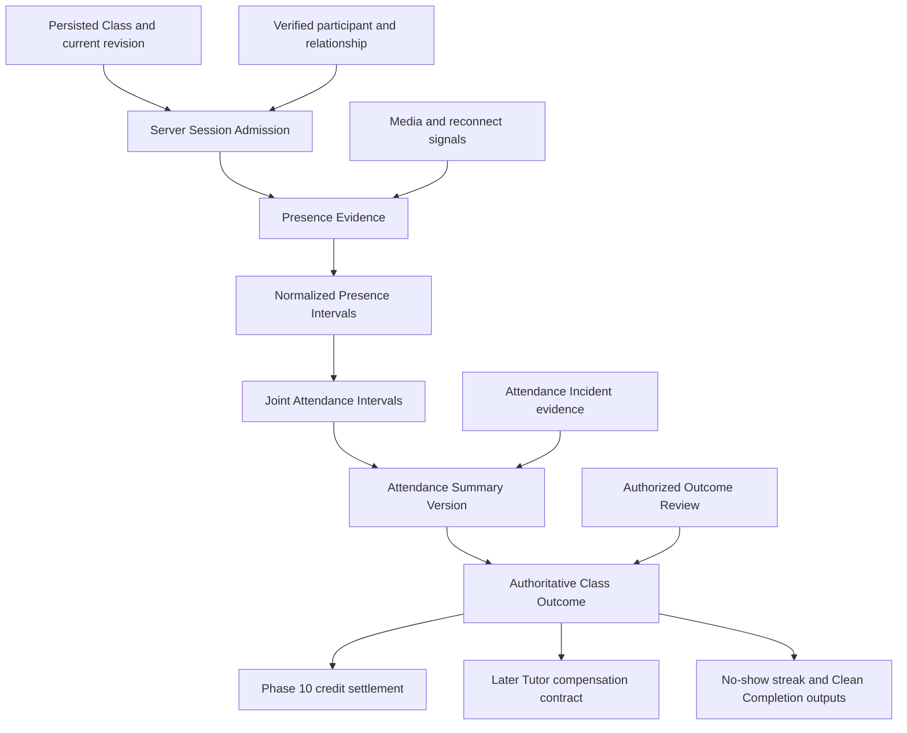
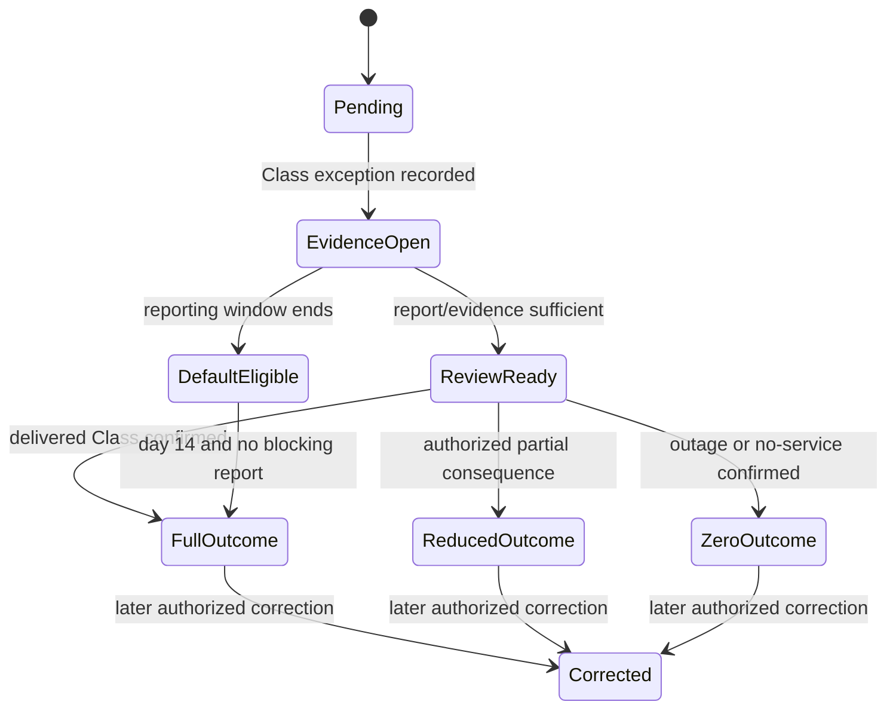

# Phase 11: Class attendance, outcomes, no-shows, and incidents

**Contract phase:** 11 of 54  
**Status:** Final approved contract  
**Last updated:** 2026-07-20  
**Depends on:** canonical glossary and approved Phases 2-10  
**Applies to:** Live Classroom admission, server-authoritative presence, Attendance Intervals, Joint Attendance, Class operational state, completion, early ending, no-shows, late starts, disconnections, Kelp outages, outside-Kelp claims, post-Class records, participation scores, outcome review, no-show streaks, and the authoritative Class financial outcome consumed by Phase 10

## 1. Purpose

This contract defines how Kelp determines what happened during a scheduled Class without trusting a browser timer, a participant's role label, or one unverified form submission.

It separates seven questions that must not be collapsed:

1. **Was an authorized participant admitted to the correct Live Classroom?**
2. **When was each Student or Tutor actually present?**
3. **For how long were the required participants jointly present?**
4. **Did the Class start, end, meet the completion threshold, or produce a no-show?**
5. **Did a technical or operational incident prevent a normal outcome?**
6. **Which educational review and participation records were submitted afterward?**
7. **Which authoritative outcome should Phase 10 use for credit settlement?**

Opening a Classroom route is not attendance. A media-provider event is not by itself a final outcome. A Tutor review is not presence evidence. Reaching the completion threshold does not silently close the live room. A financial outcome does not pay a Tutor by itself.

## 2. Contract authority and approval record

The canonical glossary and approved Phases 2-10 remain authoritative. In particular, Phase 11 preserves:

- 30-, 60-, and 90-minute scheduled Class durations;
- the 10-minute Student and Tutor no-show checkpoint;
- accumulated Joint Attendance equal to 50% of scheduled duration as the normal completion threshold;
- 15-, 30-, and 45-minute thresholds for 30-, 60-, and 90-minute Classes;
- the 5-, 10-, and 15-credit Student no-show mapping;
- zero Student charge and zero Tutor compensation for Tutor no-show;
- zero automatic charge and compensation for an approved Kelp outage that prevents service;
- a seven-day reporting window and a maximum 14-day Settlement Pending period for qualifying exceptions;
- normal settlement after 14 days when no required exception report is made and Kelp has not independently confirmed an outage;
- account-wide consecutive Student no-shows and the Phase 9 two-month Subscription Freeze;
- an attended Class resetting the Student no-show streak;
- no-show incidents remaining separate from the Student late-change entitlement;
- Guardian read access to the linked child's Class status without authorship or status-changing authority;
- Administrator-only correction of Ongoing or taught Class status after ordinary server transitions;
- append-only history, server-authoritative decisions, and compensating corrections.

The product owner approved all twelve Phase 11 recommendations on 2026-07-20. The settled rules, approved rules, evidence model, Class-state and outcome lifecycles, time anchors, review boundaries, and Phase 11 invariants in this document are authoritative. Items explicitly marked **Deferred** remain assigned to later contracts.

## 3. Settled baseline from earlier phases

The following rules are already settled and are not reopened here:

1. A Class is one scheduled meeting event; the Classroom is the persistent Subject space; the Live Classroom is the synchronous meeting environment.
2. Only a persisted Scheduled Class can become an ordinary paid live session.
3. A Projected Meeting creates no attendance, no-show, credit, or Tutor-compensation event.
4. Class revisions preserve one logical Class identity.
5. A different scheduled duration requires the valid Phase 4 change workflow before the six-hour Hold Window.
6. Duration cannot change inside the Hold Window.
7. A permitted late start does not reduce the promised scheduled duration.
8. A Tutor may not unilaterally extend a Class and create more Student credits or compensation.
9. Joint Attendance accumulates only while the Student and Tutor are both present.
10. Disconnections pause the current interval and separate valid intervals may accumulate.
11. The normal Completion Threshold is 50% of scheduled duration.
12. A Student no-show requires Tutor presence and Student absence at the 10-minute checkpoint.
13. A Tutor no-show requires Student presence and Tutor absence at the 10-minute checkpoint.
14. A Student no-show creates the approved half-credit outcome and a conduct incident.
15. A Tutor no-show creates a zero-credit outcome, releases the Student commitment, creates no Tutor compensation, and generates an investigation alert.
16. An approved Kelp outage does not consume either party's late-change entitlement.
17. A Class attendance or incident outcome is the only valid input for Phase 10 settlement.
18. Phase 10 never infers attendance from browser state.
19. Student and Tutor conduct reports are distinct from attendance evidence and ordinary post-Class reviews.
20. Independent Tutor Classes create no Kelp Lesson Credit or Tutor-payout outcome even when Kelp records their attendance.

## 4. Scope

### Included

Phase 11 defines:

- Live Classroom admission and presence-evidence boundaries;
- Attendance Interval and Joint Attendance accumulation;
- operational Class state versus final attendance and financial outcome;
- the scheduled start, entry, no-show, and expected-end time anchors;
- Student no-show, Tutor no-show, mutual absence, and early-departure handling;
- permitted late starts and duration preservation;
- normal and valid early completion;
- repeated-disconnection and suspected-incident behavior;
- Kelp outage and outside-Kelp claim review;
- the authoritative financial-outcome record sent to Phase 10;
- Tutor post-Class educational review and Student survey boundaries;
- participation scoring and normalization;
- account-wide Student no-show streak inputs;
- Clean Completed Class output for later entitlement and reliability contracts;
- Group Course attendance evidence boundaries;
- Class-status visibility, correction authority, idempotency, audit, and notifications.

### Deferred

Phase 11 does not define:

- cancellation and rescheduling entitlement accounting inside the six-hour Hold Window;
- Tutor short-notice cancellation penalties and the rolling 24-Class consequence schedule;
- Tutor money accrual, commission, settlement hold, payout, or dispute recovery;
- Group Course per-member Lesson Credit prices or Tutor revenue allocation;
- final Support Case queues, complaint adjudication, safeguarding, or conduct penalties;
- Jitsi, WebRTC, Twilio, email, push, device-fingerprint, or monitoring-provider implementation;
- exact database tables, RLS policies, RPCs, APIs, jobs, or frontend flows;
- statutory consumer, employment, recording-consent, accessibility, or privacy requirements;
- raw technical-telemetry retention periods;
- Lesson Request acceptance, attachments, expiry, or competing requests;
- detailed Tutor Availability, holidays, and Time Off;
- report-card calculation beyond the participation output already approved;
- Independent Tutor private payment or dispute rules.

## 5. Phase 11 concepts

### Class Session

The bounded live occurrence associated with one persisted Class and one current Class revision. It owns admission, presence evidence, operational state, attendance summary, incident references, and one authoritative outcome history. It is not the persistent Classroom or the media-provider room by itself.

### Session Admission

The server-authoritative decision permitting one verified Class participant to enter the Class Session in a specific role. Admission is scoped to the Class, current Membership or Tutor Assignment, participant, role, and effective time. A query parameter or browser role never creates admission.

### Presence Evidence

An append-only server record indicating that an admitted participant was available in the Live Classroom during a bounded time. It may consume authenticated heartbeats, media-session events, reconnect events, and trusted server observations, but no single browser timer is authoritative.

### Presence Interval

A normalized interval derived from valid Presence Evidence for one admitted participant role. Overlapping tabs or devices for the same participant form a union of time and never multiply attendance.

### Joint Attendance Interval

The intersection of one Student Presence Interval and the assigned Tutor Presence Interval for the same Class Session. Only the union of valid Joint Attendance Intervals contributes to accumulated Joint Attendance.

### Attendance Summary

The immutable result Version that records scheduled anchors, admitted participants, normalized intervals, Joint Attendance, threshold, lateness, early departure, incident references, and the evidence Version used to derive an outcome.

### No-show Checkpoint

The instant 10 minutes after the authoritative scheduled start. It is evaluated server-side against admitted presence and incident evidence. A client clock cannot create or avoid a no-show.

### Operational Class State

The real-time state used to show whether the Class is scheduled, open for entry, waiting, Ongoing, or ended. It is separate from the final attendance and financial outcome.

### Authoritative Class Outcome

The append-only server decision stating the final attendance type and the financial-output code for one Class revision. It references the Attendance Summary and any incident decision and supplies Phase 10 with a full, half, reduced, zero, or pending credit outcome.

### Early Completion Confirmation

An independently attributed acknowledgment that a substantive Class ended intentionally before reaching the ordinary Completion Threshold. It never manufactures presence time and is valid only through the approved below-threshold workflow.

### Attendance Incident

A traceable suspected or confirmed event that may affect the Class outcome, such as a Kelp outage, media failure, repeated disconnection, participant early departure, outside-Kelp claim, or contradictory evidence.

### Outcome Review

The Quality Assistant investigation that evaluates a timely Attendance Incident and recommends or approves the authoritative outcome within its granted scope. It is not a silent edit to Attendance Intervals or prior status.

### Post-Class Tutor Review

The attributed educational record completed by the Tutor after the Class. It confirms instruction focus, format, participation evidence, participation score, and optional feedback. It is not attendance authority or a conduct report.

### Post-Class Student Survey

The Student's optional, separately permissioned feedback about the Class. It may create a confidential conduct report but never changes attendance or settlement merely because it is submitted.

### Student No-show Streak Event

The append-only account-wide event that increments or resets the Student's consecutive no-show streak after an authoritative Kelp-managed Class outcome.

### Clean Completion Event

The append-only statement that a completed Class satisfies the existing Clean Completed Class definition for later late-change entitlement and Tutor reliability contracts.

## 6. Boundaries consumed by Phase 11

Phase 11 must not use attendance as a substitute for:

- Classroom Membership, Guardian Relationship, or Tutor Assignment;
- Course state, Course Progress, or Lesson Schedule authority;
- Tutor Qualification or Operationally Enabled Scope;
- Class booking, duration-change, cancellation, or rescheduling authority;
- Student credit ownership, allocation, Commitment, or Hold;
- Tutor compensation or payout;
- Support Case guilt, safeguarding, or conduct consequence;
- Group Course price or financial allocation;
- notification consent or delivery-channel selection.

Attendance answers what Kelp can authoritatively say occurred in one Class Session. It does not grant access, schedule another Class, transfer credits, or decide a Tutor's payment ledger by itself.

## 7. Approved evidence model



Every evidence record must identify:

- Class and current revision;
- Class Session;
- participant Account and authoritative role;
- admission decision;
- server-observed start and end or heartbeat instant;
- provider and source where applicable;
- idempotency key;
- trust level and validation state;
- superseding or invalidating evidence where applicable;
- recorded instant and audit actor.

The evidence layer records facts. The outcome layer applies product rules. Neither layer overwrites the other.

## 8. Approved dual-state Class model

Phase 11 requires two separate dimensions.

### Operational session state

| State | Meaning |
| --- | --- |
| `scheduled` | Entry is not yet open |
| `entry_open` | Authorized participants may use prejoin and admission |
| `waiting` | At least one required participant is admitted but Joint Attendance has not begun |
| `ongoing` | A valid Joint Attendance Interval has begun inside the permitted start window |
| `ended` | The entitled live duration ended or the session was deliberately closed |

### Authoritative outcome state

| State | Meaning |
| --- | --- |
| `unresolved` | No terminal outcome is ready |
| `completed` | The ordinary Completion Threshold was reached |
| `valid_early_completion` | A substantive below-threshold meeting was independently confirmed by both participants |
| `student_no_show` | Tutor satisfied the checkpoint rule and Student did not |
| `tutor_no_show` | Student satisfied the checkpoint rule and Tutor did not |
| `mutual_absence` | Neither party satisfied the checkpoint rule |
| `student_early_departure` | Joint Attendance began but the Student ended availability before threshold |
| `tutor_early_departure` | Joint Attendance began but the Tutor ended availability before threshold |
| `approved_outage` | A confirmed Kelp failure prevented normal service |
| `valid_cancellation` | A later cancellation contract supplies an authorized outcome |
| `settlement_pending` | A timely exception requires review |
| `administratively_corrected` | An authorized append-only successor replaces the effective result |

The visible `ongoing` label depends on the operational state. The credit ledger depends on the Authoritative Class Outcome. Guardians may therefore see that a Class ended while its incident outcome remains pending.

## 9. Approved time anchors

For one Class:

- `T` is the authoritative scheduled start from the current Class revision;
- `D` is the approved scheduled duration of 30, 60, or 90 minutes;
- `T-entry` is the approved entry-open instant at `T - 15 minutes`;
- `T-no-show` is the settled checkpoint at `T + 10 minutes`;
- `S` is the first valid Joint Attendance instant at or after `T` and no later than `T-no-show`;
- `E` is the entitled expected end at `S + D`;
- `J` is accumulated Joint Attendance across the Class Session;
- `C` is the ordinary Completion Threshold at `D x 50%`.

Presence before `T` supports device checks, waiting, and timely-arrival evidence but does not accumulate Joint Attendance before the scheduled service begins. The first valid Joint Attendance instant after `T-no-show` cannot silently revive the original Class as an ordinary on-time session.

## 10. Entry, admission, and waiting

The approved ordinary flow is:

1. prejoin opens 15 minutes before `T`;
2. an authenticated participant receives Session Admission only after Class, Membership, Assignment, and role validation;
3. a Student may enter the waiting state before the Tutor admits them to the synchronous room;
4. the server records admitted availability, not merely a loaded prejoin page;
5. the Class remains `waiting` while only one required participant is present;
6. the Class becomes `ongoing` at `S` when both required participants have valid presence;
7. Observer or Guardian presence never counts as Student or Tutor presence.

A Tutor must not delay Student admission in order to manufacture Student absence. A Student admission request made before the checkpoint remains evidence even if Tutor action or Kelp delivery is delayed.

## 11. Presence normalization and Joint Attendance

Phase 11 requires these normalization rules:

- use server timestamps for interval boundaries;
- union overlapping valid devices or tabs for the same participant;
- never count two devices twice;
- pause an interval when evidence becomes stale or a trusted leave event occurs;
- allow separate intervals to accumulate;
- intersect the Student and assigned Tutor unions to calculate Joint Attendance;
- exclude Guardian, Mentor, Quality Assistant, observer, and support presence from Joint Attendance;
- retain source evidence so a corrected summary can be reproduced;
- never infer presence from chat, whiteboard, file, or form activity alone.

The approved stale-evidence tolerance is 90 seconds. A gap at or below that tolerance may remain one interval only when surrounding authenticated evidence and provider state support continuity. A longer unsupported gap splits the Presence Interval. The exact heartbeat frequency is an architecture choice and must be materially shorter than the tolerance.

## 12. Completion Threshold

The ordinary Completion Threshold is:

| Scheduled duration | Completion Threshold |
| --- | ---: |
| 30 minutes | 15 accumulated joint minutes |
| 60 minutes | 30 accumulated joint minutes |
| 90 minutes | 45 accumulated joint minutes |

Reaching the threshold makes the Class eligible for a `completed` outcome and the full approved Student credit quantity. It does not end the operational session immediately. The Class remains `ongoing` until its entitled end, deliberate end, or incident transition so Guardians can see live status accurately.

Joint Attendance beyond the scheduled duration is preserved as actual history but creates no additional Lesson Credit charge, curriculum unit, or Tutor compensation by itself.

## 13. No-show Checkpoint

At `T-no-show`, the server evaluates required presence and timely-arrival evidence.

| Student | Tutor | Approved outcome |
| --- | --- | --- |
| Absent throughout the grace period | Validly present and available at checkpoint | `student_no_show` |
| Validly present and available at checkpoint | Absent throughout the grace period | `tutor_no_show` |
| Absent | Absent | `mutual_absence` |
| Both validly present by checkpoint | Both validly present | Begin or continue `ongoing` |
| Contradictory or Kelp-impaired evidence | Uncertain | `settlement_pending` |

The party relying on the other's no-show must remain validly available through the checkpoint unless trusted Kelp evidence proves that platform failure prevented it. Joining briefly and leaving before the checkpoint does not automatically establish the other party's no-show.

Once valid Joint Attendance begins, an ordinary no-show cannot be declared for that Class. A later departure uses the early-departure or incident rules.

## 14. Late starts and expected end

A Class may start at any `S` from `T` through `T + 10 minutes`, inclusive. The Student receives the full scheduled duration, so `E = S + D`.

Examples:

| Scheduled Class | First valid Joint Attendance | Expected end |
| --- | --- | --- |
| 09:00 for 30 minutes | 09:00 | 09:30 |
| 09:00 for 60 minutes | 09:07 | 10:07 |
| 09:00 for 90 minutes | 09:10 | 10:40 |

The one-hour Tutor buffer should absorb ordinary permitted lateness. A start after the checkpoint does not become normal merely because both parties later enter. The room may remain available for communication or incident resolution, but only an authorized correction or replacement-Class workflow may change the original outcome.

## 15. Entitled duration and ordinary ending

The entitled live duration begins at `S`, not when the first participant opens prejoin. At `E`:

- the ordinary live entitlement ends;
- the operational Class moves toward `ended`;
- the server closes the current Attendance Summary Version;
- accumulated Joint Attendance is evaluated;
- any suspected incident is evaluated before a final outcome;
- the Tutor review and Student survey may open;
- Phase 10 receives no outcome until the authoritative result exists.

A courtesy conversation continuing after `E` is not a Class extension. It creates no additional credit or Tutor-compensation entitlement and cannot delay the next Class. If the application leaves the room technically open, it must distinguish post-Class presence from entitled attendance.

A participant closing a browser is evidence of departure, not authority to select the financial result.

## 16. Early ending at or above the threshold

When Joint Attendance has reached `C`, ending before `E` normally produces a full `completed` outcome.

The Attendance Summary still records:

- actual Joint Attendance;
- which participant ended or disconnected first;
- whether both selected a deliberate-end action;
- technical signals;
- Tutor and Student explanations;
- whether a conduct or service incident was created.

Reaching the threshold settles the ordinary credit quantity, but it does not immunize Tutor conduct or technical quality from review. A Tutor who repeatedly ends Classes immediately after the threshold may create a separate quality or reliability concern even though the Student credit outcome remains full under the settled 50% rule.

## 17. Approved below-threshold outcome rules

When `0 < J < C`, the reason for ending matters.

### Student leaves while Tutor remains available

The approved outcome is `student_early_departure` with the full scheduled Student credit quantity, unless a timely approved Kelp or safety incident establishes a different outcome. The Tutor made the reserved service available and the Student cannot convert departure into a half-price no-show after Joint Attendance began.

### Tutor leaves while Student remains available

The approved outcome is `tutor_early_departure` and `settlement_pending`. It creates no automatic Student Charge or Tutor compensation while the Quality Assistant reviews whether the departure was Kelp-caused, an emergency, mutually agreed, or Tutor-caused.

### Both intentionally finish a substantive Class

The approved outcome is `valid_early_completion` only when:

- both participants had valid Joint Attendance;
- both submit separately attributed Early Completion Confirmations within 24 hours;
- both state that the intended lesson was delivered and ending was voluntary;
- neither reports a contradictory technical, conduct, or service incident;
- the selected Subject and Instruction Focus match the Class;
- the decision is auditable.

A valid early completion receives the full scheduled credit quantity. A missing or contradictory confirmation creates `settlement_pending`; Tutor submission alone cannot manufacture a full-charge outcome below threshold.

### Both disconnect without a deliberate end

The Class becomes `settlement_pending` when it remains below threshold and the evidence cannot establish responsibility. Automatic financial rules must not guess which participant caused the loss of service.

## 18. Repeated disconnections and technical evidence

Separate valid Joint Attendance Intervals accumulate toward `J`. Reconnection never resets previously accumulated valid time.

The following do not independently prove fault:

- a browser `offline` event;
- one lost heartbeat;
- a Jitsi participant-left event;
- a low-bandwidth estimate;
- camera or microphone being disabled;
- a participant changing devices;
- a page refresh;
- another participant's accusation.

The system should create or propose an Attendance Incident when:

- either required participant has repeated unsupported gaps;
- the same gap affects both participants or many rooms;
- provider and Kelp evidence disagree;
- Joint Attendance remains below threshold near `E`;
- a participant claims the room forced them out;
- the expected end cannot be determined safely;
- the Class resumes after an apparent terminal event.

Technical diagnostics support review but remain separately permissioned from educational records. A Tutor does not receive the Student's private device, network, or payment data, and a Guardian does not receive raw technical telemetry.

## 19. Authoritative Class financial outcome

Phase 11 produces exactly one effective Authoritative Class Outcome Version for Phase 10 at a time.

It must identify:

- Class and current revision;
- Class Session;
- scheduled start and duration;
- operational start and end;
- outcome type;
- full, half, reduced, zero, or pending financial-output code;
- exact Student credit quantity when already settled by contract;
- Attendance Summary Version;
- incident and review references;
- decision authority;
- effective and recorded instants;
- predecessor and correction reason;
- no-show-streak action;
- Clean Completion eligibility;
- audit completion state.

Phase 10 consumes the credit quantity and outcome reference. The later Tutor-compensation contract consumes the outcome type and its own price and compensation rules. Phase 11 does not convert Lesson Credits into Tutor money.

## 20. Approved outcome matrix

| Attendance or incident outcome | Student credit output | Phase 10 action | Tutor-compensation signal | No-show streak |
| --- | ---: | --- | --- | --- |
| `completed` | Full: 10, 20, or 30 | Charge full Hold | Normal eligible | Reset |
| `valid_early_completion` | Full: 10, 20, or 30 | Charge full Hold | Normal eligible | Reset |
| `student_no_show` | Half: 5, 10, or 15 | Charge half, release half | Later no-show rule | Increment |
| `tutor_no_show` | 0 | Release full Hold | None | No change |
| `mutual_absence` | 0 | Release full Hold after outcome | None | No change pending later conduct rules |
| `student_early_departure` | Full | Charge full Hold | Normal eligible | Reset because attendance occurred |
| `tutor_early_departure` | Pending | Preserve Hold | Pending | No change |
| confirmed outage preventing service | 0 | Release full Hold | None | No change |
| valid zero-charge cancellation | 0 | Release full Hold | Later cancellation rule | No change |
| outside-Kelp or contradictory claim | Pending | Preserve Hold up to 14 days | Pending | No change until decision |
| authorized reduced outcome | Explicit approved quantity | Charge quantity, release remainder | Later rule | Decision-specific |

The matrix is authoritative for Phase 11 attendance outcomes. Later conduct and Tutor-compensation contracts consume its signals without reopening the Student credit quantities settled here.

## 21. Kelp service outage

An outage can be:

- **confirmed automatically**, when trusted Kelp or integrated-provider monitoring proves material failure;
- **reported**, when a participant files a timely incident and Kelp has not yet confirmed it;
- **suspected**, when attendance evidence shows a correlated failure pattern.

A confirmed outage that materially prevents the Class produces an `approved_outage` zero-charge outcome without requiring the Student to prove Kelp's own failure. The Hold is released, no Tutor compensation is created by this Class, and neither party's late-change entitlement is affected.

A reported or suspected outage enters `settlement_pending` while evidence is reviewed. The participant has seven days from the scheduled Class to add the required report. Kelp should not use missing technical sophistication or inaccessible device logs against the Student when Kelp evidence independently confirms the failure.

A localized participant device or internet failure is not automatically a Kelp outage. It may still justify a Case-specific outcome after review.

## 22. Outside-Kelp meeting claims

Opening another video service, exchanging messages, or asserting that a meeting occurred outside Kelp does not create Joint Attendance automatically.

The approved exception workflow is:

1. either participant reports the Class, Student, Tutor, date, and reason within seven days;
2. the claim creates `settlement_pending` for at most 14 days from the Class;
3. each participant may submit a separately attributed delivery confirmation;
4. a Quality Assistant compares both accounts, Kelp outage evidence, Course context, and any permitted supporting evidence;
5. a mutually confirmed substantive lesson may receive a full outcome as an exceptional delivered Class;
6. an approved Kelp outage that prevented delivery receives a zero outcome;
7. a disputed or unsupported claim receives the reviewed outcome and may create a separate conduct Case;
8. if no one files the report required to prevent normal settlement and Kelp has not confirmed an outage, the normal full outcome becomes eligible after day 14 under the settled rule.

Outside-Kelp delivery must not become the ordinary attendance path. It lacks Kelp's normal evidence, tools, and safety controls and may trigger quality review even if the delivered-Class outcome is approved.

## 23. Settlement Pending lifecycle

Settlement Pending preserves uncertainty; it is not a hidden zero charge.



During pending state:

- the Phase 10 Hold remains protected;
- no final credit Charge or release is posted;
- no Tutor payout conclusion is inferred;
- evidence and deadlines are visible to the assigned reviewer;
- parties see that review is pending without seeing each other's confidential submission;
- the same exception cannot settle twice;
- a later correction uses Phase 10 Reversal or release mechanics rather than deletion.

## 24. Post-Class Tutor Review

The Tutor Review is required for every attended Kelp-managed Class and is due within 24 hours of operational ending.

It should contain:

- Class and Course identity;
- the snapshotted Subject, Subtopic, and Content from the Class rather than editable replacements;
- actual Instruction Focus and lesson format;
- participation score from 0 through 5;
- structured participation evidence;
- optional Assignment feedback;
- optional educational message;
- optional Student-profile educational note subject to later privacy rules;
- separate option to create a confidential conduct report;
- Tutor actor and submission instant;
- Version and correction history.

The required review must not keep the Class operationally `ongoing`, manufacture attendance, or block an otherwise valid financial outcome. If missing after 24 hours, it creates a Tutor operational reminder and, after the later escalation threshold, a quality-review item.

The approved ordinary edit window is two hours after initial submission. Later corrections create a successor Version and never overwrite what Students or Guardians previously saw.

## 25. Participation grading

The Tutor records a whole-number raw participation score from 0 through 5 after each attended Class.

The normalized report-card value is:

```text
normalized participation = raw score x 20
```

| Raw score | Normalized value |
| ---: | ---: |
| 0 | 0 |
| 1 | 20 |
| 2 | 40 |
| 3 | 60 |
| 4 | 80 |
| 5 | 100 |

The score is educational judgment, not attendance evidence or a conduct sanction. A no-show, cancellation, or outage creates no participation score unless a later report-card rule explicitly defines a non-grade placeholder. Missing participation is missing data, not automatically zero.

## 26. Student survey and conduct separation

The Student survey is optional. It may record:

- overall Class impression;
- general feedback or suggestions;
- optional technical feedback;
- a request to create a separate confidential Tutor-conduct report.

Skipping the survey never changes attendance, credits, Tutor compensation, access, or the right to file a later Support Case within an applicable deadline.

Tutor and Student conduct reports:

- are separate from educational reviews and surveys;
- keep reporter, subject, allegation, evidence, and access scope explicit;
- do not automatically change the Class outcome;
- may create a Settlement Pending state only through explicit incident authority;
- are not shown to Guardians, the accused party, or unrelated staff merely because they can see the Class;
- route to the later Support and safeguarding contracts.

## 27. Account-wide Student no-show streak

The approved deterministic rule is:

- a final `student_no_show` for any Kelp-managed Class increments the Account-wide streak;
- a final `completed` or `valid_early_completion` Kelp-managed Class resets it to zero;
- an attended `student_early_departure` also resets it because the Student appeared and the incident is not a no-show;
- Tutor no-show, mutual absence, cancellation, outage, Settlement Pending, Independent Tutor Class, and Projected Meeting neither increment nor reset it;
- the third consecutive increment triggers the Phase 9 Subscription Freeze exactly once;
- an outcome correction appends a compensating streak event and recomputes the effective streak;
- lifting an invalid freeze never recreates missed Classes retroactively;
- a Student no-show does not consume the separate late-change entitlement.

The streak is Account-wide across the Student's Kelp-managed Courses and Tutors. It is not one streak per Classroom.

## 28. Clean Completion and Course Progress outputs

An authoritative completed outcome may also produce a Clean Completion Event when the Class:

- was completed or validly completed early;
- was not a Student no-show;
- was not affected by a late Student cancellation or rescheduling entitlement use;
- was not disrupted by a Tutor-initiated late change, no-show, or early-departure incident;
- was not subject to an approved technical incident that disqualifies it;
- has no unresolved outcome review that could change those facts.

Ordinary arrival within the 10-minute grace period does not by itself make a completed Class unclean. The later entitlement and Tutor-reliability contracts may consume the Clean Completion Event but must not reinterpret raw browser presence.

For recurring Course progression:

- only an authoritative completed or validly completed early 60- or 90-minute Theory Class with a valid Tutor post-Class record can satisfy the Phase 4 Qualifying Theory Class input;
- a Problem-Solving-only Class never advances the curriculum Cursor;
- a no-show, cancellation, mutual absence, outage, pending outcome, or invalid session never advances it;
- a later outcome correction creates a corresponding append-only Course Progress correction rather than rewriting history silently.

## 29. Group Course attendance boundary

Phase 11 requires participant-specific attendance inside a Group Course:

- the assigned Tutor has one Presence Interval union for the Class Session;
- each Student has a separate Presence Interval union and Joint Attendance intersection with the Tutor;
- one Student's absence does not cancel the Class for present Students;
- one Student's outcome is not copied to the cohort;
- Guardian visibility remains child-specific;
- the Class operational state may become `ongoing` when the Tutor and at least one enrolled Student begin valid Joint Attendance;
- per-member no-show and completion evidence may be produced;
- Group Course credit quantity and Tutor revenue allocation remain deferred;
- cohort-minimum consequences after activation remain a later Group Course contract.

An observer, Guardian, Mentor, or Quality Assistant never substitutes for an enrolled Student in Group Course attendance.

## 30. Visibility and privacy

### Student

The Student may see their own admission state, operational Class state, accumulated attendance summary after the Class, authoritative outcome, pending deadline, Tutor educational review where allowed, their survey, and available correction route. They do not see private Tutor diagnostics, another Student, staff deliberation, or another party's confidential conduct report.

### Guardian

A verified Guardian may see the linked child's scheduled, waiting, Ongoing, ended, no-show, completion, and pending-review status; attendance summary; visible Tutor educational review; participation result; and correction route. Guardian access remains read-only and child-scoped. Raw network telemetry, confidential surveys, conduct reports, and unrelated Students remain hidden.

### Tutor

The assigned Tutor may see the Class operational state, admitted Student status needed to teach, shared Attendance Summary, their own review, and the outcome needed for professional follow-up. They do not see the Student's payment method, full credit balance, Guardian payment details, private Student survey, or confidential Support deliberation.

### Mentor and Quality Assistant

The Supervising Mentor sees educational and reliability information needed for supervision. A Quality Assistant sees incident, evidence, and outcome material within their oversight scope. Neither receives unrelated Account, payment, device, or Support data.

### Administrator

An Administrator may perform an audited outcome correction or exceptional access action under Phase 7. Break-glass access, reason, scope, and review remain mandatory where ordinary authority is insufficient.

### Independent Tutor

An Independent Tutor sees attendance and educational records for their own Students and Courses under the same privacy boundaries, but Kelp produces no Student credit or Tutor-payout result for those Classes.

## 31. Outcome disputes and correction authority

The Student or Tutor may report a suspected attendance, no-show, outage, or outcome error within seven days of the Class. Filing a report does not delete the current outcome or guarantee a financial change.

The approved authority chain is:

1. the server performs ordinary state transitions and deterministic outcomes;
2. a Quality Assistant investigates qualifying exceptions and records the recommended or approved incident result within scope;
3. only an Administrator may post a correction to an Ongoing or taught Class status after the ordinary transition, using the Quality Assistant result or other valid authority;
4. the correction creates a successor Attendance Summary and Authoritative Class Outcome Version;
5. Phase 10 receives a linked Reversal, Charge, or release instruction when the credit result changes;
6. the later Tutor-compensation contract receives the corrected outcome independently;
7. no correction deletes original evidence, status, review, or financial history.

A Tutor, Student, Guardian, browser administrator flag, or open workspace cannot directly rewrite attendance or terminal Class status.

## 32. Concurrency, failure, and audit requirements

### Concurrency

The server must prevent:

- duplicate Session Admissions creating duplicate participants;
- overlapping device evidence multiplying one participant's time;
- the same Presence Evidence closing two intervals;
- one no-show checkpoint producing two outcomes;
- a Class moving from `ended` back to `ongoing` without correction authority;
- one incident settling twice;
- a pending outcome defaulting while an approved review is being committed;
- one Class financial outcome being sent to Phase 10 twice as different current Versions;
- duplicate no-show streak increments;
- duplicate Clean Completion or Course Progress events.

### Failure defaults

When evidence is incomplete or contradictory, the safe default is not to invent attendance or charge authority. The Class enters `settlement_pending` when the contract permits review. A transient retry must use the same idempotency identity.

If the Attendance Summary persists but the outcome does not, retry outcome creation without rebuilding different intervals from mutable client state. If the outcome persists but the downstream credit or later compensation consumer fails, create reconciliation work and do not issue a second outcome.

### Audit

Audit persistence is part of every admission, interval normalization, checkpoint, outcome, incident, review, correction, streak, and Clean Completion transition. Required audit includes:

- actor and authority;
- Class, revision, and Session;
- prior and new state;
- evidence and rule Version;
- server effective and recorded times;
- reason and incident references;
- downstream event identity;
- idempotency key;
- correction predecessor.

If required audit persistence fails, the transition is not successful.

## 33. Notification Events

Phase 11 should create server-side Notification Events for at least:

- Class entry opens;
- Tutor or Student is waiting where disclosure is permitted;
- Class becomes Ongoing;
- no-show checkpoint is approaching for the absent participant;
- Student no-show recorded;
- Tutor no-show recorded and investigation opened;
- Class ended and outcome is ready;
- Settlement Pending opened, evidence due, or deadline approaching;
- outage confirmed;
- post-Class Tutor Review due or overdue;
- Student survey available;
- outcome corrected;
- third Student no-show triggered the Subscription Freeze;
- Class marked clean for applicable progress counters.

In-app visibility is separate from email, Twilio SMS, push, or another delivery channel. Notification preferences and critical-message exceptions belong to the later notification contract.

## 34. Approved Phase 11 decisions

The product owner approved all twelve decisions below on 2026-07-20.

### Decision 1: Dual-state Class model

**Approved rule:** store operational session state separately from the authoritative attendance and financial outcome. Let Guardians see `ongoing` or `ended` without pretending a pending incident has already settled.

**Why:** one status field cannot safely represent live presence, no-show evidence, incident review, and credit settlement.

### Decision 2: Entry and time anchors

**Approved rule:** open prejoin 15 minutes before the scheduled start, begin countable Joint Attendance no earlier than the scheduled start, keep the settled no-show checkpoint at 10 minutes, and define the expected end as first valid Joint Attendance plus scheduled duration.

**Why:** Students receive their full promised duration without turning prejoin checks into paid attendance.

### Decision 3: Presence normalization

**Approved rule:** derive Presence Intervals from authenticated server evidence, union duplicate devices, accumulate reconnects, and use a 90-second stale-evidence tolerance only when surrounding evidence supports continuity.

**Why:** browser timers and individual provider events are too easy to duplicate, lose, or manipulate.

### Decision 4: No-show and mutual-absence matrix

**Approved rule:** require the claiming party to remain validly available through the 10-minute checkpoint. Keep the settled Student and Tutor no-show outcomes. Treat mutual absence as zero Student charge and zero Tutor compensation with separate conduct/reliability review rather than calling the Student a no-show when the Tutor was also absent.

**Why:** the half-charge Student no-show rule assumes the Tutor actually made the reserved service available.

### Decision 5: Late start and entitled end

**Approved rule:** permit normal start through `T + 10 minutes`, extend the expected end by the same lateness, and refuse to silently revive the original Class after the checkpoint. Post-end courtesy time creates no additional commercial entitlement.

**Why:** this preserves the promised duration and makes the checkpoint meaningful.

### Decision 6: Completion and below-threshold endings

**Approved rule:** keep 50% accumulated Joint Attendance as the normal full-charge threshold. Below threshold, charge full for Student early departure, hold Tutor early departure for review, and permit full valid early completion only after separate Student and Tutor confirmations within 24 hours.

**Why:** a Tutor cannot unilaterally manufacture a full charge, while a Student cannot convert partial attendance and voluntary departure into the cheaper no-show outcome.

### Decision 7: Disconnections and Kelp outages

**Approved rule:** accumulate valid reconnect intervals, avoid assigning fault from one technical signal, send unresolved below-threshold failures to review, and issue an immediate zero outcome when trusted Kelp evidence confirms an outage that prevented service.

**Why:** Kelp should own confirmed platform failure without treating every household connection problem as a Kelp outage.

### Decision 8: Outside-Kelp claims and deadlines

**Approved rule:** keep the settled seven-day reporting and 14-day pending windows. Require separate delivery confirmations and Quality Assistant review for an off-platform lesson; allow a confirmed delivered lesson to settle full, a prevented lesson to settle zero, and the settled normal default after day 14 when no required report was filed.

**Why:** Kelp cannot derive outside attendance automatically, but exceptional delivery should remain reviewable and auditable.

### Decision 9: Post-Class records and participation

**Approved rule:** require the Tutor Review within 24 hours, allow a two-hour ordinary edit window, lock Subject taxonomy to the Class snapshot, grade participation from 0 to 5 and normalize by multiplying by 20, and keep the Student survey optional and conduct reports separate.

**Why:** academic records remain useful without letting a form rewrite attendance, taxonomy, or confidential incident data.

### Decision 10: No-show streak and Clean Completion

**Approved rule:** increment the account-wide streak only for final Kelp-managed Student no-shows, reset it for an attended completed or Student-early-departure Class, leave unrelated outcomes neutral, and emit a separate Clean Completion Event for later one-per-eight and one-per-24 rules.

**Why:** cancellations and Tutor failures should not accidentally forgive or create a Student no-show, and later reliability contracts need a stable input.

### Decision 11: Group Course attendance

**Approved rule:** calculate attendance and outcome per Student against the common Tutor presence. Let the Class become Ongoing with the Tutor and at least one Student, never copy one Student's outcome to the cohort, and defer per-member credits and revenue.

**Why:** one absent Student must not erase service delivered to everyone else.

### Decision 12: Review, correction, and visibility authority

**Approved rule:** let the server produce ordinary outcomes, let a Quality Assistant investigate and approve scoped incident results, and reserve post-transition Ongoing or taught-status correction to an Administrator through append-only successor Versions. Show Guardians child-scoped summaries, not raw telemetry or confidential reports.

**Why:** this honors the settled administrative correction rule while preserving Quality Assistant oversight and Guardian access.

## 35. Phase 11 invariants

The following invariants are authoritative:

1. A Class Session belongs to one persisted Class and current Class revision.
2. A Projected Meeting creates no Class Session attendance outcome.
3. Loading a route, prejoin page, or media frame is not attendance.
4. Session Admission requires server-authoritative identity, relationship, Class, and role validation.
5. A browser role value never creates Session Admission.
6. Guardian, observer, Mentor, Quality Assistant, and Support presence never substitutes for Student or Tutor presence.
7. Operational Class state and Authoritative Class Outcome are separate.
8. The visible `ongoing` state begins only after valid Joint Attendance begins.
9. Ending the operational session does not invent a final financial outcome.
10. Presence Evidence is append-only and server-timestamped.
11. One participant's overlapping tabs or devices never multiply attendance.
12. Presence Intervals use the union of valid evidence for one participant.
13. Joint Attendance uses the intersection of Student and assigned Tutor Presence Intervals.
14. Separate valid Joint Attendance Intervals accumulate.
15. Chat, whiteboard, file, or form activity alone never proves presence.
16. Presence before scheduled start does not accumulate paid Joint Attendance.
17. Prejoin opens 15 minutes before scheduled start.
18. The no-show checkpoint remains 10 minutes after scheduled start.
19. A permitted Class start occurs no later than the no-show checkpoint.
20. The expected end equals first valid Joint Attendance plus scheduled duration.
21. A permitted late start does not reduce scheduled duration.
22. A start after the checkpoint cannot silently revive the ordinary Class.
23. Courtesy time after the expected end creates no extra Student charge or Tutor compensation.
24. The Completion Threshold remains 50% of scheduled duration.
25. The thresholds remain 15, 30, and 45 joint minutes for 30-, 60-, and 90-minute Classes.
26. Reaching the threshold makes the Class eligible for a full outcome.
27. Reaching the threshold does not immediately end the operational session.
28. Joint Attendance above scheduled duration creates no additional commercial entitlement by itself.
29. Student no-show requires Tutor availability through the checkpoint and Student absence.
30. Tutor no-show requires Student availability through the checkpoint and Tutor absence.
31. Once Joint Attendance begins, the Class cannot later become an ordinary no-show.
32. Student no-show produces the settled half-credit quantity.
33. Tutor no-show produces zero Student Charge and no Tutor compensation.
34. Mutual absence is not a Student no-show.
35. Mutual absence produces no automatic Student charge or Tutor compensation.
36. Student early departure after Joint Attendance begins is distinct from Student no-show.
37. Student early departure produces the full scheduled credit quantity unless an approved incident changes it.
38. Tutor early departure below threshold enters review and creates no automatic final Charge.
39. Valid early completion below threshold requires separately attributed Student and Tutor confirmations.
40. Tutor confirmation alone cannot create valid early completion below threshold.
41. Early Completion Confirmations are due within 24 hours.
42. A contradictory early-completion report creates Settlement Pending.
43. One lost heartbeat or provider event never proves participant fault by itself.
44. A 90-second stale-evidence tolerance applies only when surrounding evidence supports continuity.
45. Confirmed Kelp outage preventing service produces a zero-charge outcome.
46. Confirmed Kelp outage creates no Tutor compensation and consumes no late-change entitlement.
47. A participant device or household-network failure is not automatically a Kelp outage.
48. Outside-Kelp activity creates no automatic Joint Attendance.
49. A qualifying exception report is due within seven days.
50. Settlement Pending lasts no longer than 14 days without a successor decision.
51. Settlement Pending preserves the Phase 10 Hold and posts no final Charge.
52. The same pending incident cannot settle twice.
53. Normal settlement becomes eligible after day 14 when no required blocking report exists and Kelp has not confirmed an outage.
54. One effective Authoritative Class Outcome Version exists at a time.
55. Every outcome references one reproducible Attendance Summary Version.
56. Phase 10 consumes the outcome and never reconstructs attendance.
57. Phase 11 never converts Lesson Credits into Tutor money.
58. A required Tutor Review is due within 24 hours.
59. A missing Tutor Review never keeps a Class Ongoing or changes valid attendance automatically.
60. The Tutor Review confirms rather than replaces the Class Subject taxonomy snapshot.
61. Participation uses whole-number scores from 0 through 5.
62. Normalized participation equals the raw score multiplied by 20.
63. Missing participation data is not automatically a zero grade.
64. The Student survey is optional and does not control attendance or settlement.
65. Conduct reports remain separate from attendance, Tutor Review, and Student survey records.
66. A final Kelp-managed Student no-show increments the Account-wide streak.
67. An attended final Kelp-managed outcome resets the Student no-show streak.
68. Tutor no-show, cancellation, outage, pending outcome, and Independent Tutor Class neither increment nor reset the Student streak.
69. The third consecutive Student no-show triggers the Phase 9 Subscription Freeze exactly once.
70. Student no-show never consumes the separate late-change entitlement.
71. Clean Completion is an explicit event and is not inferred later from UI state.
72. Only a completed or validly completed early 60- or 90-minute Theory Class with a valid Tutor post-Class record may supply the Phase 4 Qualifying Theory Class input.
73. A Problem-Solving-only Class never advances the curriculum Cursor.
74. Group Course attendance is participant-specific.
75. One Group Course Student's absence never assigns the same outcome to the cohort.
76. Group Course credit and revenue allocation remain deferred.
77. A Student, Tutor, Guardian, route, or workspace cannot directly rewrite Ongoing or taught Class status.
78. A Quality Assistant may investigate and approve incident results only within scope.
79. An Administrator posts any post-transition Class-status correction through an append-only successor Version.
80. A correction never deletes the original evidence, Attendance Summary, outcome, streak, or downstream financial history.
81. Duplicate evidence, retries, or webhooks never duplicate attendance, no-show, streak, or financial outcomes.
82. Failed required audit persistence prevents the admission, interval, checkpoint, outcome, incident, correction, streak, or Clean Completion transition from succeeding.
83. A timely Student admission request cannot become Student absence solely because the Tutor or Kelp failed to complete admission.
84. The participant relying on the other party's no-show remains validly available through the checkpoint unless trusted Kelp failure evidence excuses departure.

## 36. Relationship to existing implementation

The repository contains a useful Classroom prototype, but it is not the Phase 11 authority:

- `src/app/classroom/classroom.html` includes prejoin, Tutor admission, post-Class Tutor review, optional Student survey, technical-exit survey, and conduct-report controls;
- `src/app/classroom/classroom.js` tracks browser-scoped presence, a `lessonStartedAt` value, network estimates, session events, reviews, and surveys;
- the current local fallback persists room snapshots and events in browser storage;
- the current Tutor participation UI uses 1-5 and must add a zero option to implement the approved 0-5 scale;
- the current Tutor review can select Subject and branch rather than consuming an immutable Class taxonomy snapshot;
- the current prototype has no server-authoritative interval normalizer, no-show checkpoint worker, outcome state machine, 14-day settlement review, account-wide streak ledger, or Phase 10 settlement integration;
- Jitsi and browser events are transport and evidence inputs, not final attendance authority;
- current route roles, local names, timestamps, and room IDs are not production authorization.

Phase 11 does not authorize modifying that prototype, creating migrations, wiring Jitsi attendance, running Docker, changing Supabase, or implementing frontend flows. Later architecture must implement the approved contract with server-side identity, time, idempotency, reconciliation, audit, and privacy boundaries.

## 37. Phase 11 completion and later-phase handoff

Phase 11 is final and authoritative. Later phases must consume its Class Sessions, Session Admissions, Presence Evidence, normalized intervals, Attendance Summaries, operational state, Authoritative Class Outcomes, incident reviews, no-show streak events, Clean Completion Events, and post-Class records rather than infer attendance or settlement from browser state, media-provider events, or unverified forms.

Later cancellation-entitlement, Tutor-reliability, Tutor-compensation, Support Case, safeguarding, and notification contracts may consume Phase 11 outputs, but they must not reopen the approved admission, time-anchor, Joint Attendance, completion, no-show, outage, correction, or audit rules unless a later approved contract explicitly amends Phase 11.

No database, API, row-level-security, Jitsi, Stripe, Twilio, Docker, Supabase, payment, or frontend implementation is authorized by this contract.
