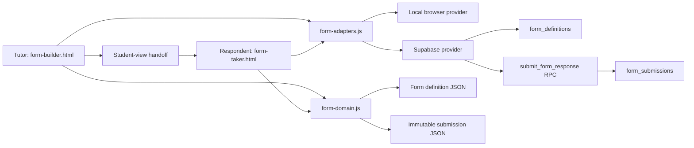

# Kelp Form Builder

The Form Builder is a vertical slice for authoring, previewing, exporting, printing, storing, and answering tutor-created forms. It is intended for lesson check-ins, pre/post-lesson surveys, feedback forms, applications, questionnaires, and triage workflows.

The feature currently has two browser surfaces:

- `form-builder.html`: the tutor-facing authoring surface.
- `form-taker.html`: the respondent-facing form runner and submission surface.
- `form-review.html`: the mentor/administrator read-only review queue and decision surface.

Both surfaces use the same domain module, so preview routing, respondent routing, imported JSON, printed paths, and immutable submission snapshots follow one contract.

See [DESIGN_REFERENCE.md](./DESIGN_REFERENCE.md) for the Form Builder's current typography, spacing, sizing, responsive rules, and cascade notes.

## Current scope

The vertical slice supports:

- Form title, audience/context, description, and single/multiple submission policy.
- Optional respondent details: full name, birthdate, e-mail, phone, country, state/province, and city.
- Country → state/province → city dependent selectors with manual-entry fallback.
- Greeting, question, phase/new-page, and goodbye blocks.
- Short answer, long answer, multiple choice, multiple answer, number, and true/false questions.
- Stable internal IDs for forms, blocks, questions, answer options, triggers, and submissions.
- Required-answer validation.
- Drag reordering, move up/down, exclusive card expansion, duplication, and guarded removal.
- Normal phases and conditional phases.
- Phase-completion, option, exact-option-set, and numeric routing conditions.
- Per-phase respondent-page colour themes.
- One-question-at-a-time respondent flow with sequential display numbering.
- Live preview, metadata summary, hierarchy tree, and routing relationship view.
- Browser drafts, JSON import/export, and a local or backend-powered form library.
- Archive → delete lifecycle for saved definitions.
- Opening saved or imported forms as independent copies with remapped IDs.
- Reachable-path selection and printable/PDF forms.
- Per-question written-answer space for printed forms.
- Immutable, retry-safe submission persistence through a backend adapter.

Assignment, tutor/student dashboards, and profile-driven distribution are intentionally outside this slice for now.

## Quick start

From the repository root:

```powershell
npm.cmd run serve:app
```

Then open:

```text
http://127.0.0.1:3000/src/app/form-builder/form-builder.html
```

The builder also works from its standalone `file://` entry point. In that mode the form library and submissions use browser storage; the Supabase provider is not loaded.

## Architecture



### Source responsibilities

| File | Responsibility |
| --- | --- |
| `form-builder.html` | Tutor-facing markup, editor sections, action controls, and modal shells. |
| `form-builder.css` | Builder, live-preview, modal, structure, library, and printable-form presentation. |
| `form-builder.js` | Authoring state, editor interactions, preview, import/export, printing, library actions, and student-view handoff. |
| `form-domain.js` | Versioned form/submission contracts, normalization, ID remapping, routing, validation, printable-route enumeration, and immutable snapshots. |
| `form-taker.html` | Respondent entry point and provider bootstrapping. |
| `form-taker.css` | Respondent page presentation and phase theming. |
| `form-taker.js` | Respondent navigation, answer collection, routing history, validation, location controls, and persistence states. |
| `form-location-data.js` | Country/state/city data adapter and fallback behavior. |
| `form-adapters.js` | Provider-independent form/submission contract plus local browser implementation. |
| `form-supabase-provider.js` | Installs the default Supabase provider into `window.KelpBackendAdapters`. |
| `form-supabase-adapters.js` | Maps the form adapter contract to Supabase queries and the submission RPC. |
| `supabase/migrations/202607170001_form_library.sql` | Database tables, lifecycle triggers, immutable-submission trigger, RPC, indexes, RLS, and grants. |
| `supabase/migrations/202607180004_content_publication.sql` | Form review lifecycle, independent-review rule, direct publication, and publication audit events. |

## Authoring workflow

1. The builder creates or normalizes a versioned form definition.
2. The tutor edits metadata and respondent-detail requirements.
3. Blocks are added and ordered. A question belongs to the most recent phase above it; questions before the first phase form the initial page.
4. A phase is either part of normal flow or has one or more triggers from an earlier phase.
5. The live preview uses the same respondent-step and routing functions as the form taker.
6. The tutor tests the complete experience with **Open student view**.
7. The form can be saved as a browser draft, exported as JSON, printed, or stored through the form-library adapter.
8. A saved form is opened as a copy before editing. The copy receives a new form ID, new block/question IDs, new option IDs, and remapped trigger references.
9. Tutors/teachers submit a saved private draft for independent review. Mentors/admins can do the same or publish an owned draft directly.
10. Any submitted or published record is immutable; revisions always begin from an independent copy.
9. A saved original moves through `active → archived → deleted`. Submissions remain independent of definition deletion.

### Blocks

| Kind | Role | Ordering rule |
| --- | --- | --- |
| `greeting` | Opening copy and start-button label. The privacy notice and consent remain mandatory. | Optional, maximum one, always first. |
| `question` | One response item with a stable ID. | Belongs to the current phase or the initial question group. |
| `phase` | Starts a new respondent page and owns following questions until the next phase. | May be normal flow or conditional. |
| `goodbye` | Pre-submission copy and submit-button label. | Optional, maximum one, always last. |

Only one editor block is expanded at a time. Duplicating a question copies its content but generates new question and option IDs; existing triggers remain attached to the original.

## Respondent workflow

The form taker converts a route snapshot into visible steps:

1. Privacy notice, greeting copy, and consent.
2. One combined respondent-details page, when at least one detail is enabled.
3. A phase-introduction card when entering a phase.
4. One question per screen.
5. The goodbye/submission page.
6. A confirmed success page only after persistence succeeds.

Question labels use the respondent's visible sequence rather than the definition's absolute block position. A conditional route that visits internal questions `1 → 9 → 24` is displayed as `Question 1 → Question 2 → Question 3`.

When an earlier answer changes, the taker recalculates the projected route and discards answers that belong only to the abandoned future branch.

## Conditional routing

Routing is forward-only:

- A target phase may reference only an earlier source phase.
- A phase-completion trigger routes after its source phase is completed.
- Answer triggers are available for routable question types.
- Multiple-choice and true/false triggers match one option ID.
- Multiple-answer triggers match an exact sorted option-ID set.
- Number triggers support `=`, `>`, `<`, `>=`, `<=`, and inclusive `between`.
- If more than one conditional destination is eligible, the earliest eligible later phase wins.
- Normal phases skipped by a forward jump are queued and resumed after that conditional branch.
- Invalid trigger references are pruned during normalization and after destructive editor changes.

`form-domain.js` is the routing authority. The builder preview, form taker, structure modal, printable-route enumerator, and tests should not reimplement these decisions independently.

## Form definition contract

The current form document version is `3`.

```json
{
  "id": "form-…",
  "version": 3,
  "meta": {
    "title": "Student Check-in",
    "audience": "Current students",
    "description": "…",
    "respondentDetails": {
      "fullName": { "enabled": true, "required": true, "verify": false }
    }
  },
  "settings": {
    "submissionPolicy": { "mode": "single" }
  },
  "blocks": []
}
```

Important invariants:

- `id` is the identity of one editable definition.
- `version` is normalized to `FORM_DOCUMENT_VERSION`.
- Every block, question, option, and trigger has its own internal ID.
- There can be at most one greeting and one goodbye.
- Short answers allow `none` or `small` PDF space.
- Long answers allow `none`, `small`, `medium`, `large`, or `custom` space; custom distance is clamped to 10–260 mm.
- Enabling state/province also enables country; enabling city also enables state/province and country.
- Requiring state/province also requires country; requiring city also requires state/province and country.
- `verify` currently records that a connected platform should verify the field later. Browser-only validation checks plausibility, not ownership.

Always pass external definitions through `normalizeState`. Use `cloneFormDefinition` when importing or opening a definition as an independent copy.

## Immutable submission contract

The current submission document version is `1`.

```json
{
  "id": "submission-…",
  "version": 1,
  "immutable": true,
  "formId": "form-…",
  "submittedAt": "2026-07-18T12:00:00.000Z",
  "snapshot": {
    "form": {
      "id": "form-…",
      "title": "Student Check-in",
      "audience": "Current students",
      "description": "…"
    },
    "respondentDetails": {},
    "pages": []
  },
  "data": {
    "respondent": {},
    "answers": [
      { "questionId": "question-…", "type": "short-answer", "value": "…" }
    ]
  },
  "metadata": {
    "formSchemaVersion": 3,
    "submissionPolicy": "single",
    "route": { "pageIds": ["privacy", "initial-questions", "goodbye"] }
  }
}
```

The snapshot contains only pages/questions on the route the respondent actually visited. It is intentionally sufficient to render the historical response after the original definition is archived or deleted.

The form taker creates the record once and keeps the same submission ID during retries. It shows success and emits `kelp:form-submitted` only after `submissions.create` confirms persistence.

## Backend adapter contract

`form-adapters.js` defines contract version `1`:

```js
{
  forms: {
    list({ status }),
    load(formId),
    save(definition),
    submitForReview(formId),
    publish(formId, { notes }),
    archive(formId),
    remove(formId)
  },
  submissions: {
    create(submission),
    list({ formId })
  },
  reviews: {
    list({ reviewStatus }),
    decide(formId, { decision, notes }),
    history({ formId })
  }
}
```

Methods may be asynchronous. A custom provider can override only the methods it owns; missing methods inherit the local implementation.

### Provider resolution

Both HTML entry points load scripts in this order:

1. `form-adapters.js`
2. `form-supabase-provider.js` through dynamic import on HTTP(S)
3. `form-domain.js`
4. Surface-specific scripts

The provider registers itself at `window.KelpBackendAdapters.forms` before the surface resolves adapters.

- `file://`: local provider.
- Builder over HTTP(S): Supabase by default; if provider setup fails, the editor can continue with a clearly labelled local fallback.
- Form taker over HTTP(S): a missing hosted provider is an error. It does not report local storage as a successful hosted submission.

### Local browser provider

| Data | Storage key |
| --- | --- |
| Builder draft | `kelp-form-builder-draft-v3` |
| Saved definitions | `kelp:forms:v1:definitions` |
| Submissions | `kelp:forms:v1:submissions` |
| Review history | `kelp:forms:v1:reviews` |
| Student-view handoff | `kelp:form-taker:v1:active` |

Local submissions are idempotent by submission ID. Reusing the ID with different content is rejected.

### Supabase provider

The Supabase implementation uses:

- `form_definitions` for owner-scoped definitions and their immutable review/publication state.
- `form_submissions` for immutable response records.
- `form_reviews` for append-only mentor/administrator decisions.
- `submit_form_response(jsonb)` for trusted submission creation.
- `save_form_draft(jsonb)`, `submit_form_for_review(text)`, `review_form(text,text,text)`, and `publish_form(text,text)` for trusted definition lifecycle transitions.
- `content_publication_events` to distinguish independent approval from privileged direct publication.

Definition lifecycle is enforced in the database:

- New definitions must be active private drafts.
- Identity, owner, and creation timestamp are immutable.
- Archived definitions cannot be modified.
- A definition with submissions cannot be overwritten; open it as a copy.
- Only archived private drafts can be hard-deleted.
- A regular tutor/teacher cannot publish; approval must come from a different mentor/administrator.
- A mentor/administrator may publish an owned draft directly, or voluntarily submit it for independent review.

Submission lifecycle is append-only:

- Direct update and delete are rejected by a trigger.
- The submission table deliberately has no foreign key to `form_definitions`, so historical snapshots survive definition deletion.
- The RPC requires an authenticated caller and an active source form.
- The RPC derives the respondent from `auth.uid()`.
- The RPC derives the form owner, server timestamp, and current single/multiple policy instead of trusting the browser.
- Repeating the same caller/submission ID returns the existing record.
- A partial unique index enforces one submission per respondent when the form policy is `single`.
- RLS permits the form owner or respondent to read a related submission.

Saving a definition requires `form.create`. Review and direct publication require `form.review` and `form.publish` respectively. These capabilities are enforced in security-definer RPCs as well as in the UI.

## Preparing assignments and student identity later

Do not add an assignment ID or authoritative student ID to the client-authored snapshot. When distribution is implemented:

1. Create an assignment/access entity that points to a form definition and its tutor.
2. Give the respondent a signed-in session or short-lived access token.
3. Pass the assignment/access reference to a trusted RPC or Edge Function.
4. Resolve and validate `assignment_id`, `respondent_id`, and `form_owner_id` on the server.
5. Store those values as indexed columns on the submission row.
6. Keep the existing immutable record as the historical content snapshot.
7. Return trusted assignment/respondent fields in tutor-facing read models rather than injecting them into old snapshot versions.

This separation lets dashboards and profiles evolve without invalidating earlier submissions.

If public anonymous forms are added, use a restricted RPC or Edge Function with expiring access tokens, rate limits, and abuse controls. Do not grant anonymous direct insert access to `form_submissions`.

## Student-view handoff

The builder opens `form-taker.html` with a generated session ID. It places a versioned handoff payload in local storage and also supports a `postMessage` handshake:

- Taker announces `kelp:form-taker:ready`.
- Builder sends `kelp:form-taker:load` with the matching session.
- Taker confirms `kelp:form-taker:loaded` and releases its opener reference.

The handshake keeps the standalone workflow usable when local storage is restricted. The active production-style surface is `form-taker.html`; the embedded standalone-document renderer in `form-builder.js` remains characterization coverage and should not become a second routing implementation.

## JSON and printing

- **Export JSON** adds `exportedAt` but preserves the definition ID.
- **Import as copy** normalizes the document and remaps every internal identity/reference.
- **Print / save as PDF** enumerates reachable respondent paths, up to 128 by default.
- The tutor chooses one route before printing.
- Printed question numbers follow the selected route.
- Written-answer height comes from each question's saved `pdfAnswerSpace` setting.
- Printing uses browser print CSS and page margins; it does not persist a PDF automatically.

## Tests

```powershell
npm.cmd run test:form-builder
npm.cmd run test:form-supabase
npm.cmd run test:form-review
npm.cmd run test:publication
npm.cmd run test:adapters
```

Coverage includes:

- Form/domain syntax and HTML script order.
- Normal and conditional respondent paths.
- Preview/taker step parity.
- Backtracking and stale-answer removal.
- Immutable snapshot shape and route capture.
- Local submission persistence.
- Failed-write retry with the same submission ID.
- Hosted-provider failure without false local success.
- JSON copy/remapping behavior.
- Printable-route and answer-space behavior.
- Supabase query/RPC mapping and migration invariants.

Reusable fixtures live in `test-fixtures/`, including a 20-question, five-phase comprehensive template.

## Known boundaries

- Assignment and dashboard retrieval are not implemented.
- Hosted submissions currently require an authenticated Supabase user.
- Respondent-field `verify` flags are metadata until a connected verification flow exists.
- Location selection improves time-zone inputs but final time-zone resolution belongs in the backend.
- The local library is suitable for standalone testing, not cross-device ownership or collaboration.
- A PDF is produced through the browser print dialog; persisted submission PDFs are a later server/document-generation concern.
