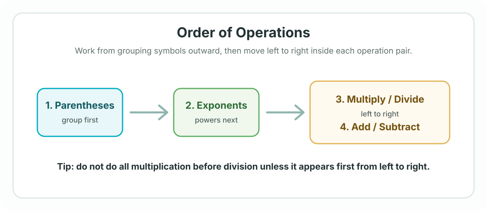

## Week goals
- Apply sign rules when adding, subtracting, multiplying, and dividing signed numbers.
- Recognize and use the commutative, associative, distributive, identity, inverse, and zero properties of multiplication.
- Evaluate numerical expressions with the correct order of operations.
- Explain each step clearly enough that another student could follow the reasoning.

## Prerequisites
- Comfortable adding, subtracting, multiplying, and dividing whole numbers.
- Familiar with positive and negative numbers on a number line.
- Able to simplify basic arithmetic expressions without variables.

## What we are studying
- Topic: Sign rules, multiplication properties, and order of operations.
- Difficulty level: Foundational. This should feel manageable, but accuracy matters because these rules appear everywhere in Algebra 1.
- Main skill: Slowing down enough to choose the correct operation order before calculating.

## Textbook reading
- Textbook: Algebra 1 course textbook.
- Pages: Assigned section on real numbers, multiplication properties, and order of operations.
- Estimated time: 25-35 minutes.

## Selected problems
- Complete the assigned examples on sign rules and order of operations.
- Do a mixed set with positive numbers, negative numbers, parentheses, exponents, multiplication, division, addition, and subtraction.
- Mark any problem where the mistake came from signs or operation order.
- Estimated time: 35-45 minutes.

## IXL practice
- IXL items: Add the assigned skill codes here if this student is using IXL this week.
- Recommended focus: Integer operations and order of operations.
- Estimated time: 15-25 minutes if assigned.

## Khan Academy videos
- Khan Academy: Add the assigned video links here if you want this student to watch before tutoring.
- Suggested focus: Order of operations and arithmetic properties.
- Estimated time: 10-20 minutes if assigned.

## PhET simulators
- No PhET simulator is required for this week.
- Optional: Add a simulator here later if you connect this topic to number lines or integer movement.

## YouTube video
- YouTube: Add one short review video here if the student needs another explanation.
- Estimated time: 5-12 minutes if assigned.

## Visual references
: Use this diagram to check the order before simplifying each expression. || Read aloud: Figure 1 shows the order of operations. Start with parentheses, then exponents, then multiplication and division from left to right, and finally addition and subtraction from left to right.

## Study tips
- Write one step per line when simplifying expressions.
- Circle parentheses and exponents before doing multiplication, division, addition, or subtraction.
- For negative numbers, pause and decide whether the sign belongs to the number or to the operation.
- Keep a short mistake list: sign error, skipped parentheses, exponent error, or arithmetic slip.

## Encouragement
- These rules may look small, but they are the grammar of algebra. Once they become automatic, equations, functions, and word problems get much easier to read.
